## 集合

### 单列集合体系结构

<div align="left">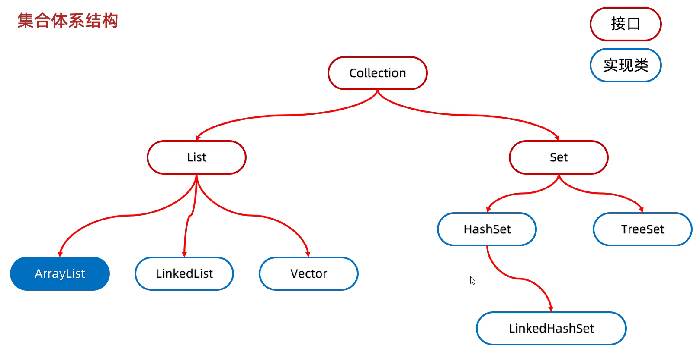</div> 

- List系列集合：添加的元素是有序的（指存和取的顺序一样）、可重复的、有索引的。  
- Set系列集合：添加的元素是无序（指存和取的顺序不一定一样）、不重复、无索引（不能通过索引获取元素）。  

Collection：Collection是单列集合的祖宗**接口**，它的功能是全部单列集合都可以继承使用的。
<div align="left">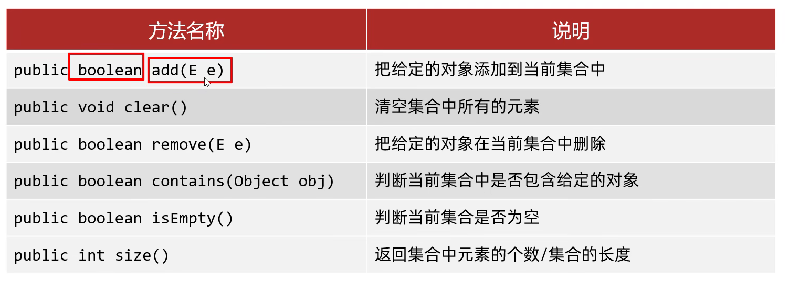</div> 

- Collection集合遍历方式
  - 迭代器遍历：在遍历过程中需要删除元素，请使用迭代器
  - 增强for遍历：仅仅想遍历
  - Lambda表达式遍历：仅仅想遍历

### 迭代器遍历

<div align="left">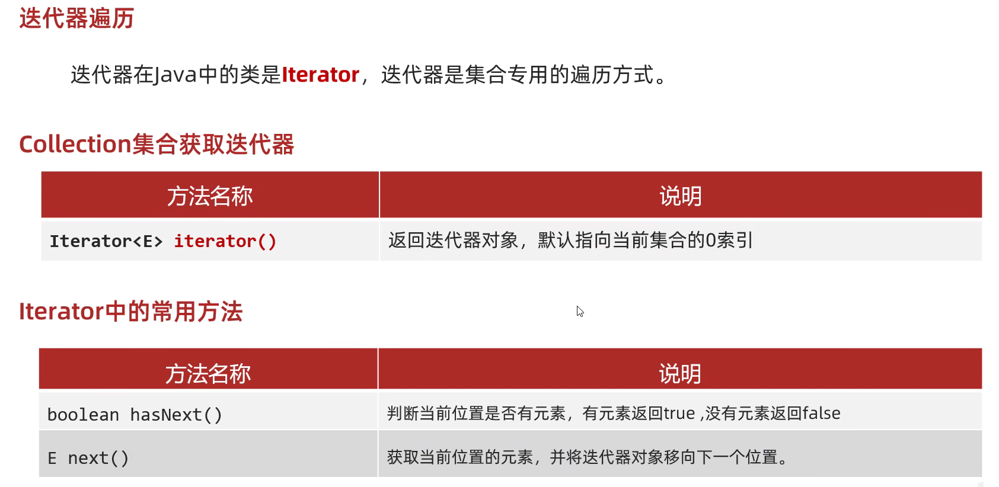</div> 

- 1.当强行获取超出索引的元素，会报错NoSuchElementException
- 2.迭代器遍历完毕，指针不会复位
- 3.循环中只能用一次next方法
- 4.迭代器遍历集合时不依赖索引，不能用集合的方法进行增加或者删除，删除可以用迭代器提供的方法remove()进行删除

### 增强for遍历

- 增强for的底层就是迭代器，为了简化迭代器的代码书写的。
- 它是JDK5之后才出现的，其内部原理就是一个Iterator迭代器
- 所有的单列集合和数组才能用增强for进行遍历，双列集合不能用增强for遍历

```java
for (元素的数据类型 变量名 : 数组或者集合){
}

for(String s : list){
  System.out.println(s);
}
``` 
- 增强for细节：
  - 修改增强for中的第三方变量，不会改变集合中原本的数据。


### Lambda表达式遍历

```java
default void forEach(Consumer<? super T> action)

coll.forEach(new Consumer<String>(){
  @Override
  public void accept(String s){
    System.out.println(s);
  }
});
// Lambda表达式形式
coll.forEach(s -> System.out.println(s));

/*forEach底层原理：遍历集合，依次得到每一个元素，把得到的每一个元素，传递给accept方法，s依次表示集合中的每一个数据*/
```
 
### List集合

- 有序：存和取的元素顺序一致
- 有索引：可以通过索引操作元素
- 可重复：存储的元素可以重复
- Collection的方法List都继承了
- List集合因为有索引，所以多了很多索引操作的方法

<div align="left">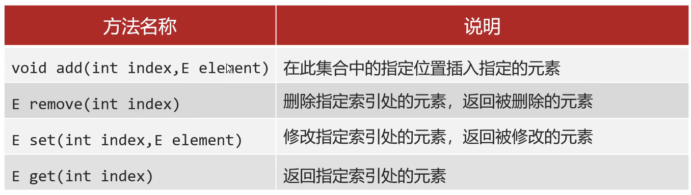</div> 

**注意：在调用方法时，如果方法出现了重载现象，优先调用实参和形参类型一致的那个方法**

List集合有五种遍历方式：
- 迭代器：在遍历过程中需要删除元素，请使用迭代器
- 列表迭代器（ListIterator，属于Iterator的子接口，add方法可以在遍历过程中添加元素）：在遍历过程中需要添加元素，请使用列表迭代器
- 增强for：仅仅想遍历
- Lambda表达式：仅仅想遍历
- 普通for（结合size方法和get方法以及循环）：遍历时想操作索引，可以用普通for

### ArrayList集合

<div align="left">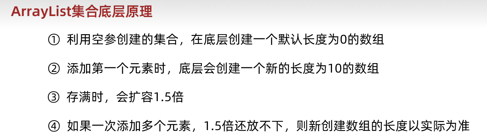</div>  

其中变量size既表示集合中元素的个数，也表示下一个元素应存储的位置。    
- ArrayList底层第一次扩容的情况。
<div align="left">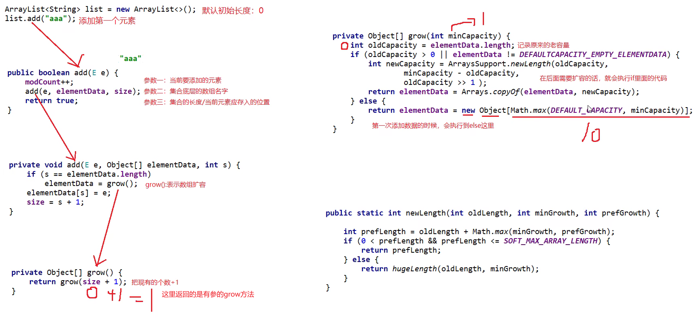</div>  
- ArrayList底层后续扩容的情况
<div align="left">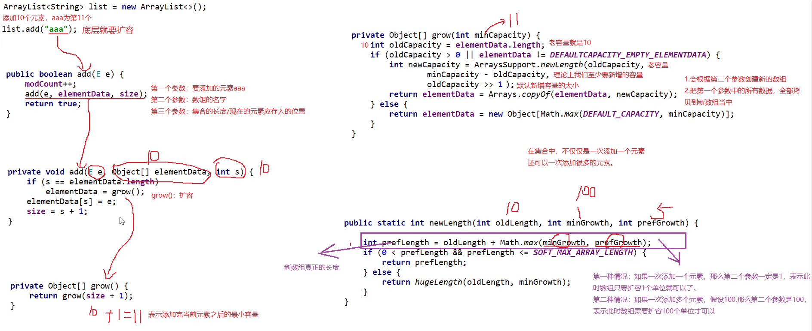</div>  

### LinkedList集合

- 底层数据结构是**双链表**，查询慢，增删快，但是如果操作的是首尾元素，速度也是极快的。
- LinkedList本身多了很多直接操作**首尾元素**的特有API。
<div align="left">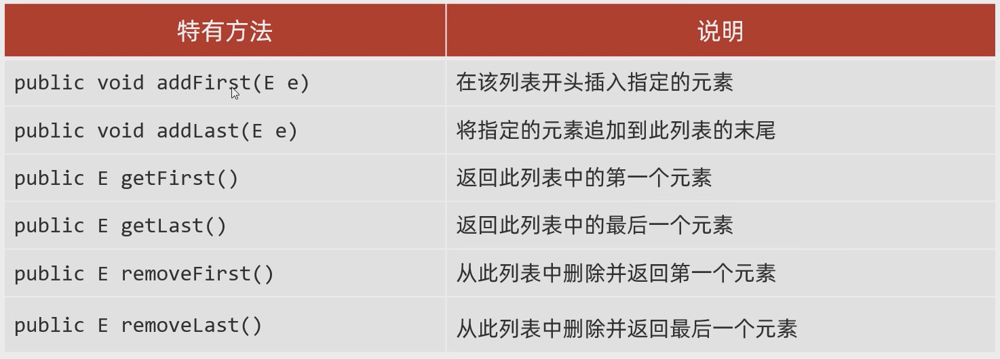</div>  
<div align="left">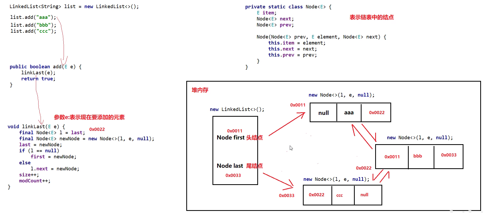</div>  

### 迭代器底层源码分析

<div align="left">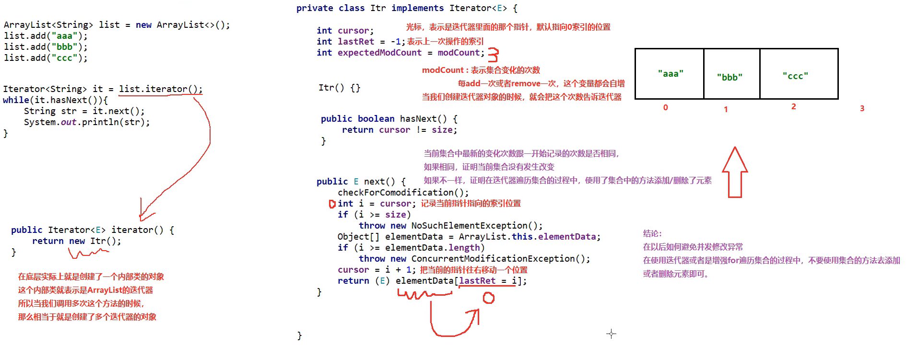</div>  


### Set集合的实现类

- HashSet：无序、不重复、无索引
- LinkedHashSet：**有序**、不重复、无索引
- TreeSet：**可排序**、不重复、无索引

**Set接口中的方法上基本上与Collection的API一致。**

### HashSet底层原理

- HashSet：无序、不重复、无索引
- HashSet集合底层采取**哈希表**存储数据
- 哈希表是一种对于增删改查数据性能都较好的结构
- 哈希表组成
  - JDK8以前：**数组+链表**
  - JDK8开始：**数组+链表+红黑树**
- **哈希值**：对象的整数表现形式
  - 根据hashCode方法计算出来的int类型的整数
  - 该方法定义在Object类中，所有对象都可以调用，默认使用地址值进行计算
  - 一般情况下，会重写hashCode方法，利用对象内部的属性值计算哈希值
- 对象的哈希值特点：
  - 如果没有重写hashCode方法，不同对象计算出的哈希值是不同的，因为地址不同
  - 如果已经重写了hashCode方法，不同的对象只要属性值相同，计算出的哈希值就是一样的
  - 在小部分情况下，不同的属性值或者不同的地址值计算出来的哈希值也有可能是一样的（哈希碰撞）
<div align="center">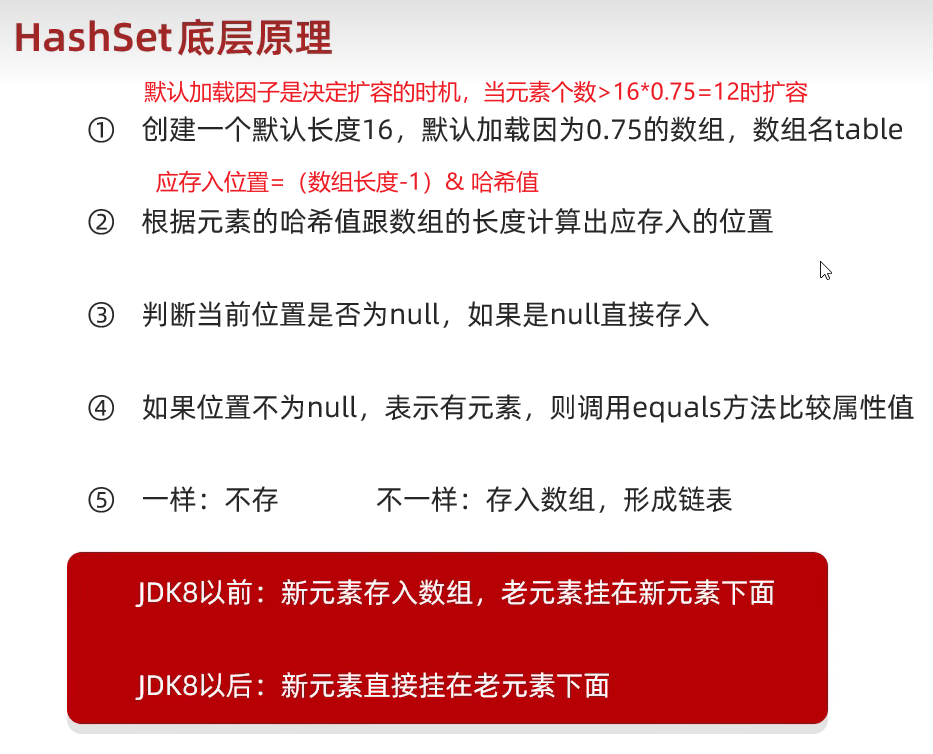</div>  

细节：
- JDK8以后，当链表长度**超过8**，而且数组长度**大于等于64**时，自动转换为红黑树
- 如果集合中存储的是自定义对象，必须要重写**hashCode**和**equals**方法

总结：
- 1. HashSet集合的底层数据结构是什么样的？
- 2. HashSet添加元素的过程？
- 3. HashSet为什么存和取的顺序不一样？
- 4. HashSet为什么没有索引？
- 5. HashSet是利用什么机制保证去重的？

### LinkedHashSet底层原理

- LinkedHashSet：**有序**、不重复、无索引
<div align="left">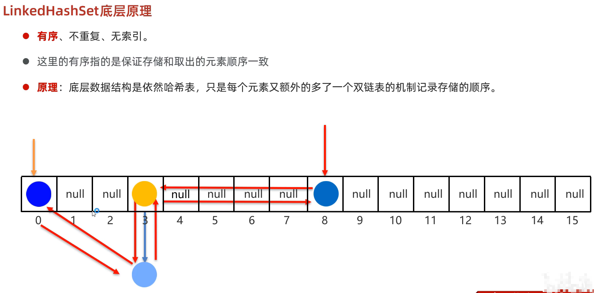</div>  

### TreeSet

- TreeSet：**可排序**、不重复、无索引
- **可排序**：按照元素的默认规则（由小到大）排序。
- TreeSet集合底层是基于**红黑树的数据结构**实现排序的，增删改查性能都较好。
- 默认的规则
  - 对于数值类型：Integer，Double，默认按照从小到大的顺序进行排序
  - 对于字符、字符串类型：按照字符在ASCII码表中的数字升序进行排序
  - 对于自定义引用数据类型，有两种比较方式：
    - 方式一：**默认排序/自然排序**：Javabean类实现Comparable接口指定比较规则
    - 方式二：**比较器排序**：创建TreeSet对象时候，传递比较器Comparator指定规则
    - **使用原则**：默认使用第一种，如果第一种不能满足当前需求，就使用第二种
    - 注意：若方式一和方式二同时存在，运行时以方式二为准
  - 方法返回值的特点：
    - 负数：表示当前要添加的元素是小的，存左边
    - 正数：表示当前要添加的元素是大的，存右边
    - 0：表示当前要添加的元素已经存在，舍弃
<div align="left">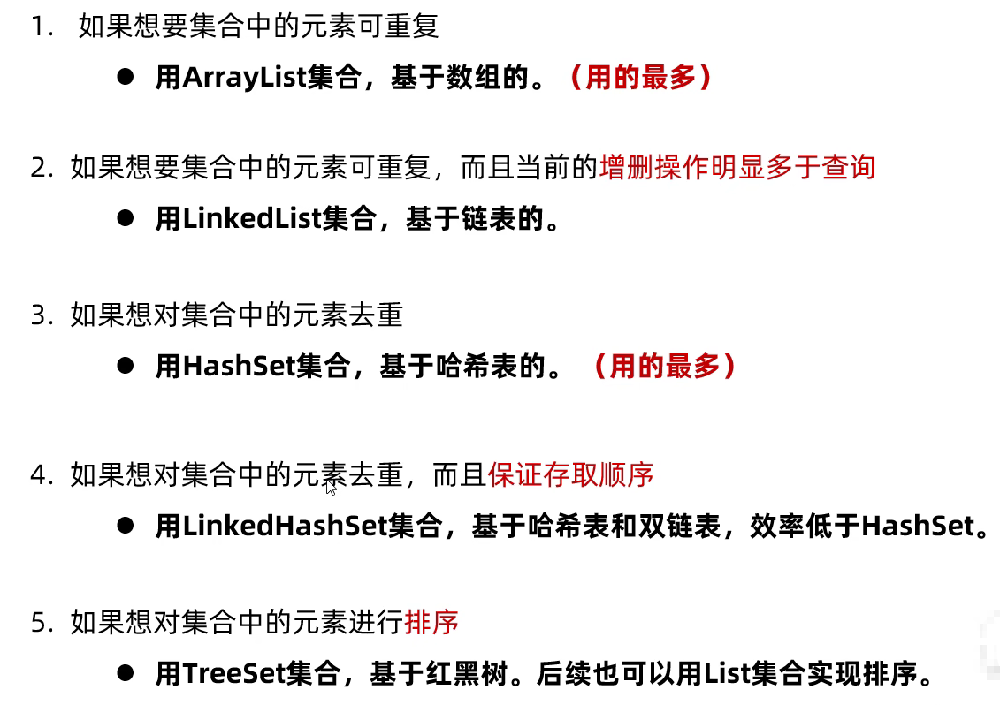</div>  


