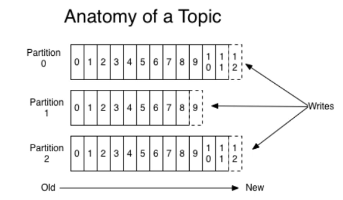
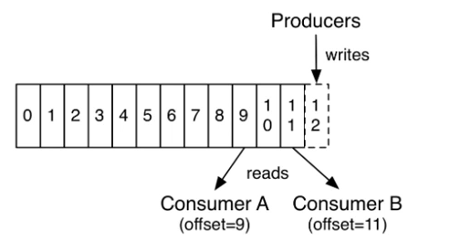

- Kafka 简介
  - Kafka 是一个分布式的流媒体平台，因为随着发展，不局限于消息队列了。
  - 应用：消息系统、日志收集、用户行为追踪、流式处理。
- Kafka特点
  - 高吞吐量(TB级)、消息持久化（存储在硬盘中，由于是顺序读写的方式，读写性能较高）、高可靠性（靠分布式保证）、高扩展性
- Kafka术语
  - Broker（Kafka的服务器）、Zookeeper（管理集群的应用）
  - Topic（主题，存放消息的位置）、Partition（对主题的分区）、Offset（消息在分区内存放的索引）
  - Leader Replica（主副本，除了备份还可以做响应）、Follower Replica（随从副本，只能备份）

<div align="center"></div> 
<div align="center"></div> 

## spring 整合 Kafka
- 引入依赖
  - spring-kafka
- 配置 Kafka
  - 配置 server、consumer
- 访问 Kafka
  - 生产者
    - `kafkaTemplate.send(topic,data);`
  - 消费者
    ```
    @KafkaListener(topic={"test"})
        public void handleMessage(ConsumerRecord record){}
    ```