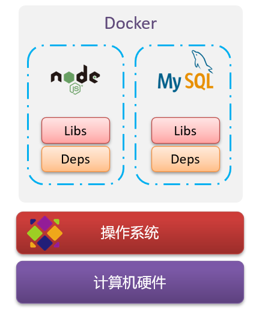
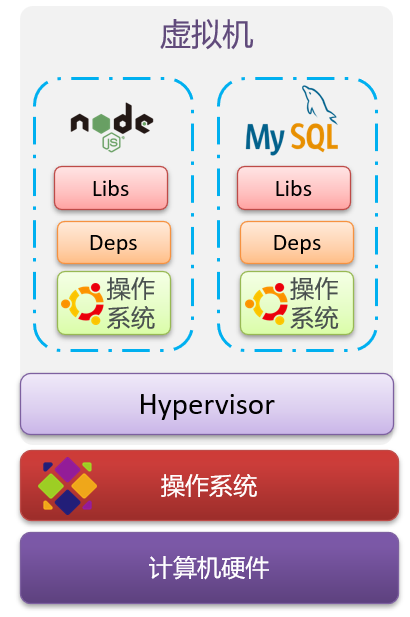
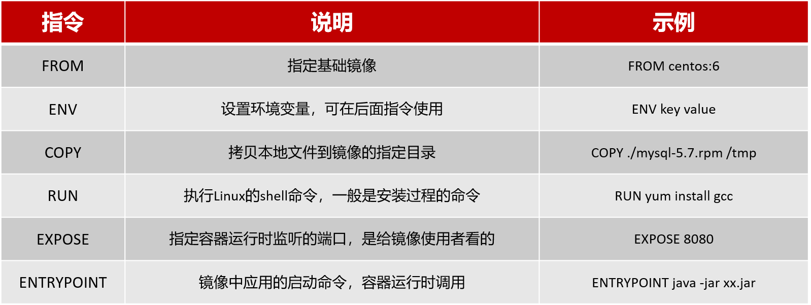

- [初识 Docker](#初识-docker)
  - [Docker 与虚拟机](#docker-与虚拟机)
  - [镜像、容器、仓库](#镜像容器仓库)
  - [Docker 架构](#docker-架构)
- [Docker 基本操作](#docker-基本操作)
  - [示例](#示例)
  - [数据卷](#数据卷)
- [Dockerfile 自定义镜像](#dockerfile-自定义镜像)
  - [镜像结构](#镜像结构)
  - [Dockerfile](#dockerfile)
- [DockerCompose](#dockercompose)
  - [什么是 DockerCompose？](#什么是-dockercompose)
  - [DockerCompose 安装](#dockercompose-安装)
  - [DockerCompose 文件内容](#dockercompose-文件内容)
  - [利用 DockerCompose 部署微服务集群](#利用-dockercompose-部署微服务集群)
- [Docker 镜像仓库](#docker-镜像仓库)
  - [简化版镜像仓库](#简化版镜像仓库)
  - [带有图形化界面版本](#带有图形化界面版本)
  - [在私有镜像仓库推送或拉取镜像](#在私有镜像仓库推送或拉取镜像)


## 初识 Docker
在大型项目中，组件往往较多，运行环境也较为复杂，部署时会碰到一些问题：
- 依赖关系复杂，容易出现兼容性问题
- 开发、测试、生产环境有差异

Docker 是如何解决依赖关系复杂，容易出现兼容性问题的？
- 将应用的 Libs(函数库)、Deps(依赖)、配置与应用一起打包，形成可移植镜像
- 将每个应用放到一个隔离容器去运行，避免互相干扰

Docker 是如何解决开发、测试、生产环境有差异的问题？
- Docker 镜像中包含完整运行环境，包括系统函数库，仅依赖系统的 Linux 内核，因此可以在任意 Linux 操作系统上运行。

总的来说，Docker 是一个快速交付应用、运行应用的技术：
1. 可以将程序及其依赖、运行环境一起打包为一个镜像，可以迁移到任意 Linux 操作系统。
2. 运行时利用沙箱机制形成隔离容器，各个应用互不干扰。
3. 启动、移除都可以通过一行命令完成，方便快捷。


### Docker 与虚拟机
虚拟机是在操作系统中模拟硬件设备，然后运行另一个操作系统，比如在 windows 系统中运行 Ubuntu 系统。  

<div align="center"></div> 

两者对比：
- 性能：Docker 接近原生，虚拟机性能较差。
- 硬盘占用：Docker 一般为 MB，虚拟机一般为 GB。
- 启动：Docker 一般为秒级，虚拟机一般为分钟级。


### 镜像、容器、仓库
镜像（Image）：Docker 将应用程序及其所需的依赖、函数库、环境、配置等文件打包在一起，称为镜像。    
容器（Container）：镜像中的应用程序运行后形成的进程就是容器，只是 Docker 会给容器做隔离，对外不可见。   
仓库(Repository)：集中存放镜像的地方。DockerHub 就是这样一个 Docker 镜像的托管平台，类似的还有阿里云镜像服务，统称为 DockerRegistry。


### Docker 架构
Docker 是一个 CS 架构的程序，由两部分组成：
- 服务端（Server）：Docker 守护进程，负责处理 Docker 指令，管理镜像、容器等。
- 客户端（Client）：通过命令或 RestAPI 向 Docker 服务端发送指令。可以在本地或远程向服务端发送指令。


## Docker 基本操作
Doker 镜像名称一般分两部分组成：[repository]:[tag]，其中，tag 是指版本，在没有指定 tag 时，默认是 latest，代表最新版本的镜像。    

```sh
docker version          # 查看 docker 版本
docker images           # 查看所有已下载镜像
docker image ls         # 查看所有已下载镜像
docker search mysql     # 查看 mysql 相关镜像
docker pull mysql:5.7   # 拉取 mysql 镜像
docker push [image]     # 推送镜像到 Registry
docker build            # 构建镜像
docker save             # 保存镜像为一个压缩包
docker load             # 加载压缩包为镜像
docker image prune      # 清理临时的、没有被使用的镜像文件
docker rmi              # 删除镜像

docker container ls     # 查看所有容器
docker ps               # 查看正在运行的容器
docker logs             # 查看容器运行日志，-f 参数可以持续查看日志
docker exec             # 进入容器执行命令
docker run              # 将一个镜像启动为容器
docker pause            # 暂停容器
docker unpause          # 将暂停的容器启动
docker start            # 启动容器
docker stop             # 停止容器
docker rm               # 删除指定容器，不能删除运行中的容器，除非添加 -f
```

### 示例
```sh
docker run --name containerName -p 80:80 -d nginx
```
参数解读：
- `--name`：给容器起一个名字
- `-p`：将宿主机端口与容器端口映射，冒号左侧是宿主机端口，右侧是容器端口
- `-d`：在后台运行容器，一般都要添加
- `nginx`：镜像名称

```sh
docker exec -it mn bash 
```
参数解读：
- `-it`：给当前进入的容器创建一个标准输入、输出终端，允许我们与容器交互
- `mn`：要进入的容器的名称
- `bash`：进入容器后执行的命令，bash 是一个 Linux 终端交互命令
> exec 命令可以进入容器修改文件，但是在容器内修改文件是不推荐的。


### 数据卷
为什么需要用到数据卷？原来的容器使用方式有什么问题？
1. 不便于修改：当我们要修改容器内的某些数据时，需要进入容器内部修改，很不方便。
2. 数据不可复用：在容器内的修改对外是不可见的。所有修改对新创建的容器是不可复用的。
3. 升级维护困难：数据在容器内，如果要升级容器必然删除旧容器，所有数据都跟着删除了。

数据卷（volume）是一个虚拟目录，指向宿主机文件系统中的某个目录，它是由 Docker 进行管理的。当我们把数据卷挂载到容器内的某个目录后，我们在数据卷中做的修改都能够实时同步到容器中。   

数据卷操作的基本语法如下：
```sh
docker volume [COMMAND]
```
`docker volume` 命令是数据卷操作，根据命令后跟随的 `COMMAND` 来确定下一步的操作：
- `create`：创建一个 volume。
- `inspect`：显示一个或多个 volume 的信息。
- `ls`：列出所有的 volume。
- `prune`：删除未使用的 volume。
- `rm`：删除一个或多个指定的 volume。

在创建容器时，可以通过 `-v` 参数来挂载一个数据卷到某个容器目录
```sh
docker run \
  -name mn \
  -v html:/root/html \    # 把 html 数据卷挂载到容器内的 /root/html 这个目录
  -p 8080:80 \ 
  nginx
```

此外，想要实现跟数据卷一样的功能，也可以直接将宿主机目录直接挂载到容器，其挂载的语法跟语句卷挂载是类似的：
- `-v [宿主机目录]:[容器内目录]`
- `-v [宿主机文件]:[容器内文件]`

数据卷挂载和目录直接挂载的区别如下：
1. 数据卷挂载耦合度低，由 docker 来管理目录，但是目录较深，不好找
2. 目录挂载耦合度高，需要我们自己管理目录，不过目录容易寻找查看


## Dockerfile 自定义镜像

### 镜像结构
要自定义镜像，首先肯定要先了解镜像结构。   
前面说过，镜像是将应用程序及其需要的系统函数库、环境配置、依赖打包而成。而它的结构是分层的，每一层称为一个 Layer。   
- BaseImage：应用依赖的系统函数库、环境、配置、文件等，因为基本都不会变，所以打包成一个基础镜像层。
- 其他层：在 BaseImage 基础上添加安装包、依赖、配置等，每次操作都形成新的一层。
- 入口（Entrypoint）：镜像运行入口，一般是程序启动的命令、脚本和参数。

### Dockerfile
Dockerfile 就是一个文本文件，其中包含一个个的指令，用指令来说明要执行什么操作来构建镜像。每一个指令都会形成一层 Layer。
<div align="center"></div> 

Dockerfile 文件示例：
```dockerfile
# 指定基础镜像
FROM ubuntu:16.04
# 配置环境变量，JDK的安装目录
ENV JAVA_DIR=/usr/local

# 拷贝jdk和java项目的包
COPY ./jdk8.tar.gz $JAVA_DIR/
COPY ./docker-demo.jar /tmp/app.jar

# 安装JDK
RUN cd $JAVA_DIR \
 && tar -xf ./jdk8.tar.gz \
 && mv ./jdk1.8.0_144 ./java8

# 配置环境变量
ENV JAVA_HOME=$JAVA_DIR/java8
ENV PATH=$PATH:$JAVA_HOME/bin

# 暴露端口
EXPOSE 8090
# 入口，java项目的启动命令
ENTRYPOINT java -jar /tmp/app.jar
```

注意：Dockerfile 的第一行必须是 FROM，从一个基础镜像来构建，基础镜像可以是基本操作系统，如 Ubuntu，也可以是其他人制作好的镜像，如 java:8-alpine。   

在编写好 dockerfile 后，可以使用 `docker build` 命令来构建镜像，以及使用 `docker run` 创建容器并运行。


## DockerCompose

### 什么是 DockerCompose？
- Docker Compose 可以基于 Compose 文件帮我们快速的部署分布式应用，而无需手动一个个创建和运行容器。
- Docker Compose 本质也是一个文本文件，通过指令定义集群中的每个容器如何运行。

### DockerCompose 安装
1. 要使用 DockerCompose 需要先安装，在 Linux 下可以通过命令安装:
```sh
# 安装
curl -L https://github.com/docker/compose/releases/download/1.29.1/docker-compose-`uname -s`-`uname -m` > /usr/local/bin/docker-compose
```

2. 修改文件权限：
```sh
# 修改权限
chmod +x /usr/local/bin/docker-compose
```

3. Base 自动补全命令
```sh
# 补全命令
curl -L https://raw.githubusercontent.com/docker/compose/1.29.1/contrib/completion/bash/docker-compose > /etc/bash_completion.d/docker-compose
```

### DockerCompose 文件内容
DockerCompose 和 Dockerfile 文件的内容是一一对应的，只是语法结构不一样。

```yml
version: "3.2"

services:           # 各种微服务
  nacos:
    image: nacos/nacos-server   # nacos 微服务镜像
    environment:
      MODE: standalone          # nacos 模式：单机
    ports:
      - "8848:8848"             # 容器内外端口映射
  mysql:
    image: mysql:5.7.25
    environment:
      MYSQL_ROOT_PASSWORD: 123
    volumes:                    # 数据卷挂载
      - "$PWD/mysql/data:/var/lib/mysql"    
      - "$PWD/mysql/conf:/etc/mysql/conf.d/"
  userservice:
    build: ./user-service       # 会在这个目录下找 Dockerfile 构建镜像
  orderservice:
    build: ./order-service
  gateway:
    build: ./gateway
    ports:
      - "10010:10010"
```

### 利用 DockerCompose 部署微服务集群
1. 编写好 DockerCompose 文件，我们要对哪些微服务做部署要在文件中写好。
2. 修改自己的微服务项目，将数据库、Nacos 地址等都命名为 DockerCompose 中的服务名。
3. 将各个微服务编译好打包成 jar 包，拷贝到它们在微服务集群中对应的子目录中，jar 包名字要与子目录中的 Dockerfile 对应。
4. 将微服务集群文件夹上传至虚拟机，利用 `docker-compose up -d` 来部署。


## Docker 镜像仓库
镜像仓库（Docker Registry）有公共的和私有的两种形式：
- 公共仓库：例如 Docker 官方的 DockerHub，国内也有一些云服务商提供类似于 Docker Hub 的公开服务，比如网易云镜像服务，DaoCloud 镜像服务，阿里云镜像服务等。
- 私有仓库：除了使用公开仓库外，用户还可以在本地搭建私有 Docker Registry。企业自己的镜像最好是采用私有 Docker Registry 来实现。

### 简化版镜像仓库
Docker 官方的 Docker Registry 是一个基础版本的 Docker 镜像仓库，具备仓库管理的完整功能，但是没有图形化界面。搭建方式比较简单，命令如下：  
```sh
docker run -d \
    --restart=always \
    --name registry	\
    -p 5000:5000 \
    -v registry-data:/var/lib/registry \
    registry
```

命令中挂载了一个数据卷 registry-data 到容器内的 /var/lib/registry  目录，这是私有镜像库存放数据的目录。

访问 http://YourIp:5000/v2/_catalog 可以查看当前私有镜像服务中包含的镜像。


### 带有图形化界面版本
使用 DockerCompose 部署带有图形界面的 DockerRegistry，命令如下：  
```yml
version: '3.0'
services:
  registry:
    image: registry
    volumes:
      - ./registry-data:/var/lib/registry
  ui:
    image: joxit/docker-registry-ui:static
    ports:
      - 8080:80
    environment:
      - REGISTRY_TITLE=传智教育私有仓库
      - REGISTRY_URL=http://registry:5000
    depends_on:
      - registry
```

### 在私有镜像仓库推送或拉取镜像
推送镜像到私有镜像服务必须先 tag，步骤如下：
1. 重新命名本地镜像，名称前缀为私有仓库的地址：192.168.150.101:8080/
```sh
docker tag nginx:latest 192.168.150.101:8080/nginx:1.0
```

2. 推送镜像
```sh
docker push 192.168.150.101:8080/nginx:1.0
```

3. 拉取镜像
```sh
docker pull 192.168.150.101:8080/nginx:1.0
```