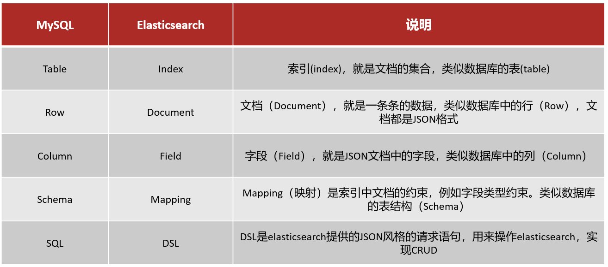

## Elasticsearch入门
- Elasticsearch简介
  - 一个分布式的（多台服务器进行部署）、Restful风格（设计风格）的**搜索引擎**
  - 支持对各种类型的数据的检索
  - 搜索速度快，可以提供实时的搜索服务
  - 便于水平扩展，每秒可以处理PB级海量数据
  - 可以理解为一个特殊的数据库，要利用ES需要将数据在ES里存一份
- E lasticsearch术语（与mysql对比着看），在ES6.0之后要废弃类型，一个索引相当于一张表
  - **索引**（database）、**类型**（table）、**文档**(一条数据)、**字段**(一列)
  - **集群**、**节点**(集群中的每台服务器)、**分片**(对索引的拆分)、**副本**(对分片的备份)
- Elasticsearch使用
  - 在搜索时会先将搜索的条件进行分词，再将词条进行匹配
  - 9200是http访问的端口，9300是TCP端口


## spring 整合 Elasticsearch
- 引入依赖
  - spring-boot-starter-data-elasticsearch
- 配置 Elasticsearch
  - cluster-name、cluster-nodes
- Spring Data Elasticsearch
  - ElasticsearchTemplate
  - ElasticsearchRepository
- 注意点
  - redis底层依赖 netty，而 ES 底层也依赖 netty，所以需要设置 NettyUtils 的 setAvailableProcessor 避免 ES 报错


## 初识 Elasticsearch

### 什么是 Elasticsearch
Elasticsearch 是一款非常强大的开源搜索引擎，可以帮助我们从海量数据中快速找到需要的内容。    

Elasticsearch 结合 Kibana、Logstash、Beats，就是 Elastic Stack (ELK)。ELK 被广泛应用在日志数据分析、实时监控等领域。其中，  
- Elasticsearch 是 ELK 的核心，负责存储、搜索、分析数据。
- Kibana 用于数据可视化。
- Logstash、Beats 用于数据抓取。  


### 什么是 Lucence
Lucene 是一个 Java 语言的搜索引擎类库，是 Apache 公司的顶级项目，由 DougCutting 于 1999 年研发。   
Lucene 的优势：易扩展、高性能（基于倒排索引）。  
Lucene 的缺点：只限于 Java 语言开发、学习曲线陡峭、不支持水平扩展。   

2004年 Shay Banon 基于 Lucene 开发了 Compass。   
2010年 Shay Banon 重写了 Compass，取名为 Elasticsearch。   

相比于 Lucene，Elasticsearch 具备下列优势：
- 支持分布式，可水平扩展。
- 提供 Restful 接口，可被任何语言调用。


### 文档、词条、索引、映射
在 ES 中，有几个概念需要了解一下，跟传统的数据库 MySQL 不一样。
- 文档：Elasticsearch 是面向文档存储的，每一条数据就是一个文档，可以是数据库中的一条商品数据，一个订单信息。文档数据会被序列化为 JSON 格式后存储在 Elasticsearch 中。   
- 词条： 对文档中的内容分词，得到的词语就是词条。   
- 索引：相同类型的文档的集合。
- 映射：索引中文档的字段约束信息，类似表的结构约束。    

<div align="center"></div>


### 正向索引和倒排索引
传统数据库是采用正向索引的，但 Elasticsearch 是按照倒排索引。这两种索引的区别如下：  
- 正向索引是按照 **文档-词条** 的方式组织的索引，一般是基于文档 id 创建的索引。每个文档都包含了它包含的词项以及相关的其他信息，比如词条的位置、频率等。这种结构更适合用于检索某个文档的内容，传统数据库如 MySQL 采用的就是这种。     
- 倒排索引是按照 **词条-文档** 的方式组织的索引，基于词条创建索引。对于每个词条，记录包含该词条的所有文档信息。这种结构更适合用于搜索某个词条在哪些文档中出现。     

<div align="center"></div>
<br>

倒排索引中包含两部分内容：  
- 词条词典（Term Dictionary）：记录所有词条，以及词条与倒排列表（Posting List）之间的关系，会给词条创建索引，提高查询和插入效率。
- 倒排列表（Posting List）：记录词条所在的文档 id、词条出现频率、词条在文档中的位置等信息。
  - 文档 id：用于快速获取文档。
  - 词条频率(TF)：词条在文档中出现的次数，用于评分。

倒排索引的搜索流程如下：   
1. 对用户输入内容分词，得到词条。
2. 根据词条在倒排索引中查找，可以得到包含词条的文档 id。
3. 根据文档 id 到正向索引中查找具体文档。


### 分词器
es 在创建倒排索引的时候需要对文档分词；在搜索时，需要对用户输入内容分词。它默认的分词规则对中文处理不太友好，可以在 kibana 中测试：  
```java
POST /_analyze
{
  "analyzer": "standard"
  "text": "分词器测试"
}
```

其中，
- `POST`：请求方式
- `/-analyzer`：请求路径，这里省略了 ip 和 端口，由 kibana 帮我们补充
- 请求参数：json 风格，`analyzer` 是分词器类型，这里是默认的 `standard` 分词器，`text` 是要分词的内容。    

由于默认的 `standard` 分词器对中文不太友好，因此处理中文分词，一般会使用 IK 分词器。它的安装上网查即可，这里就不提了。   
IK 分词器包含两种模式：
- `ik_smart`：按词切分，不重复包含字，最少切分，粗粒度。例如，“分词器测试” 会被分为 “分词器” 和 “测试” 这两个词条。
- `ik_max_word`：按词切分后，还按字切分，最细切分，细粒度。例如，“分词器测试” 会被分词为 “分词器”、“分词”、“分”、“词”、“器”、“测试”、“测”、“试” 这么多个词条。  

#### IK 分词器——扩展词库 
除了现有的词库，我们还可以扩展 IK 分词器的词库，只需要修改 IK 分词器目录中的 config 目录中的 IkAnalyzer.cfg.xml 文件：   
```xml
<properties>
        <comment>IK Analyzer 扩展配置</comment>
        <!--用户可以在这里配置自己的扩展字典 *** 添加扩展词典-->
        <entry key="ext_dict">ext.dic</entry>
</properties>
```
然后在 ext.dic 文件中，添加想要扩展的词语即可。

#### IK 分词器——停用词库
我们还可以禁止某些敏感词条，同样是在 IkAnalyzer.cfg.xml 文件中修改：
```xml
<properties>
        <comment>IK Analyzer 扩展配置</comment>
         <!--用户可以在这里配置自己的扩展停止词字典  *** 添加停用词词典-->
        <entry key="ext_stopwords">stopword.dic</entry>
</properties>
```
然后在 ext_stopword.dic 文件中添加想要禁止的敏感词即可。


## 索引库操作

### mapping 属性
mapping 是对索引库中文档的约束，常见的 mapping 属性包括：
- type：字段数据类型，常见的简单类型有：
  - 字符串：text（可分词的文本）、keyword（精确值，例如：品牌、国家、ip 地址）
  - 数值：long、integer、short、byte、double、float
  - 布尔：boolean
  - 日期：date
  - 对象：object
- index：是否创建索引，默认为 true
- analyzer：使用哪种分词器
- properties：该字段的子字段

以下面的字段为例：
```json
{
    "age": 21,
    "weight": 52.1,
    "isMarried": false,
    "info": "mapping属性例子",
    "email": "myc@itcast.cn",
    "score": [99.1, 99.5, 98.9],
    "name": {
        "firstName": "彦祖",
        "lastName": "吴"
    }
}
```

对应每个字段的映射应为：
- age：类型为 integer；参与搜索，因此需要 index 为 true；无需分词器。
- weight：类型为float；参与搜索，因此需要 index 为 true；无需分词器。
- isMarried：类型为 boolean；参与搜索，因此需要 index 为 true；无需分词器。
- info：类型为字符串，需要分词，因此是 text；参与搜索，因此需要 index 为 true；分词器可以用ik_smart。
- email：类型为字符串，但是不需要分词，因此类型是 keyword；不参与搜索，因此需要 index 为false；无需分词器。
- score：虽然是数组，但是只看元素的类型，类型为 float；参与搜索，因此需要 index 为 true；无需分词器。
- name：类型为 object，需要定义多个子属性。
  - name.firstName：类型为字符串，但是不需要分词，因此是 keyword；参与搜索，因此需要 index 为 true；无需分词器。
  - name.lastName：类型为字符串，不需要分词，类型是 keyword；参与搜索，因此需要 index 为 true；无需分词器。


### 创建索引库
ES 中通过 Restful 请求操作索引库和文档。请求内容用 DSL (Domain Specific Language) 语句来表示。   

创建索引库和 mapping 的 DSL 语法如下：   
```json
PUT /索引库名称
{
  "mappings": {
    "properties": {
      "字段名1":{
        "type": "text",
        "analyzer": "ik_smart"
      },
      "字段名2":{
        "type": "keyword",
        "index": "false"
      },
      "字段名3":{
        "properties": {
          "子字段": {
            "type": "keyword",
            "index": "false"
          }
        }
      },
      // ...略
    }
  }
}
```

### 查询索引库
```json
GET /索引库名
```

### 修改索引库
倒排索引结构虽然不复杂，但是一旦数据结构改变（比如改变了分词器），就需要重新创建倒排索引，这简直是灾难。因此索引库一旦创建，无法修改 mapping。    
虽然无法修改 mapping 中已有的字段，但是却允许添加新的字段到 mapping 中，因为不会对倒排索引产生影响。  

添加新字段：
```json
PUT /索引库名/_mapping
{
  "properties": {
    "新字段名":{
      "type": "integer"
    }
  }
}
```

### 删除索引库
```json
DELETE /索引库名
```


## 文档操作

### 新增文档
```json
POST /索引库名/_doc/文档id
{
    "字段1": "值1",
    "字段2": "值2",
    "字段3": {
        "子属性1": "值3",
        "子属性2": "值4"
    },
    // ...
}
```

### 查询文档
```json
GET /索引库名/_doc/文档id
```

### 删除文档
```json
DELETE /索引库名/_doc/文档id
```

### 修改文档
对于修改文档，有两种方式：
- 全量修改：直接覆盖原来的文档，其本质是先删除文档，再新建一个。值得注意的是，当 id 不存在时，虽然没有了删除操作，但新增操作还是会执行，此时修改操作就变成了新增操作。
- 增量修改：修改文档中的部分字段。

对于全量修改，其语法是：  
```json
PUT /索引库名/_doc/文档id
{
    "字段1": "值1",
    "字段2": "值2",
    // ... 略
}
```

对于增量修改，其语法是：  
```json
POST /索引库名/_update/文档id
{
    "doc": {
         "字段名": "新的值",
    }
}
```

注意：全量修改对应的是 `PUT` 和 `_doc`，增量修改对应的是 `POST` 和 `_update`。


### 动态映射
当我们向 ES 中插入文档时，如果文档中字段没有对应的 mapping，ES 会帮助我们字段设置 mapping，规则如下：  
- 字符串：
  - 日期格式字符串：mapping 为 date 类型。
  - 普通字符串：mapping 为 text 类型，并添加 keyword 类型子字段。
- 布尔值：boolean
- 浮点数：float
- 整数：long
- 对象嵌套：object，并添加 properties。
- 数组，由数组中第一个非空类型决定。
- 空值：忽略。


## RestAPI 

ES 官方提供了各种不同语言的客户端，用来操作 ES。**这些客户端的本质就是组装 DSL 语句，通过 HTTP 请求发送给 ES。** 官方文档地址：https://www.elastic.co/guide/en/elasticsearch/client/index.html。   

其中，Java Rest Client 包括了两种：
- Java Low Level Rest Client
- Java High Level Rest Client  


### 初始化 RestClient
在 ES 提供的 API 中，与 ES 一切交互都封装在一个名为 RestHighLevelClient 得到类中，要对 ES 进行操作，必须先完成这个对象的初始化，建立与 ES 的连接。    

步骤如下：
1. 引入 ES 的 RestHighLevelClient 依赖：
```xml
<dependency>
    <groupId>org.elasticsearch.client</groupId>
    <artifactId>elasticsearch-rest-high-level-client</artifactId>
    <version>7.12.1</version>
</dependency>
```

2. 初始化 RestHighLevelClient：
```java
RestHighLevelClient client = new RestHighLevelClient(RestClient.builder(
  HttpHost.create("http://192.168.150.101:9200")
));
```

### RestClient 操作索引库

#### RestClient 创建索引库
```java
@Test
void createIndex() throws IOException {
    // 1.创建 Request 对象
    CreateIndexRequest request = new CreateIndexRequest("hotel");
    // 2.设置请求参数
    request.source(MAPPING_TEMPLATE, XContentType.JSON);
    // 3.发送请求
    client.indices().create(request, RequestOptions.DEFAULT);
}
```
这里说明一下这三步：  
1. 创建 Request 对象。因为是创建索引库的操作，所以是 `CreateIndexRequest`。
2. 设置请求参数。这里其实就是设置 DSL 的 JSON 参数部分，也就是 mapping 部分。因为 JSON 字符串很长，所以这里将其定义为 `MAPPING_TEMPLATE`，让代码看起来更加优雅。
3. 发送请求。`client.indices()` 方法返回值是 `indicesClient` 类型，封装了所有与索引库操作相关的方法。


#### RestClient 删除索引库
类似的，RestClient 删除索引库的代码如下：  
```java
@Test
void testDeleteIndex() throws IOException {
  // 1. 创建 Request 对象
  DeleteIndexRequest request = new DeleteIndexRequest("hotel");
  // 2. 发送请求
  client.indices().delete(request, RequestOptions.DEFAULT);
}
```


#### RestClient 判断索引库是否存在
判断索引库是否存在，本质就是查询，对应的 DSL 是 `GET /索引库`，用 RestClient 的步骤如下：  
```java
@Test
void testExitsIndex() throws IOException {
  GetIndexRequest request = new GetIndexRequest("hotel");
  // 注意，这里是 exists() 方法，不是 get()
  boolean exists = client.indices().exists(request, RequestOptions.DEFAULT);
  System.out.println(exists ? "索引库已经存在！" : "索引库不存在");
}
```


### RestClient 操作文档

这里先总的说一下文档操作的基本步骤：  
1. 初始化 `RestHighLevelClient`
2. 创建 xxxRequest。xxx 是 Index、Get、Update、Delete。
3. 准备参数(Index 和 Update 时需要)
4. 发送请求。调用 RestHighLevelClient.xxx() 方法，xxx 是 index、get、update、delete。
5. 解析结果（Get 时需要）

#### 新增文档
```java
@Test
void testAddDocument() throws IOException {
  // 1. 根据 id 查询数据库中酒店数据
  Hotel hotel = hotelService.getById(61083L);
  // 2. 将类型转换为文档类型，因为 Hotel 是对应 MySQL 数据库中数据的类，而 HotelDoc 是对应 ES 中数据的类，主要是地理坐标字段不一样
  HotelDoc hotelDoc = new HotelDoc(hotel);
  // 3. 将 HotelDoc 转 json
  String json = JSON.toJSONString(hotelDoc);

  // 4. 准备 Request 对象
  IndexRequest request = new IndexRequest("hotel").id(hotelDoc.getId().toString());
  // 5. 准备要新增的文档数据，也就是上面的 json
  request.source(json, XContentType.JSON);
  // 6. 发送请求
  client.index(request, RequestOptions.DEFAULT);
}
```

#### 查询文档
```java
@Test
void testGetDocumentById() throws IOException {
  GetRequest request = new GetRequest("hotel", "61082");
  GetResponse response = client.get(request, RequestOptions.DEFAULT);
  // 请求的结果是一个 JSON，其中文档放在一个 _source 属性中，所以要 getSourceAsString() 方法获取
  String json = response.getSourceAsString();
  // 将文档从 JSON 格式解析出来，也就是反序列化
  HotelDoc hotelDoc = JSON.parseObject(json, HotelDoc.class);
  System.out.println(hotelDoc);
}
```

#### 删除文档
```java
@Test
void testDeleteDocument() throws IOException {
  DeleteRequest request = new DeleteRequest("hotel", "61083");
  client.delete(request, RequestOptions.DEFAULT);
}
```

#### 修改文档
我们上面说过，修改有两种方式：全量修改和增量修改。   

在 RestClient 的 API 中，全量修改与新增的 API 完全一致，判断依据是 ID：  
- 如果新增时，ID 已经存在，则是修改。
- 如果新增时，ID 不存在，则是新增。

所以，这里不对全量修改进行赘述，主要说一下增量修改：  
```java
@Test
void testUpdateDocument() throws IOException {
  UpdateRequest request = new UpdateRequest("hotel", "61083");
  // 修改的参数是每两个参数为一对 key value
  request.doc(
    "price", "952",
    "starName", "五星"
  );
  client.update(request, RequestOptions.DEFAULT);
}
```

#### 批量导入文档
如果要批量导入数据到 ES，可以利用 `BulkRequest`。`BulkRequest` 本质就是将多个普通的 CRUD 请求组合在一起发送。其中提供了一个 `add()` 方法，用来添加请求。  

```java
@Test
void testBulkRequest() throws IOException {
  // 批量查询酒店数据
  List<Hotel> hotels = hotelService.list();

  // 1.创建 Request
  BulkRequest request = new BulkRequest();
  // 2.准备参数，添加多个新增的 Request
  for (Hotel hotel : hotels) {
    // 2.1.转换为文档类型 HotelDoc
    HotelDoc hotelDoc = new HotelDoc(hotel);
    // 2.2.创建新增文档的 Request 对象
    request.add(new IndexRequest("hotel")
          .id(hotelDoc.getId().toString())
          .source(JSON.toJSONString(hotelDoc), XContentType.JSON));
  }
  // 3.发送请求
  client.bulk(request, RequestOptions.DEFAULT);
}
```