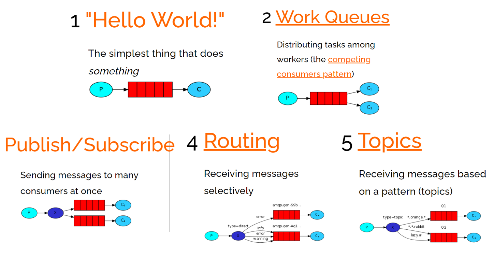

# 初识 RabbitMQ

## 同步通讯和异步通讯
同步通讯：请求方等待响应方的直接响应，就像打电话一样，需要实时响应。对于请求方来说，需要等待响应方的处理结果，通信是阻塞的。    

优点：
- 时效性强，可以立即得到结果。

存在问题：
- 耦合度高：每次加入新的需求，都要修改原来的代码。
- 性能和吞吐能力下降：调用者需要等待服务提供者响应，如果调用链过长则响应时间等于每次调用的时间之和。
- 资源浪费：调用链中的每个服务在等待响应过程中，不能释放请求占用的资源，高并发场景下会极度浪费系统资源。
- 级联失败：如果服务提供者出现问题，所有调用方都会跟着出问题，如同多米诺骨牌一样，迅速导致整个微服务集群故障。

&nbsp;

异步通讯：发送方发送消息后不等待接收方的直接响应，可以继续执行其他任务，就像发邮件一样，不需要马上回复。对于请求方来说，发送后立即返回不需等待，因此通信是非阻塞的，允许系统中的不同部分独立地演化。典型的异步通讯方式包括消息队列和事件驱动架构。      

为了解除事件发布者与订阅者之间的耦合，两者并不是直接通信，而是有一个中间人（Broker）。发布者发布事件到 Broker，不关心谁来订阅事件。订阅者从 Broker 订阅事件，不关心谁发来的消息。  

<div align='center'></div>

Broker 是一个像数据总线一样的东西，所有的服务要接收数据和发送数据都发到这个总线上，这个总线就像协议一样，让服务间的通讯变得标准和可控。

优点：
- 吞吐量提升：无需等待订阅者处理完成，响应更快速。
- 故障隔离：服务没有直接调用，不存在级联失败问题。
- 调用间没有阻塞，不会造成无效的资源占用。
- 耦合度极低，每个服务都可以灵活插拔，可替换。
- 流量削峰：不管发布事件的流量波动多大，都由 Broker 接收，订阅者可以按照自己的速度去处理事件。

缺点：
- 架构复杂了，业务没有明显的流程线，不好管理。
- 需要依赖于 Broker 的可靠、安全、性能。


## 不同异步通讯技术对比
MQ，中文是消息队列（Message Queue），字面上看是存放消息的队列，也就是事件驱动架构中的 Broker。  
常见的 MQ 实现有：
- ActiveMQ
- RabbitMQ
- RocketMQ
- Kafka

这几种常见 MQ 对比：
|           | **RabbitMQ** | **ActiveMQ** | **RocketMQ** | **Kafka**  |
| :-------: | :-------     | :------- | :-------| :------- |
| 公司/社区  | Rabbit       | Apache       | 阿里         | Apache     |
| 开发语言   | Erlang       | Java         | Java         | Scala&Java |
| 协议支持   | AMQP，XMPP，SMTP，STOMP | OpenWire,STOMP，REST,XMPP,AMQP | 自定义协议   | 自定义协议 |
| 可用性     | 高           | 一般         | 高           | 高         |
| 单机吞吐量 | 一般          | 差           | 高           | 非常高     |
| 消息延迟   | 微秒级        | 毫秒级       | 毫秒级        | 毫秒以内   |
| 消息可靠性 | 高            | 一般         | 高           | 一般       |

- 追求可用性：Kafka、 RocketMQ 、RabbitMQ
- 追求可靠性：RabbitMQ、RocketMQ
- 追求吞吐能力：RocketMQ、Kafka
- 追求消息低延迟：RabbitMQ、Kafka


# RabbitMQ 入门

MQ 基本结构：
<div align='center'></div>

RabbitMQ 中的一些角色：
- publisher：生产者
- consumer：消费者
- exchange：交换机，负责消息路由
- queue：队列，存储消息
- virtualHost：虚拟主机，隔离不同租户的 exchange、queue、消息


## RabbitMQ 消息模型
RabbitMQ 官方提供了 多 个 MQ 的 Demo 示例，对应了几种不同的消息模型，这里是其中5种：   
- 基本消息队列（BasicQueue）
- 工作消息队列（WorkQueue）
- 发布订阅（Publish、Subscribe），这种又根据交换机类型不同分为三种：
  - Fanout Exchange：广播
  - Direct Exchange：路由
  - Topic Exchange：主题

<div align='center'></div>


## 基本消息队列（BasicQueue）
基本消息队列的模型图：  
<div align='center'></div>


### publisher 实现
基本消息队列的消息发送流程：
- 建立连接 Connection
- 创建 Channel
- 利用 Channel 声明队列
- 利用 Channel 向队列发送消息
- 关闭连接和 Channel

```java
import com.rabbitmq.client.Channel;
import com.rabbitmq.client.Connection;
import com.rabbitmq.client.ConnectionFactory;

@Test
public void testSendMessage() throws IOException, TimeoutException {
    // 1.建立连接
    ConnectionFactory factory = new ConnectionFactory();
    // 1.1.设置连接参数，分别是：主机名、端口号、vhost、用户名、密码
    factory.setHost("192.168.150.101");
    factory.setPort(5672);
    factory.setVirtualHost("/");
    factory.setUsername("itcast");
    factory.setPassword("123321");
    // 1.2.建立连接
    Connection connection = factory.newConnection();

    // 2.创建通道 Channel
    Channel channel = connection.createChannel();

    // 3.创建队列
    String queueName = "simple.queue";
    channel.queueDeclare(queueName, false, false, false, null);

    // 4.发送消息
    String message = "hello, rabbitmq!";
    channel.basicPublish("", queueName, null, message.getBytes());
    System.out.println("发送消息成功：【" + message + "】");

    // 5.关闭通道和连接
    channel.close();
    connection.close();
}
```

### consumer 实现
基本消息队列的消息接收流程：
- 建立连接 Connection
- 创建 Channel
- 利用 Channel 声明队列
- 定义 Consumer 的消费行为 `handlerDelivery()`
- 利用 Channel 将消费者与队列绑定

```java
import com.rabbitmq.client.*;

public class ConsumerTest {
    public static void main(String[] args) throws IOException, TimeoutException {
        // 1.建立连接
        ConnectionFactory factory = new ConnectionFactory();
        // 1.1.设置连接参数，分别是：主机名、端口号、vhost、用户名、密码
        factory.setHost("192.168.150.101");
        factory.setPort(5672);
        factory.setVirtualHost("/");
        factory.setUsername("itcast");
        factory.setPassword("123321");
        // 1.2.建立连接
        Connection connection = factory.newConnection();

        // 2.创建通道 Channel
        Channel channel = connection.createChannel();

        // 3.创建队列
        String queueName = "simple.queue";
        channel.queueDeclare(queueName, false, false, false, null);

        // 4.订阅消息
        channel.basicConsume(queueName, true, new DefaultConsumer(channel){
            @Override
            public void handleDelivery(String consumerTag, Envelope envelope,
                                       AMQP.BasicProperties properties, byte[] body) throws IOException {
                // 5.处理消息
                String message = new String(body);
                System.out.println("接收到消息：【" + message + "】");
            }
        });
        // 这句会先打印出来，因为订阅消息是异步的
        System.out.println("等待接收消息。。。。");
    }
}
```

之所以生产者和消费者都要声明队列，是为了避免队列不存在，因为不确定生产者实例先启动还是消费者实例先启动。   


## SpringAMQP 
AMQP，全称是 Advanced Message Queuing Protocol，是用于在应用程序之间传递业务消息的开放标准。该协议与语言和平台无关，更符合微服务中独立性的要求。

Spring AMQP 是基于 AMQP 协议定义的一套 API 规范，基于 RabbitMQ 提供了模板来发送和接收消息。它包含了两部分，其中 spring-amqp 是基础抽象，spring-rabbit 是底层的默认实现。    

Spring AMQP 提供了三个功能：
- 自动声明队列、交换机及其绑定关系
- 基于注解的监听器模式，异步接收消息
- 封装了 `RabbitTemplate` 工具，用于发送消息

### Spring AMQP 简化 Basic Queue 使用
引入依赖：
```xml
<!--AMQP依赖，包含RabbitMQ-->
<dependency>
    <groupId>org.springframework.boot</groupId>
    <artifactId>spring-boot-starter-amqp</artifactId>
</dependency>
```

#### 消息发送
首先配置 MQ 地址，在 publisher 服务的 application.yml 中添加配置：
```yml
spring:
  rabbitmq:
    host: 192.168.150.101 # 主机名
    port: 5672 # 端口
    virtual-host: / # 虚拟主机
    username: itcast # 用户名
    password: 123321 # 密码
```

利用 RabbitTemplate 实现消息发送：
```java
import org.springframework.amqp.rabbit.core.RabbitTemplate;

@Test
public void testSimpleQueue() {
    // 队列名称
    String queueName = "simple.queue";
    // 消息
    String message = "hello, spring amqp!";
    // 发送消息
    rabbitTemplate.convertAndSend(queueName, message);
}
```

#### 消息接收
同样，首先配置 MQ 地址，在 consumer 服务的配置文件中添加配置：
```yml
spring:
  rabbitmq:
    host: 192.168.150.101 # 主机名
    port: 5672 # 端口
    virtual-host: / # 虚拟主机
    username: itcast # 用户名
    password: 123321 # 密码
```

然后在 consumer 服务中新建一个类用于消息处理，要将其注册为 bean：
```java
package cn.itcast.mq.listener;
import org.springframework.amqp.rabbit.annotation.RabbitListener;

@Component
public class SpringRabbitListener {

    @RabbitListener(queues = "simple.queue")
    public void listenSimpleQueueMessage(String msg) throws InterruptedException {
        System.out.println("spring 消费者接收到消息：【" + msg + "】");
    }
}
```


## WorkQueue  
工作消息队列 Work Queue，也被称为（Task Queues），任务模型。简单来说，就是让多个消费者绑定到一个队列，共同消费队列中的消息。  

<div align='center'></div>

为什么要用工作消息队列？   
当消息比较耗时的时候，可能生产消息的速度会远远大于消息的消费速度。长此以往，消息就会堆积得越来越多，无法及时处理。此时用 Work Queue，多个消费者共同处理消息，速度就能大大提高了。   

### Work Queue 使用
Work Queue 的使用总体上跟 Basic Queue 是相似的，在消息发送部分是完全一样的，而在消息接收部分则是需要定义多个 RabbitListener 绑定同一个队列。   

```java
@RabbitListener(queues = "simple.queue")
public void listenWorkQueue1(String msg) throws InterruptedException {
    System.out.println("消费者1接收到消息：【" + msg + "】" + LocalTime.now());
    Thread.sleep(20);
}

@RabbitListener(queues = "simple.queue")
public void listenWorkQueue2(String msg) throws InterruptedException {
    System.err.println("消费者2........接收到消息：【" + msg + "】" + LocalTime.now());
    Thread.sleep(200);
}
```

除此之外，还需要在 consumer 服务中的配置文件中添加配置信息：
```yml
spring:
  rabbitmq:
    listener:
      simple:
        prefetch: 1 # 每次只能获取一条消息，处理完成才能获取下一个消息
```

添加这个配置是要通过 `prefetch` 来控制消费者预取的消息数量。若不配置，则由于消息预取技术，消息会平均分配给每个消费者而没有考虑消费者的处理能力，这样显然是有问题的。   


## 发布/订阅
发布订阅的模型如下：
<div align='center'></div>

可以看到，相比基本消息队列和工作消息队列来说，发布订阅模型中，多了一个 exchange 角色，而且过程略有变化：   
- Publisher：生产者不再是发送消息到对了，而是发送给 exchange。
- Exchange：交换机。一方面，接收生产者发送的消息。另一方面，知道如何处理消息，例如递交给某个特别队列、递交给所有队列、或是将消息丢弃。到底如何操作，取决于 Exchange 的类型。Exchange 有以下三种类型：
  - Fanout：广播，将消息交给所有绑定到交换机的队列。
  - Direct：定向，将消息交给符合指定 routing key 的队列。
  - Topic：通配符，将消息交给符合路由模式（routing pattern）的队列。
- Consumer：消费者，与以前一样，订阅队列，没有变化。
- Queue：消息队列也与以前一样，接收消息、缓存消息。

**Exchange 只负责转发消息，不具备存储消息的能力**，因此如果没有任何队列与 Exchange 绑定，或者没有符合路由规则的队列，那么消息会丢失!   


## 发布订阅之 Fanout 
Fanout，英文直译是扇出，但是在 MQ 中叫广播更合适，它的模型如下：   
<div align='center'></div>  

在 Fanout 模式下，消息发送流程是这样的：
1. 可以有多个队列，但每个队列都要绑定到 Exchange。
2. 生产者发送的消息，只能发送到交换机，交换机来决定要发送给哪个队列，生产者无法决定。
3. 交换机把消息发送给绑定过的所有队列。
4. 订阅队列的消费者都能拿到消息。


### 声明队列和交换机
Spring 提供了一个接口 Exchange，来表示所有不同类型的交换机：
<div align='center'></div>  

创建一个类，声明队列和交换机：
```java
import org.springframework.amqp.core.Binding;
import org.springframework.amqp.core.BindingBuilder;
import org.springframework.amqp.core.FanoutExchange;
import org.springframework.amqp.core.Queue;
import org.springframework.context.annotation.Bean;
import org.springframework.context.annotation.Configuration;

@Configuration
public class FanoutConfig {

    // 声明交换机，"itcast.fanout" 是交换机的名称
    @Bean
    public FanoutExchange fanoutExchange(){
        return new FanoutExchange("itcast.fanout");
    }

    // 第一个队列，"fanout.queue1" 是队列名称
    @Bean
    public Queue fanoutQueue1(){
        return new Queue("fanout.queue1");
    }

    // 绑定队列一到交换机上
    @Bean
    public Binding bindingQueue1(Queue fanoutQueue1, FanoutExchange fanoutExchange){
        return BindingBuilder.bind(fanoutQueue1).to(fanoutExchange);
    }

    // 第二个队列，"fanout.queue2" 是队列名称
    @Bean
    public Queue fanoutQueue2(){
        return new Queue("fanout.queue2");
    }

    // 绑定队列二到交换机上
    @Bean
    public Binding bindingQueue2(Queue fanoutQueue2, FanoutExchange fanoutExchange){
        return BindingBuilder.bind(fanoutQueue2).to(fanoutExchange);
    }
}
```

### 发送消息
Fanout 模式下发送消息与之前相差不多，唯一区别就是将队列名称改成了交换机名称，`convertAndSend` 方法参数是三个，而不是两个。
```java
@Test
public void testFanoutExchange() {
    // 交换机名称
    String exchangeName = "itcast.fanout";
    // 消息
    String message = "hello, everyone!";
    rabbitTemplate.convertAndSend(exchangeName, "", message);
}
```

### 消息接收
Fanout 模式下接收消息与之前一致。
```java
@RabbitListener(queues = "fanout.queue1")
public void listenFanoutQueue1(String msg) {
    System.out.println("消费者1接收到Fanout消息：【" + msg + "】");
}

@RabbitListener(queues = "fanout.queue2")
public void listenFanoutQueue2(String msg) {
    System.out.println("消费者2接收到Fanout消息：【" + msg + "】");
}
```


## 发布订阅之 Direct
在某些场景下，我们希望不同的消息被不同的队列消费。这时就要用到 Direct 类型的 Exchange。  
<div align='center'></div>  

在 Direct 类型消息队列下：
- 队列与交换机的绑定，不能是任意绑定了，而是需要指定一个 `RoutingKey`，一个队列可以有多个 `RoutingKey`。
- 消息的发送方在向 Exchange 发送消息时，也必须指定消息的 `RoutingKey`。
- Exchange 不再把消息交给每一个绑定的队列，而是根据消息的 `RoutingKey` 进行判断，只有队列的 `RoutingKey` 与消息的 `RoutingKey` 完全一致，才会接收到消息。

### 基于注解声明队列和交换机
基于 `@Bean` 的方式声明队列和交换机比较麻烦，Spring 还提供了基于注解方式来声明。  

```java
@RabbitListener(bindings = @QueueBinding(
    value = @Queue(name = "direct.queue1"),
    exchange = @Exchange(name = "itcast.direct", type = ExchangeTypes.DIRECT),
    key = {"red", "blue"}
))
public void listenDirectQueue1(String msg){
    System.out.println("消费者接收到direct.queue1的消息：【" + msg + "】");
}

@RabbitListener(bindings = @QueueBinding(
    value = @Queue(name = "direct.queue2"),
    exchange = @Exchange(name = "itcast.direct", type = ExchangeTypes.DIRECT),
    key = {"red", "yellow"}
))
public void listenDirectQueue2(String msg){
    System.out.println("消费者接收到direct.queue2的消息：【" + msg + "】");
}
```

### 发送消息
发送消息与之前类似，但是要指定 `RoutingKey`：   
```java
@Test
public void testSendDirectExchange() {
    // 交换机名称
    String exchangeName = "itcast.direct";
    // 消息
    String message = "红色警报！日本乱排核废水，导致海洋生物变异，惊现哥斯拉！";
    // 发送消息
    rabbitTemplate.convertAndSend(exchangeName, "red", message);
}
```


## 发布订阅之 Topic
Topic 类型的 Exchange 与 Direct 相比，都是可以根据 `RoutingKey` 把消息路由到不同的队列。只不过 Topic 类型 Exchange 可以让队列在绑定 `RoutingKey` 的时候使用通配符。    

<div align='center'></div>  

`Routingkey` 一般都是有一个或多个单词组成，多个单词之间以 "." 分割，例如： `item.insert`   

 通配符规则：
- `#`：匹配一个或多个词，例如，`item.#` 能够匹配 `item.spu.insert` 或者 `item.spu`
- `*`：匹配不多不少恰好1个词，例如，`item.*` 只能匹配 `item.spu`

### 发送消息和接收消息
Topic 下的发送消息与 Direct 完全一样。接收消息也大致相同，唯一差别就是 consumer 的 `RoutingKey` 定义时会使用通配符，Exchange 类型也不同：

```java
@RabbitListener(bindings = @QueueBinding(
    value = @Queue(name = "topic.queue1"),
    exchange = @Exchange(name = "itcast.topic", type = ExchangeTypes.TOPIC),
    key = "china.#"
))
public void listenTopicQueue1(String msg){
    System.out.println("消费者接收到topic.queue1的消息：【" + msg + "】");
}
```


## 消息转换器
在发送消息时，Spring 会把消息序列化为字节发送给 MQ，接收消息的时候，还会把字节反序列化为 Java 对象。但是，在默认情况下，Spring 采用的是 JDK 序列化，存在问题：
- 数据体积过大
- 有安全漏洞
- 可读性差

### 配置 JSON 转换器
使用JSON方式来做序列化和反序列化。   
在 publisher 和 consumer 服务中都引入依赖：   
```xml
<dependency>
    <groupId>com.fasterxml.jackson.dataformat</groupId>
    <artifactId>jackson-dataformat-xml</artifactId>
    <version>2.9.10</version>
</dependency>
```

配置消息转换器，在启动类中添加一个 Bean 即可：
```java
@Bean
public MessageConverter jsonMessageConverter(){
    return new Jackson2JsonMessageConverter();
}
```