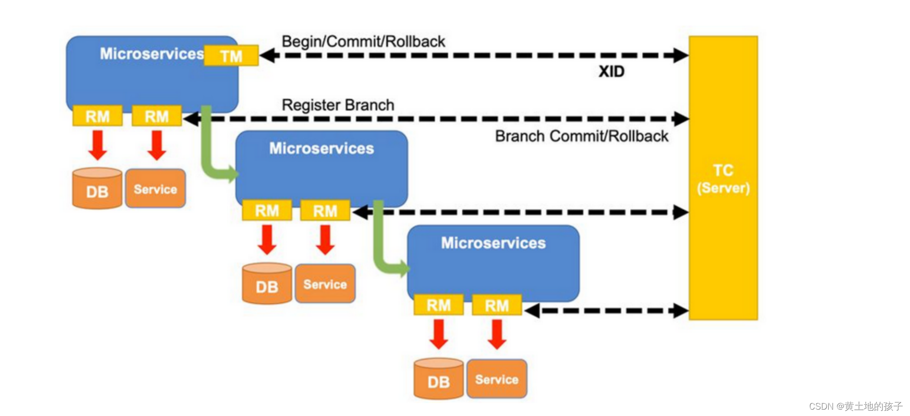
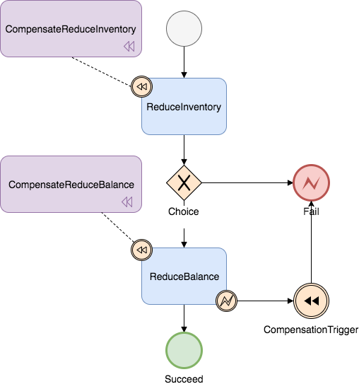

# 为什么需要分布式事务

随着业务的发展，系统访问量和业务复杂程度也快速增长，单系统架构不足以满足需求，因而需要拆分成多个业务系统，各系统专注于自身业务，比如交易系统、支付系统、财务系统等。  

一个完整的业务往往需要调用多个服务，这多个服务之间需要保持数据一致性，因而需要分布式事务。

# 分布式事务理论基础

## 两阶段提交

两阶段提交（Two Phase Commitment Protocol, 2PC），事务管理器分两个阶段协调资源管理器，第一阶段准备资源，也就是预留事务所需的资源，如果每个资源管理器都资源预留成功，则进行第二阶段资源提交，否则协调资源管理器回滚资源。  

## TCC

TCC，全称是 Try-Confirm-Cancel，实际上是服务化的两阶段提交，业务开发者需要实现三个接口，对应服务的两个阶段：  
1. Try 接口：对应第一阶段服务，由业务代码编排来调用 Try 接口进行资源预留
2. Confirm 接口：对应第二阶段服务的成功操作，当所有参与者的 Try 接口都调用成功，事务管理器会提交事务，并调用每个参与者的 Confirm 接口真正提交业务操作
3. Cancel 接口：对应第二阶段的失败操作，当有参与者的 Try 接口调用失败，则调用每个参与者的 Cancel 接口回滚事务。

## Saga

Saga 是一种补偿协议，在该模式下，每个参与者都是一个冲正补偿服务，即它有正向操作和逆向回滚操作。   

Saga 在分布式事务执行过程中，依次执行每个参与者的正向操作，若全部正向操作执行成功，则提交分布式事务。若其中有任意一个参与者的正向操作失败，则分布式事务会逆向回去执行之前参与者的逆向回滚操作，使分布式事务回到初始状态。  

Saga 理论基础：Hector & Kenneth 发表的论文 Sagas（1987）

# Seata 

## Seata 模块

Seata 中有三大模块，分别是 TM、RM、TC。其中，TM 和 RM 是作为 Seata 的客户端与业务系统集成在一起，TC 作为 Seata 的服务端独立部署。  
- TC：Transaction Coordinator，事务协调者，维护全局和分支事务的状态，驱动全局事务提交或回滚
- TM：Transaction Manager，事务管理器，定义全局事务的范围（开始全局事务、提交或回滚全局事务）
- RM：Resource Manager，资源管理器，管理分支事务处理的资源，与 TC 交谈以注册分支事务和报告分支事务的状态，并驱动分支事务提交或回滚

 

seata 分布式事务的执行流程如下：（有待完善）  
1. TM 开启分布式事务，向 TC 注册全局事务记录；
2. 按业务场景，编排数据库、服务等事务内资源（RM 向 TC 汇报资源准备状态）；
3. TM 结束分布式事务，事务一阶段结束（TM 通知 TC 提交/回滚分布式事务）；
4. TC 汇总事务信息，决定分布式事务是提交还是回滚；
5. TC 通知所有 RM 提交/回滚资源，事务二阶段结束；

## AT 模式

一种无侵入的分布式事务解决方案

### 前提

- 基于支持本地 ACID 事务的关系型数据库
- Java 应用，通过 JDBC 访问数据库

### 整体机制

遵循两阶段提交协议，
1. 一阶段：业务数据和回滚日志记录在同一个本地事务中提交
  - 本地事务开启时，先获取本地锁，确保资源在本地没有其他事务在修改
  - 本地事务提交前，先获取全局锁，确保资源在全局没有其他本地事务在修改
  - 本地事务提交后，释放本地锁和连接资源
2. 二阶段：
  - 提交异步化，非常快速地完成
  - 回滚通过一阶段的回滚日志进行反向补偿 

### 写隔离

- 一阶段本地事务提交前，需要确保先拿到全局锁，拿不到全局锁则不能提交本地事务
- 拿全局锁的尝试被限制在一定范围内，超出范围将放弃，并回滚本地事务，释放本地锁

### 读隔离

在数据库本地事务隔离级别为 Read Committed 或以上的基础上，AT 模式的默认隔离级别是 Read Uncommitted。    

如果需要要求全局的 Read Committed，目前 Seata 可通过 Select For Update 语句的代理来实现。

### 工作机制

#### 一阶段

1. 解析 SQL：得到 SQL 的类型，表，条件等相关信息
2. 查询前镜像：根据解析 SQL 得到的信息，生成查询语句，定位数据，将数据记录下来生成前镜像
3. 执行业务 SQL 语句修改数据
4. 查询后镜像：根据前镜像的结果，通过主键定位数据，重新记录数据生成后镜像
5. 插入回滚日志：把前后镜像数据以及业务 SQL 相关的信息组成一条回滚日志记录，插入到 UNDO_LOG 表中
6. 本地事务提交前，向 TC 注册分支，申请记录的全局锁
7. 本地事务提交：将业务数据的更新和步骤5中生成的 UNDO_LOG 一并提交
8. 将本地事务提交的结果上报给 TC

#### 二阶段——回滚

1. 收到 TC 的分支回滚请求，开启一个本地事务，执行如下操作
2. 通过事务 ID 和分支 ID 查找到相应的 UNDO_LOG 记录
3. 数据校验：拿 UNDO_LOG 中的后镜像与当前数据比较，若有不同，说明数据被当前全局事务外的动作做了修改，这种情况需要根据配置策略来做处理
4. 根据 UNDO_LOG 中的前镜像和业务 SQL 的相关信息生成并执行回滚的语句
5. 提交本地事务，并把本地事务的执行结果（即分支事务回滚结果）上报给 TC

#### 二阶段——提交

1. 收到 TC 的分支提交请求，把请求放入一个异步任务的队列中，马上返回提交成功的结果给 TC
2. 异步任务阶段的分支提交请求将异步和批量地删除相应 UNDO_LOG 记录

## TCC 模式

TCC (Try-Confirm-Cancel) 模式，不依赖于底层数据资源的事务支持，支持把自定义的分支事务纳入到全局事务的管理中。  
- 一阶段 prepare 行为：调用自定义的 prepare 逻辑
- 二阶段 commit 行为：调用自定义的 commit 逻辑
- 二阶段 rollback 行为：调用自定义的 rollback 逻辑

### 整体机制

在两阶段提交协议中，RM 需要提供“准备”、“提交”和“回滚” 3 个操作；而 TM 分 2 阶段协调所有资源管理器，在第一阶段询问所有资源管理器“准备”是否成功，如果所有资源均“准备”成功则在第二阶段执行所有资源的“提交”操作，否则在第二阶段执行所有资源的“回滚”操作，保证所有资源的最终状态是一致的，要么全部提交要么全部回滚。

### 优势

TCC 完全不依赖底层数据库，能够实现跨数据库、跨应用资源管理，可以提供给业务方更细粒度的控制

### 缺点

TCC 是一种侵入式的分布式事务解决方案，需要业务系统自行实现 Try，Confirm，Cancel 三个操作，对业务系统有着非常大的入侵性，设计相对复杂

### 适用场景

TCC 模式是高性能分布式事务解决方案，适用于核心系统等对性能有很高要求的场景

## Saga 模式

Saga 模式是 Seata 提供的长事务解决方案，在 Saga 模式中，业务流程中每个参与者都提交本地事务，当出现某一个参与者失败则补偿前面已经成功的参与者，一阶段正向服务和二阶段补偿服务都由业务开发实现。  

### 适用场景

- 业务流程长、业务流程多
- 参与者包含其他公司或遗留系统服务，无法提供 TCC 模式要求的三个接口

### 优势

- 一阶段提交本地事务，无锁，高性能
- 事件驱动架构，参与者可异步执行，高吞吐
- 补偿服务易于实现

### 缺点

- 不保证隔离性

### Saga 在 Seata 中实现

Saga 在 Seata 中是基于状态机引擎实现的，机制如下：  
1. 通过状态图来定义服务调用的流程并生成 json 状态语言定义文件
2. 状态图中一个节点可以是调用一个服务，节点可以配置它的补偿节点
3. 状态图 json 由状态机引擎驱动执行，当出现异常时状态引擎反向执行已成功节点对应的补偿节点将事务回滚
    > 注意：异常发生时是否进行补偿也可由用户自定义决定   
4. 可以实现服务编排需求，支持单项选择、并发、子流程、参数转换、参数映射、服务执行状态判断、异常捕获等功能

 

## Seata 使用注意事项

1. 在子方法中可以捕获异常但处理时要慎重，确保应该回滚的异常能够抛至 TM 端。  
    > 比如 RM 存在全局异常捕获器，RM 将异常包装成了一个正常的 result 响应给了 TM，导致 seata 的事务拦截器无法发现事务出现了异常，此时自行在代码中根据 result 中的 code 之类可判断业务出现异常的返回内容进行抛出异常,或者使用 seata api 进行回滚，切记 api 回滚必须结束调用，假设 TM 调用了 RM1 就出现错误，进行了 api 回滚，那么不应该让这个调用链再走到 RM2 去,应该直接 return 结束方法调用.