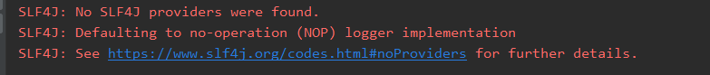
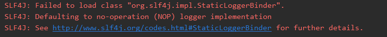
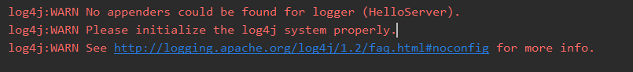
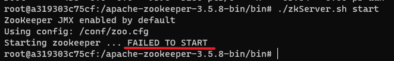
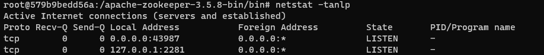
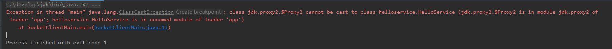
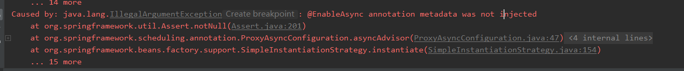

- [Slf4j 问题](#slf4j-问题)
- [curator 问题](#curator-问题)
    - [CuratorFrameworkFactory 的 builder()方法用不了](#curatorframeworkfactory-的-builder方法用不了)
- [Docker 容器中问题](#docker-容器中问题)
- [Zookeeper 问题](#zookeeper-问题)
  - [Docker中启动 Zookeeper 出错](#docker中启动-zookeeper-出错)
  - [windows 下启动 zkCli.cmd 出错](#windows-下启动-zkclicmd-出错)
- [代理问题](#代理问题)
- [spring 配置问题](#spring-配置问题)
> 1. VS code 中按 control + shift + P  
> 2. 选择Markdown All in One: Create Table of Contents     

## Slf4j 问题

<div align="center"></div> 

这是由于 slf4j 在 1.8.0 之后的机制不一样了，版本太高，将 2.0.7 调成 1.7.25。  
但是，改成 1.7.25 后又出现新的 bug

<div align="center"></div>

这个报错的意思是“加载类文件org.slf4j.impl.StaticLoggerBinder时失败”。  
官网所说的解决方法是：
> This error is reported when the org.slf4j.impl.StaticLoggerBinder class could not be loaded into memory. This happens when no appropriate SLF4J binding could be found on the class path. Placing one (and only one) of slf4j-nop.jar, slf4j-simple.jar, slf4j-log4j12.jar, slf4j-jdk14.jar or logback-classic.jar on the class path should solve the problem.

所以解决方法就是在 pom 文件中添加上述的任意一个依赖（且只能有一个）。  
之后又有了另外一个 bug。
<div align="center"></div>

解决方案：上述的依赖换了一个，从 slf4j-log4j12.jar 换成了 slf4j-simple.jar。


## curator 问题
<div align="center"></div>

这个应该是镜像的问题，换一个镜像

#### CuratorFrameworkFactory 的 builder()方法用不了
不止是 builder 方法，CuratorFrameworkFactory 的 newClient 等其余方法也都用不了，明明下载在 CuratorFrameworkFactory 类中是有该方法的。  
**这是一个菜鸟级的错误：代码直接写在了类中而没有写在方法中**


## Docker 容器中问题
- `bash: ps: command not found` ：镜像没有打包 ps 命令，使用 `apt-get update && apt-get install procps` 安装


## Zookeeper 问题
### Docker中启动 Zookeeper 出错
执行了 `./zkServer.sh start` 后出现问题：
<div align="center"></div>

这个问题通过查询   `/log` 下的日志，可以知道是因为端口绑定问题，需要配置 zoo.cfg 文件，将客户端端口和 ZooKeeper 的 Admin 服务器的端口。  
clientPort 配置项是 ZooKeeper 服务器监听客户端连接的端口。当 Curator 客户端与 ZooKeeper 服务器建立连接时，需要指定此端口以进行通信。另一方面，serverPort 配置项是 ZooKeeper 服务器用于通信的端口。该端口用于 ZooKeeper 服务器之间进行数据同步和通信。  
```cfg
clientPort=2185
admin.serverPort=8083
```
同时，单机情况下还需要将最后一行注释掉
```cfg
# server.1=localhost:2888:3888;2181
# 2181：对cline端提供服务
# 3888：选举leader使用
# 2888：集群内机器通讯使用（Leader监听此端口）
```
server.A=B：C：D：其中 A 是一个数字，表示这个是第几号服务器；B 是这个服务器的 ip 地址；C 表示的是这个服务器与集群中的 Leader 服务器交换信息的端口；D 表示的是万一集群中的 Leader 服务器挂了，需要一个端口来重新进行选举，选出一个新的 Leader，而这个端口就是用来执行选举时服务器相互通信的端口。

> Admin 服务器是 ZooKeeper 提供的一个额外的服务器，用于提供一些管理和监控功能。通过 Admin 服务器，您可以执行诸如查看节点信息、监视指标、执行诊断命令等操作。  
当您将 admin.serverPort 设置为 8083 时，ZooKeeper 的 Admin 服务器将在 8083 端口上监听请求。您可以使用 HTTP 或 HTTPS 协议连接到该端口，通过相应的接口与 ZooKeeper 进行交互。  

上面的操作做完后，仍然显示这个错误。
<div align="center"></div>

通过命令 `netstat -tanlp` 查询得知，当修改了 zoo.cfg 文件中的 clientPort 的值的时候，重启后，该端口仍然处于监听状态，且没有对应的 pid 可以杀掉。
<div align="center"></div>


### windows 下启动 zkCli.cmd 出错
因为服务端已经更改了端口号为 2281，而 `zkCli.cmd` 命令开启后一直连接不上，换为命令 `./zkCli.cmd -server 127.0.0.1:2281` 手动指定端口，即可成功连接。


## 代理问题
<div align="center"></div>

**原因在于获取代理对象时的第二个参数用法错误。**  
原来的代码中为
```java
public <T> T getProxy(Class<T> clazz) {
    return (T) Proxy.newProxyInstance(clazz.getClassLoader(), clazz.getInterfaces(), this);
}
```

本来是要获取某类中所实现的所有接口，返回值为 `Class<?>[]`，但用上面获取到的是接口的接口，所以出错了。  
**解决方法：**  
1. 用该接口的实现类去调用 `getInterfaces()`
2. `new Class[]{代理接口.class}`，如下所示：
```java
public <T> T getProxy(Class<T> clazz) {
    return (T) Proxy.newProxyInstance(clazz.getClassLoader(), new Class[]{clazz}, this);
}
```


## spring 配置问题
<div align="center"></div>

**原因**：是因为扫描到的包包括框架的内部包，导致包发生同名冲突问题。   
**解决方法**：给出具体的扫描包范围。  
**建议**：不要将各个包放在项目的 java 文件夹下，这样不好扫描，最好在 java 文件夹下再建立一个子文件夹，然后将各个包放在子文件夹下，就如路径：`java/github/myc/remoting/`。

