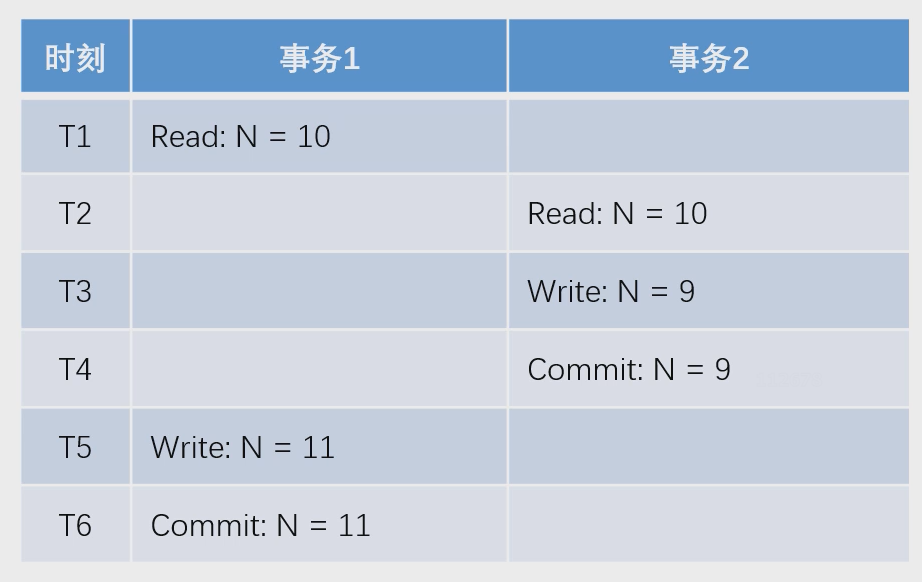
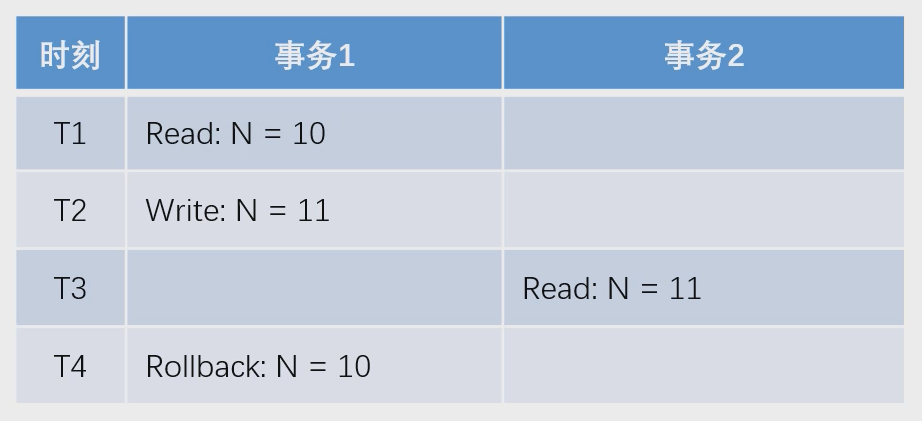
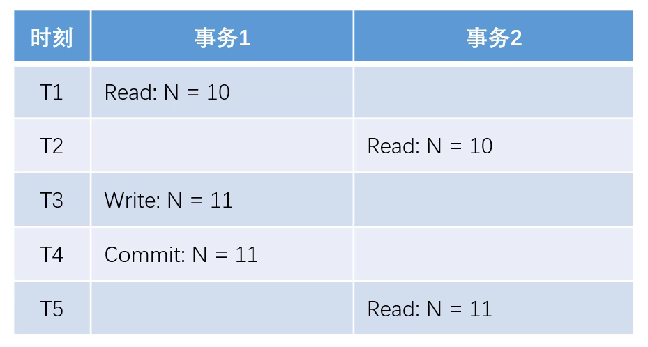
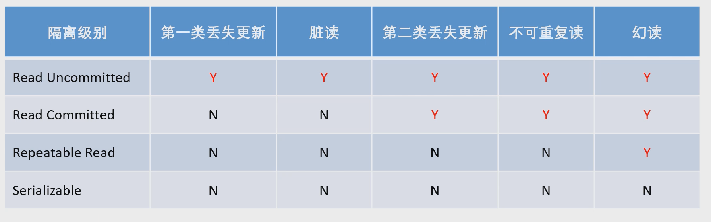

## 事务管理

### 事务

 

### 事务的隔离性

 

#### 第一类丢失更新
某一个事务的回滚，导致另外一个事务已更新的数据丢失了。  

 

#### 第二类丢失更新
某一个事务的提交，导致另外一个事务已更新的数据丢失了。  

 

#### 脏读
某一个事务，读取了另外一个事务未提交的数据。 

 

#### 不可重复读
某一个事务，对同一个数据前后读取的结果不一致。

 

#### 幻读
某一个事务，对同一个表前后查询到的**行数**不一致。

 

#### 事务隔离级别
（Y表示会出现这种异常）

 

### 数据库保障数据安全的实现机制

 

#### spring事务管理
- 声明式事务
  - 通过XML配置，声明某方法的事务特征。
  - 通过注解，声明某方法的事务特征。
- 编程式事务
  - 通过 TransactionTemplate管理事务，并通过它执行数据库的操作。

- 事务传播行为
  - REQUIRED：支持当前事务（外部事务），如果不存在则创建新事务。
  - REQUIRES_NEW：创建一个新事物，并且暂停当前事务（外部事务）。
  - NESTED：如果当前存在事务（外部事务），则嵌套在该事务中执行（独立的提交和回滚），否则就会和 REQUIRED 一样。

#### Redis事务
- 在Redis事务中，不要进行查询，因为查询只能获得事务前的结果，不能实时获得执行事务时的结果，因此是无效查询。