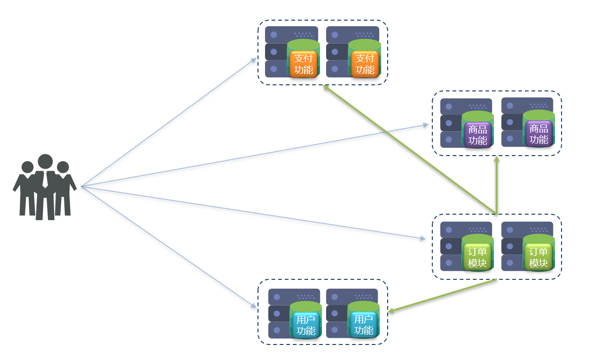

## 认识微服务

### 单体架构
单体架构：将业务的所有功能集中在一个项目中开发，打成一个包部署。   

 

优点：
- 架构简单
- 部署成本低

缺点：
- 耦合度高
- 扩展性差

### 分布式架构
分布式架构：根据业务功能对系统进行拆分，每个业务模块作为独立项目开发，称为一个服务。   

 

优点：
- 降低服务耦合
- 有利于服务升级拓展

缺点：
- 架构复杂，难度大
- 部署成本高

分布式架构的要考虑的问题：
- 服务拆分粒度如何？
- 服务集群地址如何维护？
- 服务之间如何实现远程调用？
- 服务健康状态如何感知？

### 微服务
微服务是一种经过良好架构设计的 **分布式** 架构方案，微服务架构特征：
- 单一职责：微服务拆分粒度更小，每一个服务都对应唯一的业务能力，做到单一职责，避免重复业务开发。
- 面向服务：微服务对外暴露业务接口。
- 自治：团队独立、技术独立、数据独立（每个服务可以有自己的数据库）、部署独立。
- 隔离性强：服务调用做好隔离、容错、降级，避免出现级联问题。

优点：拆分粒度更小、服务更独立、耦合度更低。   
缺点：架构非常复杂，运维、监控、部署难度提高。   

#### 微服务的架构
微服务的架构一般来说包括以下几个方面：
- 注册中心
- 配置中心
- 服务集群
- 服务网关

 

#### 几种常见微服务技术对比

 

## 服务拆分及远程调用