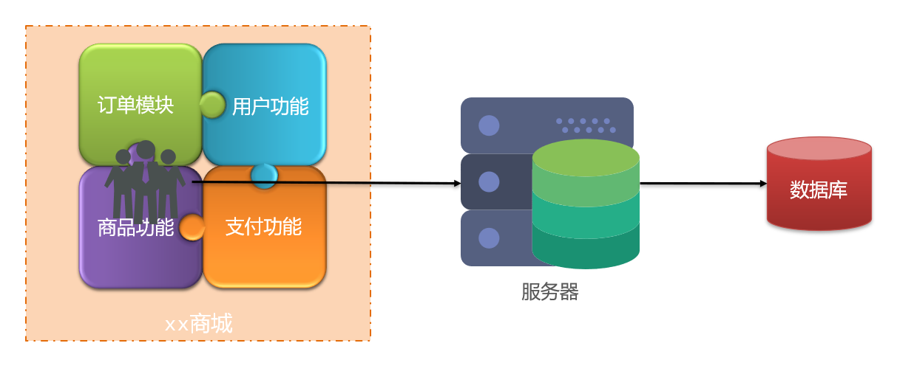
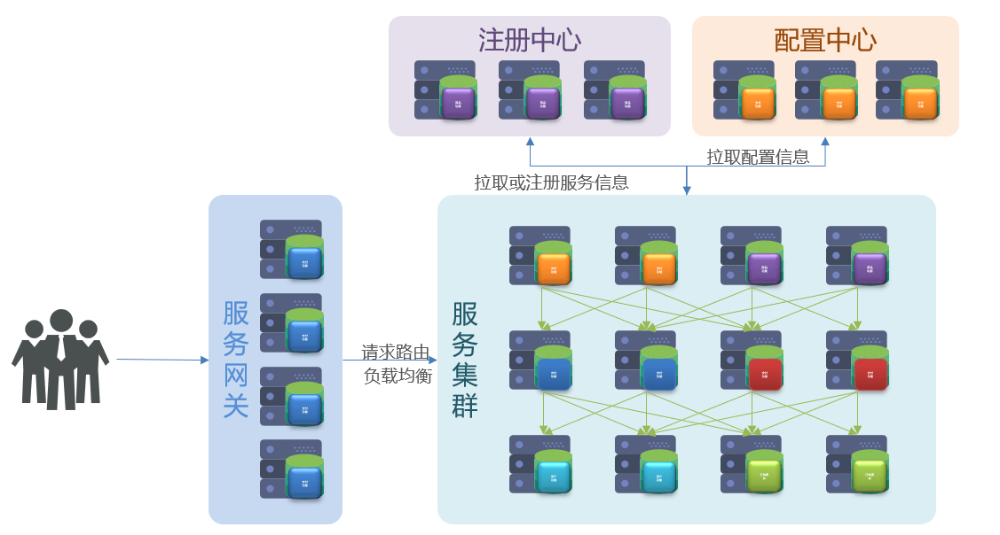
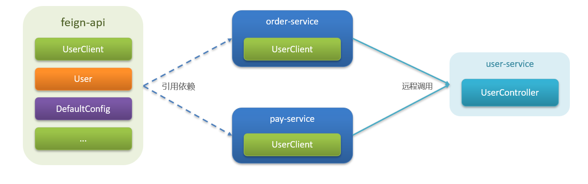
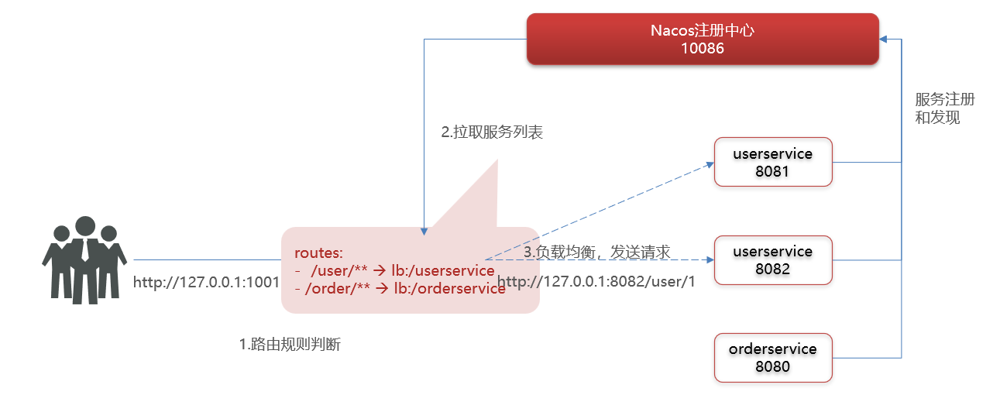
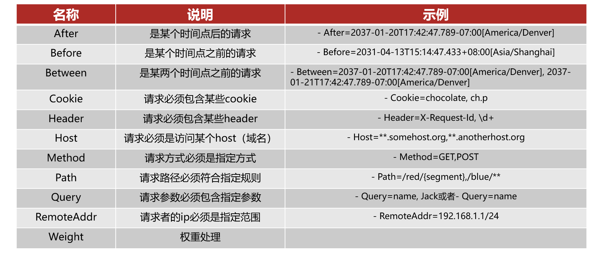

## 认识微服务

### 单体架构
单体架构：将业务的所有功能集中在一个项目中开发，打成一个包部署。   

<div align="center"></div> 

优点：
- 架构简单
- 部署成本低

缺点：
- 耦合度高
- 扩展性差

### 分布式架构
分布式架构：根据业务功能对系统进行拆分，每个业务模块作为独立项目开发，称为一个服务。   

<div align="center"></div> 

优点：
- 降低服务耦合
- 有利于服务升级拓展

缺点：
- 架构复杂，难度大
- 部署成本高

分布式架构的要考虑的问题：
- 服务拆分粒度如何？
- 服务集群地址如何维护？
- 服务之间如何实现远程调用？
- 服务健康状态如何感知？


### 微服务
微服务是一种经过良好架构设计的 **分布式** 架构方案，微服务架构特征：
- 单一职责：微服务拆分粒度更小，每一个服务都对应唯一的业务能力，做到单一职责，避免重复业务开发。
- 面向服务：微服务对外暴露业务接口。
- 自治：团队独立、技术独立、数据独立（每个服务可以有自己的数据库）、部署独立。
- 隔离性强：服务调用做好隔离、容错、降级，避免出现级联问题。

优点：拆分粒度更小、服务更独立、耦合度更低。   
缺点：架构非常复杂，运维、监控、部署难度提高。   

#### 微服务的架构
微服务的架构一般来说包括以下几个方面：
- 注册中心
- 配置中心
- 服务集群
- 服务网关

<div align="center"></div> 

#### 几种常见微服务技术对比

<div align="center"></div> 


## 服务拆分及远程调用

### 服务拆分
服务拆分注意事项：
1. 不同微服务，要做到单一职责，不要重复开发相同业务
2. 微服务数据独立，不要访问其他微服务的数据库
3. 微服务可以将自己的业务暴露为接口，供其他微服务使用

### 远程调用
远程调用的其中一种方式是基于 `RestTemplate` 发起 HTTP 请求。HTTP 请求做远程调用是与语言无关的调用，只要知道对方的 ip、端口、接口路径、请求参数即可。   

基于 `RestTemplate` 远程调用的步骤：
1. 注册 `RestTemplate`，将其注册为 bean
```java
@MapperScan("cn.itcast.order.mapper")
@SpringBootApplication
public class OrderApplication {
    public static void main(String[] args) {
        SpringApplication.run(OrderApplication.class, args);
    } 
    
    @Bean
    public RestTemplate restTemplate(){
        return new RestTemplate();
    }
}
```

2. 服务远程调用 `RestTemplate` 
```java
@Service
public class OrderService {
    @Autowired    
    private RestTemplate restTemplate;
    
    public Order queryOrderById(Long orderId) {
        // 1.查询订单        
        Order order = orderMapper.findById(orderId);        
        // TODO 2.查询用户         
        String url = "http://localhost:8081/user/" +  order.getUserId();
        // 因为是 get 查询，所以是 getForObject
        // 虽然通过 HTTP 请求返回的是 JSON 数据，但是该方法可以指定返回类型，从而自动将 JSON 转换为目标类型
        User user = restTemplate.getForObject(url, User.class);        
        // 3.封装user信息        
        order.setUser(user);        
        // 4.返回        
        return order;    
    }
}
```


## Eureka 注册中心

### 远程调用的问题
- 服务消费者应该如何获取服务提供者的地址信息？
- 如果有多个服务提供者，消费者应该如何选择？
- 消费者如何得知服务提供者的健康状态？

### Eureka 原理
消费者该如何获取服务提供者具体信息？
- 服务提供者启动时向 Eureka 注册自己的信息
- Eureka 保存这些信息
- 消费者根据服务名称向 Eureka 拉取提供者信息

如果有多个服务提供者，消费者应该如何选择？   
服务消费者可以利用负载均衡算法，从服务列表中挑选一个  

消费者如何感知服务提供者健康状态？   
- 服务提供者会每隔30秒向 EurekaServer 发送心跳请求，报告健康状态
- Eureka 会更新记录服务列表信息，心跳不正常会被剔除
- 消费者因此可以拉取到最新的信息

### 搭建 EurekaServer
搭建 EurekaServer 的服务步骤如下：
1. 创建项目，引入 `spring-cloud-starter-netflix-eureka-server` 依赖。因为 EurekaServer 本身也是一个微服务项目，这也意味着它启动时需要将自己也注册上去。
```xml
<dependency>    
    <groupId>org.springframework.cloud</groupId>    
    <artifactId>spring-cloud-starter-netflix-eureka-server</artifactId>
</dependency>
```

2. 编写启动类，添加 `@EnableEurekaServer` 注解
3. 添加 application.yml 文件，编写配置
```yml
server:
  port: 10086
spring:
  application:
    name: eurekaServer  # eureka 的服务名称
eureka:
  client:
    service-url:        # eureka 的地址信息
      defaultZone: http://127.0.0.1:10086/eureka/
```

### 服务注册
一个微服务向 Eureka 注册的步骤如下：
1. 引入 `spring-cloud-starter-netflix-eureka-client` 依赖，注意，依赖末尾是 `client`
```xml
<dependency>    
    <groupId>org.springframework.cloud</groupId>    
    <artifactId>spring-cloud-starter-netflix-eureka-client</artifactId>
</dependency>
```
2. 在 application.yml 文件中编写配置信息
```yml
spring:  
  application:   
    name: userservice      # 服务名称
eureka:  
  client:    
    service-url:            # eureka 的地址信息
      defaultZone: http://127.0.0.1:10086/eureka/
```

### 服务发现
基于 Eureka 做服务的拉取是基于服务名称获取服务列表，再对服务列表做负载均衡。   

基于 Eureka 做服务拉取的步骤如下：
1. 修改访问的 url 路径，用服务名代替 ip、端口
```java
// 原先的 url 路径
String url = "http://127.0.0.1:8080/user/" + order.getUserId();

//修改后的 url 路径
String url = "http://userservice/user/" + order.getUserId();
```

2. 在要做服务拉取的微服务中 `RestTemplate` 上添加 `@LoadBalanced` 注解;
```java
@Bean
@LoadBalanced
public RestTemplate restTemplate() {
    return new RestTemplate();
}

```


## Ribbon 负载均衡

### 负载均衡原理
<div align="center"></div> 

### 负载均衡策略
Ribbon 的负载均衡规则是一个叫做 `IRule` 的接口来定义的，每一个子接口都是一种规则：   
<div align="center"></div>

这些规则实现类的规则描述如下：   
<div align="center"></div> 

通过定义 `IRule` 的实现可以修改负载均衡策略，有两种方式：  
1. 代码方式：在 Application 启动类中，定义一个新的 `IRule` 并注册为 bean：
```java
@Bean
public IRule randomRule(){
    return new RandomRule();
}
```

2. 配置文件方式：在 application.yml 文件中，添加新的配置去修改：
```yml
userservice:    # 要实现负载均衡的某个服务的名称
  ribbon:
    NFLoadBalancerRuleClassName: com.netflix.loadbalancer.RandomRule # 负载均衡规则
```

### 懒加载
Ribbon 默认是采用懒加载，即第一次访问时才回去创建 `LoadBalanceClient`，请求时间会比较长。   
而饥饿加载则会在项目启动时创建，降低第一次访问的耗时，通过下面配置开启饥饿加载：   

```yml
ribbon:
  eager-load:
    enabled: true # 开启饥饿加载 
      clients: userservice # 指定对 userservice 这个服务饥饿加载
```


## Nacos 注册中心

### 认识 Nacos
Nacos 是阿里巴巴的产品，现在是 SpringCloud 的一个组件，相比于 Eureka 功能更加丰富，在国内受欢迎程度较高。    

Nacos 要使用前需要安装。    
安装完后需要进行端口的配置，Nacos 默认端口是 8848，若该端口已被占用，则可以修改配置文件 application.properties 中的端口。   
Nacos 的启动命令是：   
```sh
startup.cmd -m standalone   # 这个命令是单机启动的
```    

### 服务注册到 Nacos
1. 在父工程中添加 `spring-cloud-alibaba` 的管理依赖，以管理版本。    
```xml
<dependency>
    <groupId>com.alibaba.cloud</groupId>
    <artifactId>spring-cloud-alibaba-dependencies</artifactId>
    <version>2.2.6.RELEASE</version>
    <type>pom</type>
    <scope>import</scope>
</dependency>
```

2. 注释掉原有的 Eureka 依赖，因为它们可能会冲突。
3. 添加 Nacos 的客户端依赖：
```xml
<dependency>
    <groupId>com.alibaba.cloud</groupId>
    <artifactId>spring-cloud-starter-alibaba-nacos-discovery</artifactId>
</dependency>
```

4. 修改 application.yml 文件，注释 Eureka 地址，添加 Nacos 地址：
```yml
spring:
  cloud:
    nacos:
      server-addr: localhost:8848     # Nacao 服务端地址
```

### Nacos 服务分级存储模型
Nacos 服务分级存储模型有三层：
1. 一级是服务，例如 `userservice`
2. 二级是集群，例如广州集群和深圳集群
3. 三级是实例，例如广州机房中的某台部署了 userservice 的服务器。    

服务调用应尽可能选择本地集群的服务，跨集群调用延迟较高。本地集群不可访问时，再去访问其他集群。  

Nacos 修改服务所在集群的方式是修改 application.yml 文件，添加如下信息：
```yml
spring:
  cloud:
    nacos:
      server-addr: localhost:8848 # nacos 服务端地址
      discovery:
        cluster-name: GZ # 配置集群名称，也就是机房位置，例如：GZ，广州
```

### 根据集群负载均衡
在修改服务所在的集群后，需要配置负载均衡规则，才能做到优先寻找与自己同集群的服务，这个规则是 `NacosRule`。  
```yml
userservice:
  ribbon:
    NFLoadBalancerRuleClassName: com.alibaba.cloud.nacos.ribbon.NacosRule
```

`NacosRule` 负载均衡策略的选择过程如下：
1. 优先选择同集群服务实例列表
2. 本地集群找不到提供者，才去其他集群寻找，并且会报警告
3. 确定了可用实例列表之后，再采用随机负载均衡策略挑选实例。

此外，Nacos 还提供了权重配置来控制实例的访问频率，权重越大则访问频率越高，若权重为 0 则完全不会被访问。具体的配置步骤是在 Nacos 控制台选择实例进行权重编辑。  

<div align="center"></div>    


### 环境隔离 - namespace
Nacos 中服务存储和数据存储的最外层都是一个名为 namespace 的东西，用以隔离不同环境。每个 namespace 都有唯一 id，不同 namespace 下的服务互相不可见。   

步骤如下：
1. 在 Nacos 控制台创建 namespace，创建后该 namespace 会有一个唯一 id。
2. 修改具体服务中的 application.yml，给服务添加 namespace：
```yml
spring:
  cloud:
    nacos:
      discovery:
        cluster-name: GZ
        namespace: 492a7d5d-237b-46a1-a99a-fa8e98e4b0f9 # 命名空间，填ID
```

### Nacos 注册中心原理细节

<div align="center"></div>   

### 临时实例和非临时实例
服务注册到 Nacos 时，可以选择注册为临时或非临时实例，通过下面的配置来设置：  
```yml
spring:
  cloud:
    nacos:
      discovery:
        ephemeral: false    # 设置为非临时实例
```

临时实例宕机时，会从 Nacos 的服务列表中剔除，而非临时实例则不会。

### Nacos 与 Eureka 对比
Nacos 与 Eureka 共同点：
1. 都支持服务注册和服务发现
2. 都支持服务提供者心跳方式做健康检测

Nacos 与 Eureka 区别：
1. Nacos 支持服务端主动检测提供者状态：临时实例采用心跳模式，非临时实例采用主动检测模式。
2. 临时实例心跳不正常会被剔除，非临时实例则不会被剔除。
3. Nacos 支持服务列表变更的消息推送模式，服务列表更新更及时。
4. Nacos 集群默认采用 AP 方式，当集群中存在非临时实例时，采用 CP 方式；Eureka 采用 AP 方式。


## Nacos 配置管理

### 统一配置管理
Nacos 提供了统一的配置管理功能，允许开发人员集中式地管理微服务架构中的配置信息，并在需要时动态刷新，无需重启微服务。   

Nacos 统一配置管理的步骤如下：   
1. 在 Nacos 控制台添加配置信息：
<div align="center"></div>   

2. 在微服务中引入 Nacos 的配置管理客户端依赖：
```xml
<!--nacos配置管理依赖-->
<dependency>
    <groupId>com.alibaba.cloud</groupId>
    <artifactId>spring-cloud-starter-alibaba-nacos-config</artifactId>
</dependency>
```

3. 在 resource 目录中添加一个 bootstrap.yml 文件，这个文件是引导文件，优先级高于 application.yml：  
```yml
spring:
  application:
    name: userservice # 服务名称
  profiles:
    active: dev # 开发环境，这里是 dev 
  cloud:
    nacos:
      server-addr: localhost:8848 # Nacos地址
      config:
        file-extension: yaml # 文件后缀名
```

4. 将 application.yml 中原来关于这部分的配置注释掉

#### 为什么要新建一个 bootstrap.yml 文件去配置？
因为统一配置管理后，项目启动之后要先读取 Nacos 中配置文件的信息，再读取本地 application.yml 文件中的配置信息。而原来中对于 Nacos 的配置信息是在 application.yml 中，这样的话就无法在读取 Nacos 配置文件信息的时候找到 Nacos，因此要把 Nacos 配置信息放在更前的步骤中。bootstrap.yml 是引导文件，优先级更高，该文件的配置信息加载会优先于 Nacos 中统一配置文件信息的拉取。


### 配置热更新
Nacos 中的配置文件变更后，微服务无需重启就可以感知。不过需要通过下面两种配置实现：  
1. 在 `@Value` 注入的变量所在类上添加注解 `@RefreshScope`
```java
@Slf4j
@RestController
@RequestMapping("/user")
@RefreshScope
public class UserController{
    @Value("${pattern.dateformat}")
    private String dateformat;
}
```

2. 使用 `@ConfigurationProperties` 注解读取配置
```java
@Component
@Data
@ConfigurationProperties(prefix="pattern")
public class PatternProperties{
    private String dateformat;
}
```

> 注意：不是所有的配置都适合放到配置中心，维护起来比较麻烦，建议将一些关键参数，需要运行时调整的参数放到 nacos 配置中心

### 配置共享
微服务启动时会从 nacos 读取多个配置文件：
1. [spring.application.name]-[spring.profile.active].yaml，例如 userservice-dev.yaml
2. [spring.application.name].yaml，例如 userservice.yaml

无论 profile 如何变化，[spring.application.name].yaml 这个文件一定会加载，因此多环境共享配置可以写入这个文件。     

此外，不同微服务之间可以共享配置文件，通过下面的两种方式来指定：  
1. 方式一：
```yml
spring:
  cloud:
    nacos:
      config:
        shared-configs:        # 多微服务间共享的配置列表
          -dataId: common.yaml  # 要共享的配置文件
```

2. 方式二：
```yml
spring:
  cloud:
    nacos:
      config:
        extends-configs:        # 多微服务间共享的配置列表
          -dataId: common.yaml  # 要共享的配置文件
```

注意：这两种方式不支持热更新。

若多个配置中有同一个配置，那么多种配置的优先级如下：   
- 服务名称-profile.yaml > 服务名称.yaml > extension-config > shared-config > 本地配置


### 搭建 Nacos 集群
Nacos 生产环境下一定要部署为集群状态，具体步骤可以搜，这里简要介绍一下步骤：
1. 搭建 MySQL 集群并初始化数据库表，因为在集群模式下 Nacos 的配置信息等存放在数据库中
2. 下载解压 Nacos
3. 修改集群配置（节点信息）、数据库配置
4. 分别启动多个 Nacos 节点
5. nginx 负载均衡和反向代理


## http 客户端 Feign

### Feign 替代 `RestTemplate`
为什么要用 Feign 替代 `RestTemplate`？   
1. 代码可读性较差，编程体验不统一
2. 参数复杂的情况下 URL 难以维护

如下为 `RestTemplate` 发起远程调用的代码：   
```java
String url = "http://userservice/user/" + order.getUserId();
User user = restTemplate.getForObject(url, User.class);
```

Feign 是一个 **声明式** 的 HTTP 客户端，其作用就是帮助我们优雅地实现 HTTP 请求的发送，解决上面提到的问题。    

使用 Feign 的步骤如下：
1. 引入依赖：
```xml
<dependency>
    <groupId>org.springframework.cloud</groupId>
    <artifactId>spring-cloud-starter-openfeign</artifactId> 
</dependency>
```

2. 在服务的启动类添加 `@EnableFeignClients` 注解开启 Feign 的功能：
3. 编写 Feign 客户端：
```java
@FeignClient("userservice")
public interface UserClient {
    @GetMapping("/user/{id}") 
    User findById(@PathVariable("id") Long id);
}
```
它主要是基于 SpringMVC 的注解来声明远程调用的信息，比如：
   - 服务名称：`userservice`
   - 请求方式：`GET`
   - 请求路径：`/user/{id}`
   - 请求参数：`Long id`
   - 返回值类型：`User`

4. 使用 Feign 客户端中定义的方法代替 RestTemplate
```java
@Autowired
private UserClient userClient;

public Order queryOrderById(Long orderId) {
    Order order = orderMapper.findById(orderId);
    // 利用 Feign 发起 HTTP 请求，查询用户
    User user = userClient.findById(order.getUserId());
    order.setUser(user);
    return order;
}
```


### 自定义配置
Feign 运行自定义配置来覆盖默认配置，可以修改的配置如下：
<div align="center"></div>   

一般我们需要配置的就是日志级别。   

关于自定义 Feign 的配置，有两种方式：
1. 通过配置文件的方式：
```yml
feign:
  client:
    config: 
      default: # 这里用 default 就是全局配置，如果是写服务名称如 userservice，则是针对某个微服务的配置
        loggerLevel: FULL # 日志级别 
```

2. 通过 Java 代码的方式，不过需要先声明一个 Bean：
```java
public class FeignClientConfiguration {
    @Bean
    public Logger.Level feignLogLevel() {
        return Logger.Level.BASIC;
    }
}
```

   - 而后如果是全局配置，则把它放到 `@EnableFeignClients` 这个注解中：
```java
@EnableFeignClients(defaultConfiguration = FeignClientConfiguration.class) 
```

- 如果是局部配置，则把它放到 `@FeignClient` 这个注解中：
```java
@FeignClient(value = "userservice", configuration = FeignClientConfiguration.class) 
```


### Feign 性能优化
Feign 底层的客户端实现：
- URLConnection：默认实现，不支持连接池
- Apache HttpClient：支持连接池
- OKHttp：支持连接池

因此连接的重复创建会消耗大量资源，因此优化 Feign 的一个点就是使用连接池代替默认的 URLConnection。其次，FULL 和 HEADERS 的日志级别会打印大量日志，也会消耗资源，最好用 BASIC 或 NONE。   

对于连接池优化，以用 HttpClient 代替为例，步骤如下：
1. 引入依赖：
```xml
<!--httpClient的依赖 -->
<dependency>
    <groupId>io.github.openfeign</groupId>
    <artifactId>feign-httpclient</artifactId>
</dependency>
```

2. 配置连接池：
```yml
feign:
  client:
    config:
      default:                      # default全局的配置
      LoggerLevel: BASIC            # 日志级别，BASIC就是基本的请求和响应信息 
  httpclient:
    enabled: true                   # 开启feign对HttpClient的支持
    max-connections: 200            # 最大的连接数
    max-connections-per-route: 50   # 每个路径的最大连接数
```


### Feign 的最佳实践
之前使用 Feign 的缺点：
1. Feign 是在消费者端的，那么对于每一个消费者实例都要去做一个配置使用，这样相当于做了重复的开发，不好。
2. 其次，FeignClient 定义的方法要跟服务提供者提供的方法保持一致（方法名除外），不然调用不成功，也就是说，这两者是有很强的关系的，有点紧耦合的意思。

最佳实践的方式有两种：继承和抽取。   
方式一：继承。给消费者的 FeignClient 和服务提供者的 Controller 定义统一的父接口作为标准，如下所示：
<div align="center"></div>   

这种方式也有缺点：一是服务紧耦合，二是父接口参数列表中的映射不会被继承。   

方式二：抽取。将 FeignClient 抽取为独立模块，并且把接口有关的 POJO、默认的 Feign 配置都放到这个模块中，提供给所有消费者使用。   
<div align="center"></div>   

对于这种方式，其实现步骤如下：
1. 首先创建一个模块并命名，比如命名为 feign-api，然后引入 feign 的 starter 依赖。
2. 将微服务中编写的 Client、POJO 类、feign 的配置类等都复制到 feign-api 模块中。
3. 在微服务中引入 feign-api 的依赖。
4. 修改微服务中与迁移到 feign-api 中的类有关的 import 部分，改为导入 feign-api 中的包。
5. 重启服务。

由于对于 `FeignClient` 进行了迁移，因此定义的 `FeignClient` 不在 SpringBootApplication 的扫描包范围，无法创建为 bean 并注入，导致 `FeignClient` 无法使用。这种情况有两种方式可以解决：
1. 方式一：在 `@EnableFeignClients` 注解中添加 basePackages：
```java
@EnableFeignClients(basePackages = "com.helloworldyc.feign.clients")
```

1. 方式二：在 `@EnableFeignClients` 注解中添加 `clients`，指定具体 `FeignClient` 的字节码（推荐）
```java
@EnableFeignClients(clients = {UserClient.class})
```


## 统一网关 Gateway

### 为什么需要网关
并不是所有的微服务都可以由外部访问的，网关可以管理对微服务的访问权限。总的来说，就是为了更好地管理和控制微服务之间的通信。    

网关有如下功能：   
1. 路由和负载均衡：微服务架构中有多个服务，它们可能分布在不同的主机和端口上。微服务网关可以用于路由请求到相应的服务实例，并在多个实例之间进行负载均衡，确保每个服务实例都能够处理适当的请求负载。
2. 协议转换：微服务可能使用不同的通信协议或数据格式。微服务网关可以充当协议转换器，将请求从一个协议或数据格式转换为另一个，从而使不同的服务能够相互通信。
3. 安全性和认证：微服务网关可以处理认证和授权，集中管理对微服务的访问权限。通过在网关层实施安全性，可以减轻每个微服务都必须处理这些方面的负担。
4. 监控和日志：微服务网关可以集中处理日志和监控功能，记录请求和响应的信息，以便进行故障排除、性能分析和系统优化。这有助于简化微服务的监控和管理。
5. 对用户请求做限流
6. 缓存和性能优化：微服务网关可以实现请求和响应的缓存，以减轻后端微服务的负担，提高性能和响应速度。
7. 降低复杂性：微服务网关可以为客户端提供一个简化的接口，隐藏底层微服务的复杂性。这有助于客户端与微服务之间的解耦，并使系统更易于理解和维护。

在 SpringCloud 中网关的实现包括两种：gateway 和 zuul。Zuul 是基于 Servlet 的实现，属于阻塞式编程。而 SpringCloudGateway 则是基于 Spring5 中提供的 WebFlux，属于响应式编程的实现，具备更好的性能。

### gateway 快速入门
网关本质上也是一个微服务，因此需要搭建网关服务，其步骤如下：
1. 创建新的 module，引入 SpringCloudGateway 的依赖和 Nacos 的服务发现依赖：
```xml
<!--网关依赖-->
<dependency>
    <groupId>org.springframework.cloud</groupId>
    <artifactId>spring-cloud-starter-gateway</artifactId>
</dependency>

<!--nacos服务发现依赖-->
<dependency>
    <groupId>com.alibaba.cloud</groupId>
    <artifactId>spring-cloud-starter-alibaba-nacos-discovery</artifactId> 
</dependency>
```

2. 配置 application.yml，编写路由配置及 Nacos 地址
```yml
server:
  port: 10010                       # 网关端口
spring:
  application:
    name: gateway                   # 服务名称
  cloud:
    nacos:
      server-addr: localhost:8848   # nacos 地址
    gateway:
      routes:                       # 网关路由配置
        - id: user-service           # 路由 id,自定义，只要唯一即可
          # uri: http://127.0.0.1:8081# 路由的目标地址，写具体 ip 就是固定地址
          uri: lb://userservice       # 路由的目标地址，lb 就是负载均衡，后面跟服务名称，动态查询服务地址
          predicates:                 # 路由断言，也就是判断请求是否符合路由规则的条件
            - Path=/user/**            # 这个是按照路径匹配，只要以/user/开头就符合要求
```
网关路由可以配置的内容包括：
- 路由 id：路由的唯一标识，自定义，只要唯一即可。
- uri：路由目的地，支持 lb 和 http 两种。写 http 即具体 ip 就是固定地址；写 lb 就是负载均衡，后面跟服务名称，动态查询服务地址。
- predicates：路由断言，判断请求是否符合要求，符合则转发到路由目的地。
- filters：路由过滤器，处理请求或响应。


总的服务过程如下：
<div align="center"></div> 


### 路由断言工厂 Route Predicate Factory
我们在配置文件中写的断言规则只是字符串，这些字符串需要被 Predicate Factory 读取并处理，转变为路由判断的条件。   
例如，`Path=/user/**` 是按照路径匹配的，这个规则是由 `org.springframework.cloud.gateway.handler.predicate.PathRoutePredicateFactory` 类来处理的。   
像这样的断言工厂在 SpringCloudGateway 还有十几个，也就是说还有十几种断言规则，如下：   
<div align="center"></div> 


### 过滤器工厂
网关还可以用来做过滤，GatewayFilter 是网关中提供的一种过滤器，可以对进入网关的请求和微服务返回的响应做处理：   
<div align="center"></div> 

Spring 提供了 31 种不同的路由过滤器工厂，例如：
- `AddRequestHeader`：给当前请求添加一个请求头
- `RemoveRequestHeader`：移除请求中的一个请求头
- `AddResponseHeader`：给响应结果中添加一个响应头
- `RemoveResponseHeader`：从响应结果中移除一个响应头
- `RequestRateLimiter`：限制请求的流量
- ...

实现步骤为：在 gateway 中修改路由配置，给单个微服务的路由添加过滤器；如果要对所有路由都生效，则可以将过滤器工厂写到 default 下。  
```yml
server:
  port: 10010                           # 网关端口
spring:
  application:
    name: gateway                       # 服务名称
  cloud:
    nacos:
      server-addr: localhost:8848       # nacos 地址
    gateway:
      routes:                           # 网关路由配置
        - id: user-service              # 路由 id,自定义，只要唯一即可
          # uri: http://127.0.0.1:8081  # 路由的目标地址，写具体 ip 就是固定地址
          uri: lb://userservice         # 路由的目标地址，lb 就是负载均衡，后面跟服务名称，动态查询服务地址
          predicates:                   # 路由断言，也就是判断请求是否符合路由规则的条件
            - Path=/user/**             # 这个是按照路径匹配，只要以 /user/ 开头就符合要求
          filters:                      # 过滤器
            - AddRequestHeader=Fault,Itcast is freaking awesome!  # 添加请求头
        - id: order-service
          uri: lb://orderservice
          predicates:
            - Path=order/**
      default-filters:                  # 默认过滤器，会对所有的路由请求都生效
        - AddRequestHeader=Truth, Itcast is freaking awesome! # 添加请求头
```


### 全局过滤器
全局过滤器的作用也是处理一切进入网关的请求和微服务响应，与 GatewayFilter 的作用一样。   
区别在于 GatewayFilter 通过配置定义，处理逻辑是固定的。而 GlobalFilter 的逻辑需要自己写代码实现，可以自定义处理逻辑。   
定义方式是：自定义类，实现 GlobalFilter 接口，添加 `@Order` 注解或者实现 `Ordered` 接口。  
```java
// GlobalFilter 接口
public interface GlobalFilter {
    /**
     *  处理当前请求，有必要的话通过{@link GatewayFilterChain}将请求交给下一个过滤器处理
     *
     * @param exchange 请求上下文，里面可以获取Request、Response等信息
     * @param chain 用来把请求委托给下一个过滤器 
     * @return {@code Mono<Void>} 返回标示当前过滤器业务结束
     */
    Mono<Void> filter(ServerWebExchange exchange, GatewayFilterChain chain);
}

/**
 * 定义全局过滤器，拦截请求，判断请求的参数是否满足下面条件：
 * 参数中是否有authorization，
 * authorization参数值是否为admin
 * 如果同时满足则放行，否则拦截
 */
@Order(-1)
@Component
public class AuthorizeFilter implements GlobalFilter {
    @Override
    public Mono<Void> filter(ServerWebExchange exchange, GatewayFilterChain chain) {
        // 1.获取请求参数
        MultiValueMap<String, String> params = exchange.getRequest().getQueryParams();
        // 2.获取authorization参数
        String auth = params.getFirst("authorization");
        // 3.校验
        if ("admin".equals(auth)) {
            // 当前过滤器放行，到下一个过滤器或转给请求微服务
            return chain.filter(exchange);
        }
        // 4.拦截       
        // 4.1.禁止访问
        exchange.getResponse().setStatusCode(HttpStatus.FORBIDDEN);
        // 4.2.结束处理
        return exchange.getResponse().setComplete();
    }
}
```

### 过滤器执行顺序
请求进入网关会碰到三类过滤器：当前路由的过滤器、DefaultFilter、GlobalFilter。   
请求路由后，会将当前路由过滤器和 DefaultFilter、GlobalFilter，合并到一个过滤器链（集合）中，排序后依次执行每个过滤器。   

具体的排序规则是：
1. 按照每个过滤器的 order 值来排序，order 值越小，优先级越高，执行顺序越靠前
2. 当过滤器的 order 值一样时，会按照 DefaultFilter -> 当前路由过滤器 -> GlobalFilter 的顺序执行。

而过滤器的 order 值是这么确定的：
- 每一个过滤器都必须指定一个 int 类型的 order 值。
- GlobalFilter 通过实现 Ordered 接口，或者添加 `@Order` 注解来指定 order 值，由我们自己指定
- 路由过滤器和 DefaultFilter 的 order 值由 Spring 指定，每种过滤器默认是按照声明顺序从 1 递增的，因此同一种过滤器不可能出现 order 值相等的情况。


### 跨域问题处理
跨域：域名不一致就是跨域，主要包括：  
- 域名不同： www.taobao.com 和 www.taobao.org 和 www.jd.com 和 miaosha.jd.com
- 域名相同，端口不同：localhost:8080 和 localhost:8081

跨域问题：浏览器禁止请求的发起者与服务端发生跨域 ajax 请求，请求被浏览器拦截的问题。    
解决方案：CORS。也就是浏览器会去服务端询问是否允许跨域请求。   

网关处理跨域采用的同样是 CROS 方案，并且只需要简单配置即可实现：
```yml
spring:
  cloud:
    gateway:
      # 。。。
      globalcors: # 全局的跨域处理
        add-to-simple-url-handler-mapping: true # 解决 options 请求被拦截问题
        corsConfigurations:
          '[/**]':            
            allowedOrigins: # 允许哪些网站的跨域请求 
              - "http://localhost:8090"
              - "http://www.leyou.com"
            allowedMethods: # 允许的跨域 ajax 的请求方式
              - "GET"            
              - "POST"           
              - "DELETE"      
              - "PUT"
              - "OPTIONS"
            allowedHeaders: "*"     # 允许在请求中携带的头信息
            allowCredentials: true  # 是否允许携带 cookie
            maxAge: 360000          # 这次跨域检测的有效期
```


### 限流过滤器
限流：对应用服务器的请求做限制，保护服务器，避免因过多请求而导致服务器过载甚至宕机。限流算法常见的包括三种：   
- 计数器算法，又包括窗口计数器算法、滑动窗口计数器算法
- 漏桶算法(Leaky Bucket)
- 令牌桶算法（Token Bucket）

#### 限流过滤器——计数器算法
固定窗口计数器算法概念如下：
- 将时间划分为多个窗口
- 在每个窗口内每有一次请求就将计数器加一，当时间到达下一个窗口时，计数器重置
- 如果计数器超过了限制数量，则本窗口内所有请求都将被丢弃。

#### 限流过滤器——漏桶算法
漏桶算法说明：
- 将每个请求视作"水滴"放入"漏桶"进行存储；
- "漏桶"以固定速率向外"漏"出请求来执行，如果"漏桶"空了则停止"漏水”；如果"漏桶"满了则多余的"水滴"会被直接丢弃。

### 限流过滤器——令牌桶算法
令牌桶算法说明：
- 以固定的速率生成令牌，存入令牌桶中，如果令牌桶满了以后，多余令牌丢弃。
- 请求进入后，必须先尝试从桶中获取令牌，获取到令牌后才可以被处理，如果令牌桶中没有令牌，则请求等待或丢弃。

