### java 内存分配

<div align="center"></div>  


### 数组内存图

<div align="center">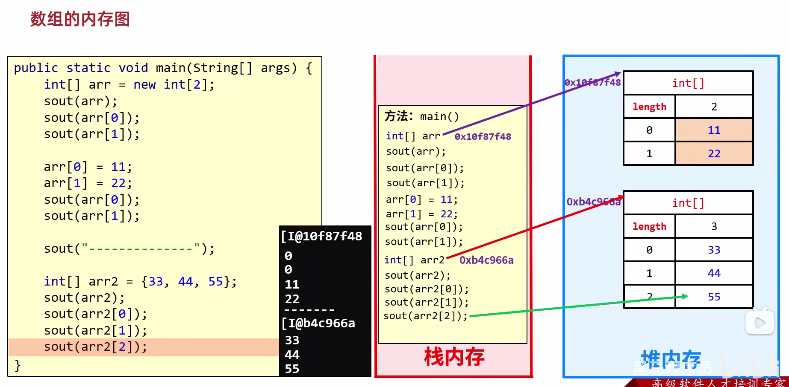</div>  

总结：
1. 只要是 new 出来的一定是在堆里面开辟了一个小空间。    
2. 如果 new 了多次，那么在堆里面有多个小空间，每个小空间中都有各自的数据。   

<div align="center">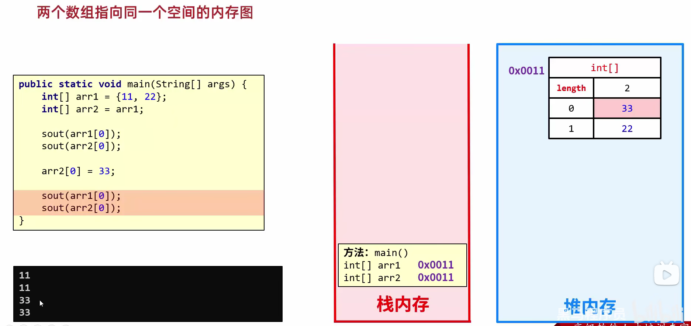</div>    

总结：当两个数组指向同一个小空间时，其中一个数组对小空间中的值发生了改变，那么其他数组再次访问的时候都是修改之后的结果了。

### 基本数据类型和引用数据类型（从内存角度解释）

<div align="center">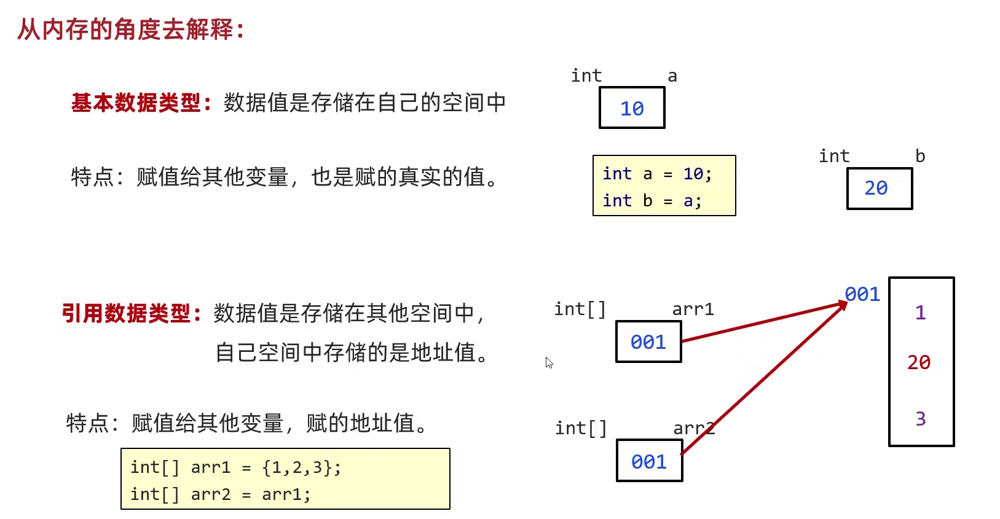</div>   

### 方法的内存
1. 方法调用的基本内存原理

<div align="center">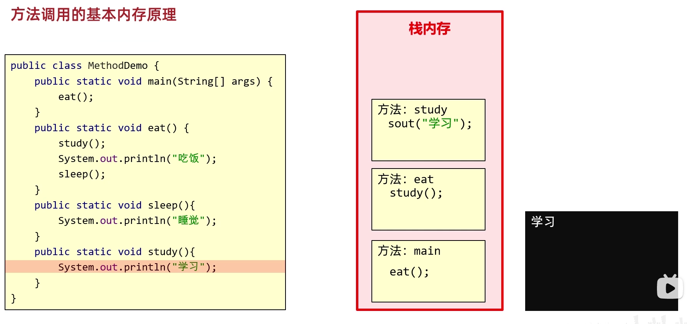</div>    
<div align="center">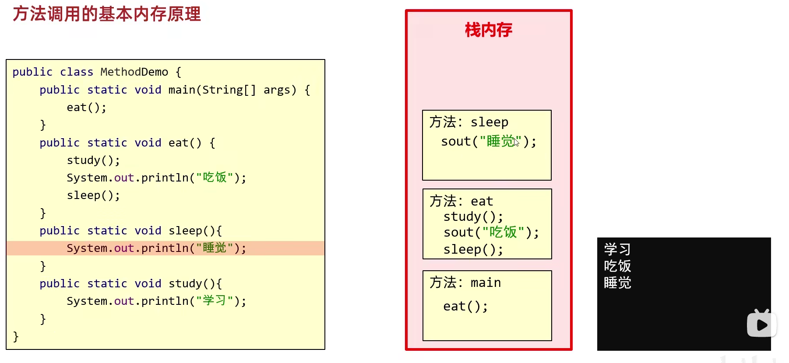</div>   

**注意：** 栈的特点是先进后出。

1. 方法传递基本数据类型的内存原理

<div align="center">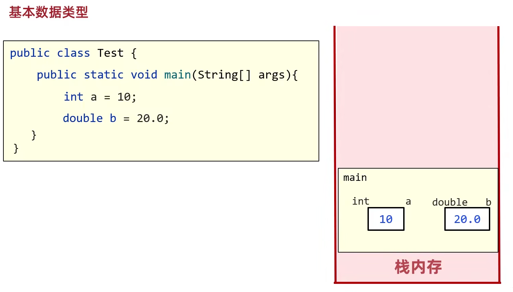</div> 

传递基本数据类型时，传递的是真实的数据，形参的改变，不影响实际参数的值。 

1. 方法传递引用数据类型的内存原理

<div align="center">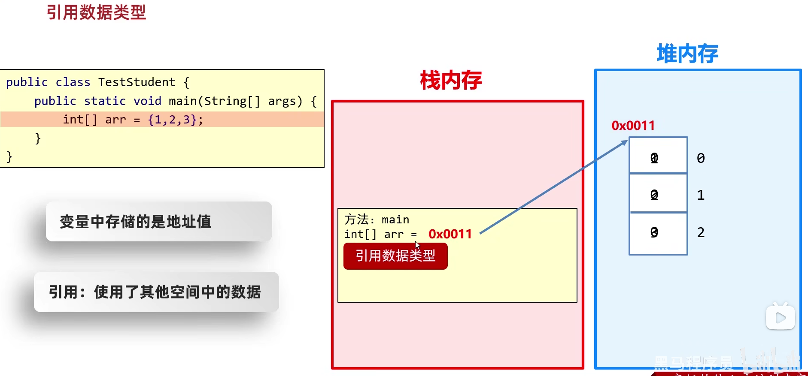</div>   

传递引用数据类型时，传递的是地址值，形参的改变，影响实际参数的值。


## 对象内存图  

### 一个对象的内存图
```java
Student s = new Student();
```

1. 加载class文件到方法区
2. 申明局部变量
3. 在堆内存中开辟一个空间
4. 默认初始化
5. 显示初始化
6. 构造方法初始化
7. 将堆内存中的地址值赋值给左边的局部变量

<div align="center">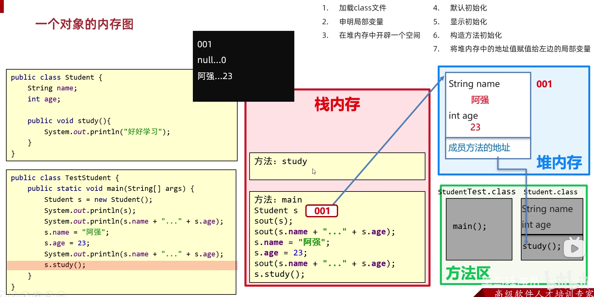</div>   

### 两个对象的内存图

<div align="center">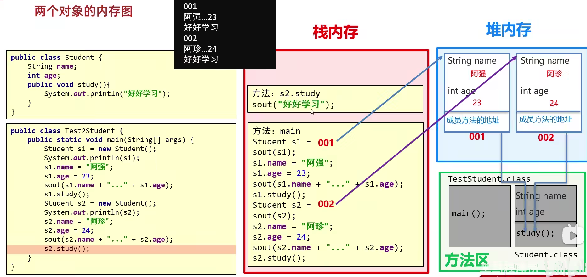</div>   

### 两个引用指向同一个对象

<div align="center">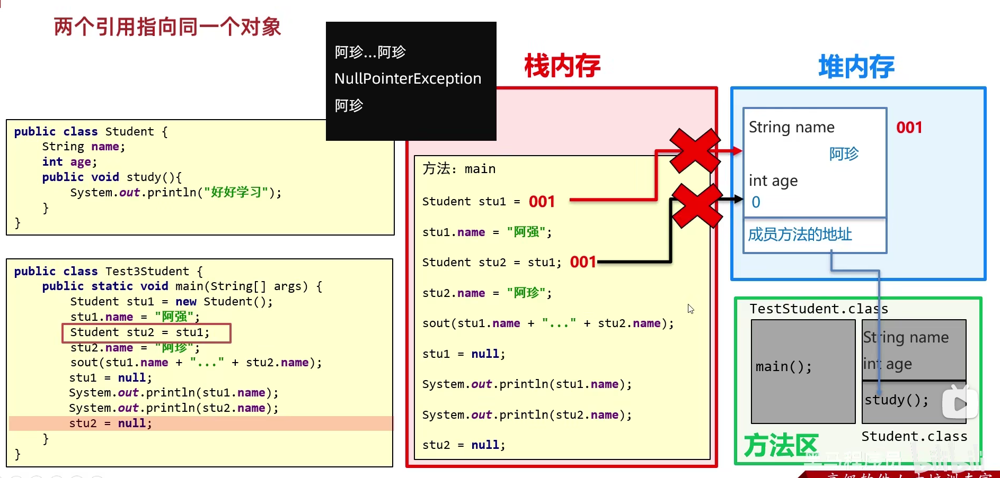</div>   

### this的内存原理

- this的作用：区分局部变量和成员变量
- this的本质：所在方法调用者的地址值

<div align="center">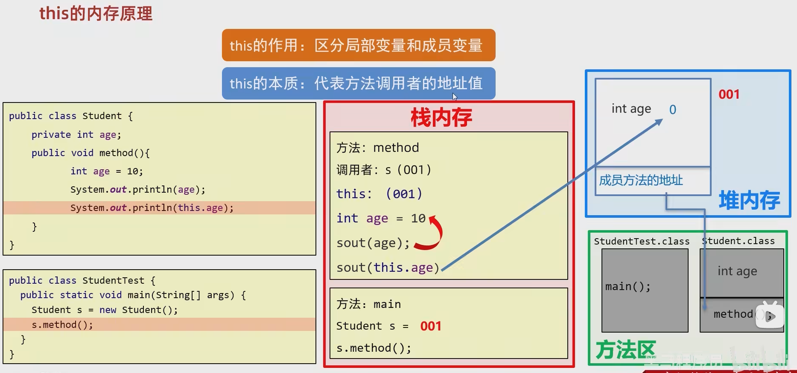</div>   
<div align="center">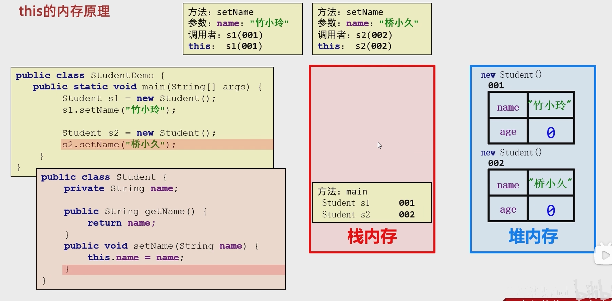</div>  


### static 内存图

<div align="left">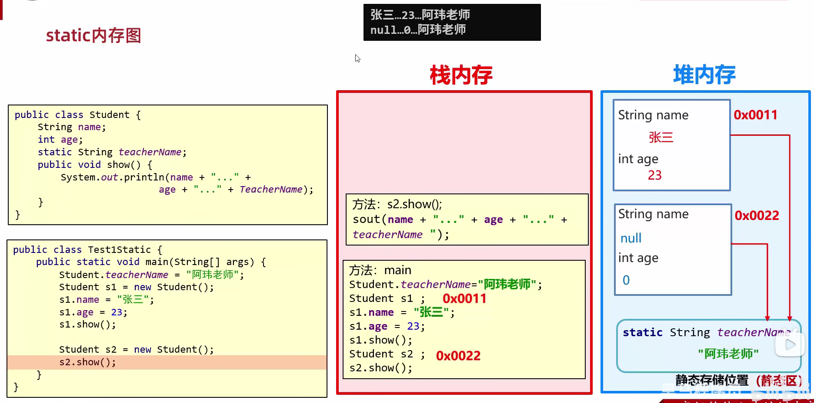</div> 


### 继承的内存图

- 没有private**成员变量**继承的内存图

<div align="left">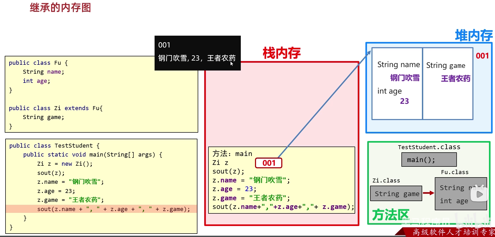</div> 

- 有private**成员方法**继承的内存图

<div align="left">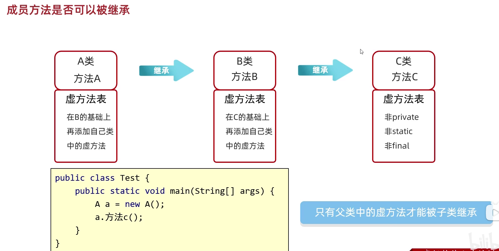</div> 
<div align="left">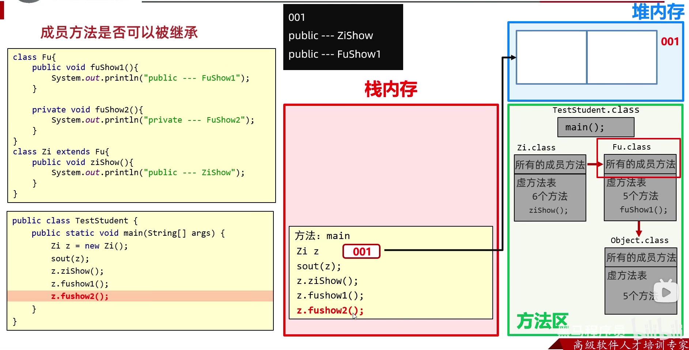</div> 

- **虚方法表中的成员方法可以被继承，不在表中的成员方法不能被继承**