### \t 制表符  
- 作用：在打印的时候，把前面字符串的长度补齐到8，或者8的整数倍。最少补1个空格，最多补8个空格。

### null  
- 在打印时不能直接打印，要以字符串的形式打印。

### 任意进制转十进制
- 公式：系数*基数的权次幂 相加
  - 系数：当前的进制数
  - 基数：当前进制数
  - 权：从右往左，依次为 0 1 2 3 4 5 …

### 十进制转任意进制
- 除基取余法
  - 不断地除以基数（几进制，基数就是几）得到余数，直到商为0，再将余数倒着拼起来即可。

### float的数值范围比long大
- 原因：float类型数字在计算机中用4个字节存储。遵循IEEE-754格式标准：         一个浮点数有2部分组成：底数m和指数e  底数部分 使用二进制数来表示此浮点数的实际值 指数部分 占用8bit的二进制数，可表示数值范围为0-255  但是指数可正可负，所以，IEEE规定，此处算出的次方必须减去127才是真正的指数。         所以，float类型的指数可从-126到128  底数部分实际是占用24bit的一个值，但是最高位始终为1，所以，最高位省去不存储，在存储中占23bit         科学计数法。  格式： SEEE EEEE EMMM MMMM MMMM MMMM MMMM MMMM S表示浮点数正负     E指数加上127后的值得二进制数据 M底数  举例： 17.625在内存中的存储  首先要把17.625换算成二进制：10001.101          整数部分，除以2，直到商为0，余数反转。         小数部分，乘以2，直到乘位0，进位顺序取。  在将10001.101右移，直到小数点前只剩1位：         1.0001101 * 2^4 因为右移动了四位  这个时候，我们的底数和指数就出来了 底数：因为小数点前必为1，所以IEEE规定只记录小数点后的就好。所以，此处的底数为：0001101 指数：实际为4，必须加上127(转出的时候，减去127)，所以为131。也就是10000011 符号部分是整数，所以是0 综上所述，17.625在内存中的存储格式是： 01000001 10001101 00000000 00000000

### 原码
- 原码：十进制数据的二进制表现形式，最左边是符号位，0为正，1为负。

### 反码
- 目的：为了解决原码不能计算负数的问题而出现的。
- 计算规则：正数的补码反码是其本身，负数的反码是符号位保持不变，其余位取反，0变1，1变0。
- 弊端：负数运算时，如果结果不跨0，没有任何问题，但是如果结果跨0，跟实际结果会有1的偏差。

### 补码
- 目的：为了解决负数计算时跨0的问题而出现的。
- 计算规则：正数的补码是其本身，负数的补码是在其反码的基础上+1。另外，补码还能多记录一个特殊的值-128，该数据在1个字节下，没有原码和反码（因此一个字节的取值范围为-128~127）。
- 注意点：计算机中的存储和计算都是以补码的形式进行的。因为CPU只会做加法运算，数的补码形式可以用加法实现减法运算。

### 其他运算符
<div align="center"></div>

### for 和 while 的对比
- 相同点：运行规则都是一样的
- 区别：
  - for循环中，控制循环的变量，因为归属于for循环的语法结构中，在for循环结束后，就不能再次被访问到了。
  - while循环中，控制循环的变量，对于while循环来说不归属其语法结构中，在while循环结束后，该变量还可以继续使用。
- 注意：循环的条件判断语句中条件不能随循环而变，一定要是确定的。

### return 和 break 关键字的区别
- return：跟循环没有什么关系，跟方法有关，表示 1 结束方法 2 返回结果。如果方法执行到了return，那么整个方法全部结束，里面的循环也会随之结束了。
- break：跟方法没有什么关系，表示结束循环或 switch。

### java 内存分配
<div align="center"></div>  


### 数组内存图
<div align="center"></div>  

总结：
1. 只要是 new 出来的一定是在堆里面开辟了一个小空间。    
2. 如果 new 了多次，那么在堆里面有多个小空间，每个小空间中都有各自的数据。   

<div align="center">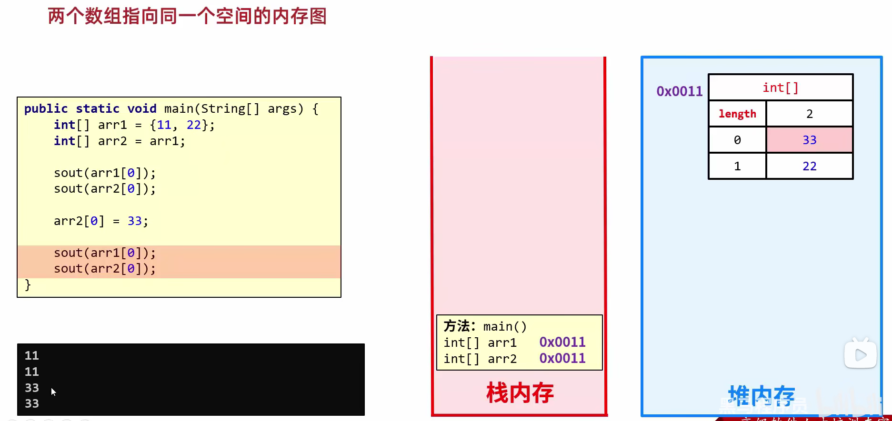</div>    

总结：当两个数组指向同一个小空间时，其中一个数组对小空间中的值发生了改变，那么其他数组再次访问的时候都是修改之后的结果了。

### 基本数据类型和引用数据类型（从内存角度解释）
<div align="center">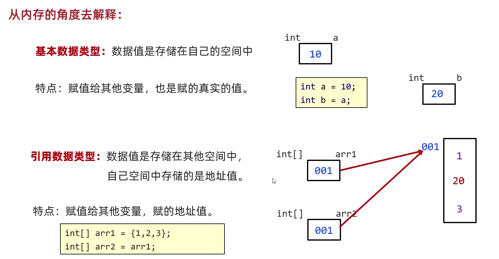</div>   

### 方法的内存
1. 方法调用的基本内存原理
<div align="center">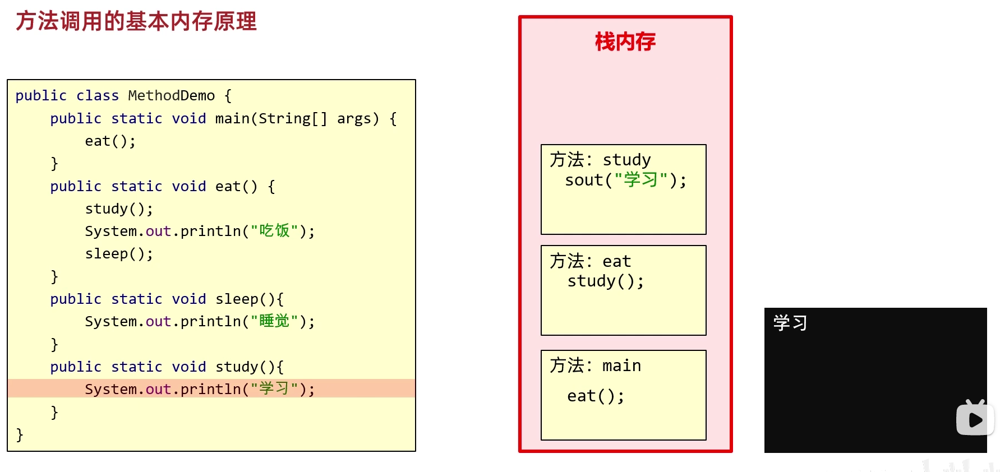</div>    
<div align="center"></div>   

**注意：**：栈的特点是先进后出。

2. 方法传递基本数据类型的内存原理
<div align="center"></div>  
传递基本数据类型时，传递的是真实的数据，形参的改变，不影响实际参数的值。 

3. 方法传递引用数据类型的内存原理
<div align="center">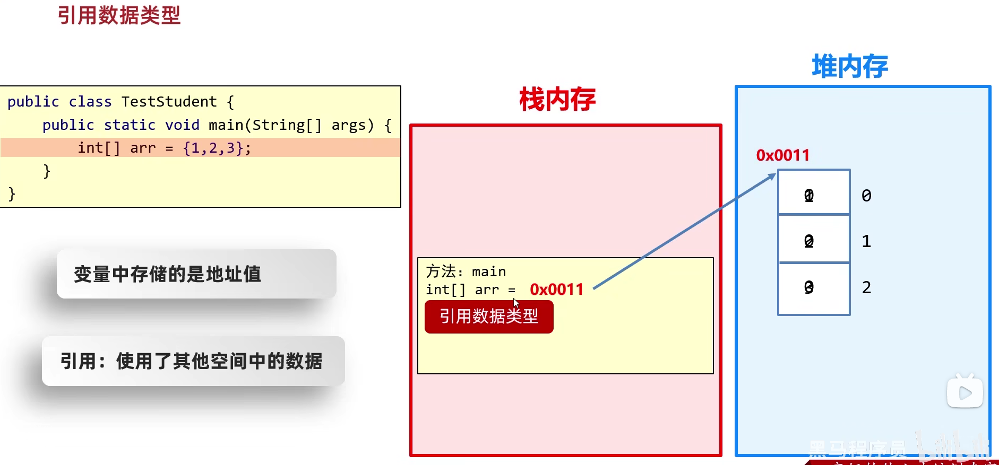</div>   
传递引用数据类型时，传递的是地址值，形参的改变，影响实际参数的值。


### 定义类的补充注意事项
- 用来描述一类事物的类，专业叫做：**Javabean类**。  
在Javabean类中，是不写main方法的。

- 在之前，编写有main方法的类，叫做 **测试类**。  
我们可以在测试类中创建javabean类的对象并进行赋值调用。

- 类名首字母建议大写，需要见名知意，驼峰模式。
- 一个java文件中可以定义多个class类，且只能一个类是public修饰，而且public修饰的类名必须成为代码文件名。**实际开发中建议还是一个文件定义一个class类**。
- 成员变量的完整定义格式是：**`修饰符 数据类型 变量名称 = 初始化值;`** 一般无需指定初始化值，存在默认值。

### 就近原则

```java
System.out.println(age);
System.out.println(this.age); //this的作用：可以区分成员变量和局部变量
```

### 构造方法
- 格式

```java
public class 类名 {
  修饰符 类名(参数) {
    方法体;
  }
}
```

- 特点：
  1. 方法名与类名相同，大小写也要一致
  2. 没有返回值类型，连void都没有
  3. 没有具体的返回值（不能由return带回结果数据）

- 执行时机
  1. 创建对象的时候由虚拟机调用，不能手动调用构造方法
  2. 每创建一次对象，就会调用一次构造方法


## 对象内存图  

### 一个对象的内存图
```java
Student s = new Student();
```
1. 加载class文件到方法区
2. 申明局部变量
3. 在堆内存中开辟一个空间
4. 默认初始化
5. 显示初始化
6. 构造方法初始化
7. 将堆内存中的地址值赋值给左边的局部变量

<div align="center"></div>   

### 两个对象的内存图
<div align="center"></div>   

### 两个引用指向同一个对象
<div align="center"></div>   

### this的内存原理
- this的作用：区分局部变量和成员变量
- this的本质：所在方法调用者的地址值
<div align="center"></div>   
<div align="center"></div>  

### 成员变量和局部变量的区别
 <div align="center"></div>  

### 键盘录入
```java
//第一套体系：遇到空格、制表符、回车就停止接收，这些符号后面的数据就不会接收了
nextInt();      //接收整数
nextDouble();   //接收小数
next();         //接收字符串 

//第二套体系：遇到回车才停止
nextLine();     //接收字符串
```

### StringBuilder 类
StringBuilder 是 java 已经写好的类，java 在底层对其做了一些特殊处理，打印对象不是地址值而是属性值。

## 字符串原理

### 字符串存储的内存原理
- 直接赋值会复用字符串常量池中的
- new 出来的不会复用，而是开辟一个新的空间

### ==号比较的是什么
- 基本数据类型比较数据值
- 引用数据类型比较地址值

### 字符串拼接的底层原理
- 等号右边没有变量参与拼接时
 <div align="center"></div>  

- 等号右边有变量参与拼接时(JDK7及JDK7以前)
<div align="center">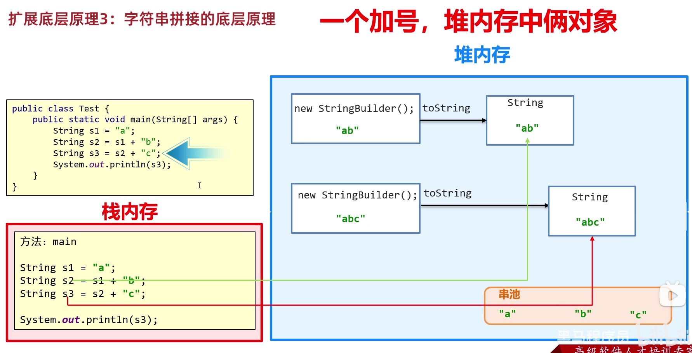</div> 

在JDK8以后进行字符串拼接时，程序先预估需要拼接的字符串的长度创建了一个数组来存储，最后再将数组变为字符串。    
结论：
- 如果没有变量参与，都是字符串直接相加，编译之后就是拼接之后的结果，会复用串池中的字符串
- 如果有变量参与，每一行拼接的代码，都会在内存中创建新的字符串，浪费内存  

建议：如果很多字符串变量拼接，不要直接+。在底层会创建多个对象，浪费时间，浪费性能。

### StringBuilder 提高效率原理图
<div align="center"></div> 

- 所有要拼接的内容都会往StringBuilder中放，不会创建很多无用的空间，节约内存

<div align="center"></div> 
<div align="center"></div> 

### StringBuilder源码分析
<div align="left"></div> 


### static
- 内存图
<div align="left">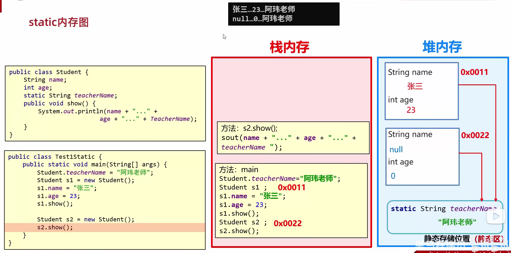</div> 

- 注意事项：
  - 静态方法只能访问静态变量和静态方法
  - 非静态方法可以访问静态变量或者静态方法，也可以访问非静态的成员变量和非静态的成员方法
  - 静态方法中是没有this关键字

### 三种类
- JavaBean类： 用来描述一类事物的类。比如，Student,Teacher,Dog,Cat等
- 测试类：用来检查其他类是否书写正确，带有main方法的类，是程序的入口
- 工具类：不是用来描述一类事物的，而是帮我们做一些事情的类。  
工具类构造时要：1.类名见名知义；2.私有化构造方法；3.方法定义为静态；

### 继承
1. Java只能单继承：一个类只能继承一个直接父类；
2. Java不支持多继承、但是支持多层继承。
3. Java中所有的类都直接或者间接继承于Object类。（即Object类是所有类的原始父类）
4. 子类只能访问父类中非私有的成员。

- 没有private**成员变量**继承的内存图
<div align="left"></div> 

- 有private**成员方法**继承的内存图
<div align="left"></div> 
<div align="left"></div> 

- **虚方法表中的成员方法可以被继承，不在表中的成员方法不能被继承**

- 继承中成员变量访问特点：**就近原则**  
先在局部位置找，本类成员位置找，父类成员位置找，逐级往上

- 若出现了重名的成员变量：
```java
System.out.println(name); //从局部位置开始往上找
System.out.println(this.name);//从本类成员位置开始往上找
System.out.println(super.name);//从父类成员位置开始往上找
```

- 方法重写的本质
<div align="left"></div> 


### 代码块
- 局部代码块(已淘汰)  
作用：提前结束变量的生命周期，节省空间
- 构造代码块（不够灵活）  
  - 写在成员位置的代码块
  - 作用：可以把多个构造方法中重复的代码抽取出来
  - 执行时机：再创建本类对象的时候会先执行构造代码块再执行构造方法
- 静态代码块（重点掌握）
  - 格式：static{}
  - 特点：需要通过static关键字修饰，随着类的加载而加载，并且自动触发、只执行一次
  - 作用：数据的初始化


### 多态
格式：父类类型 变量名 = new 子类类型
- 调用成员变量时：**编译看左边，运行看左边**  
编译看左边：javac编译代码的时候，会看左边的父类中有没有这个变量，如果有，编译成功，如果没有编译失败。  
运行看左边：java运行代码的时候，实际获取的就是左边父类中成员变量的值。

- 调用成员方法时：**编译看左边，运行看右边**  
编译看左边：javac编译代码的时候，会看左边的父类中有没有这个变量，如果有，编译成功，如果没有编译失败。
运行看右边：java运行代码的时候，实际上运行的是子类中的方法。

- 能调用哪些方法，由引用类型决定，具体执行情况，由实际内存对象类型决定

- java执行方法时，会根据引用的类型得到相应的方法，如果不存在编译时会报错，真正执行时，会动态去匹配，如果真正的对象是子类的话，且此方法在子类中被覆盖的话，就会执行子类方法。   
java类型匹配时，如果不能匹配的话就做向上类型转换，转换为父类，直到能够匹配为止，若一直不能匹配在编译时会报错

### 接口
- **JDK7以前**：接口中只能定义抽象方法。
- **JDK8的新特性**：接口中可以定义有方法体的方法。（默认方法、静态方法）
- **JDK9的新特性**：接口中可以定义私有方法。

#### JDK8以后接口中新增的默认方法
- 允许在接口中定义默认方法，需要使用关键字default修饰。  
  作用：解决接口升级的问题

- 接口中**默认方法**的定义格式：
  - 格式：`public default 返回值类型 方法名（参数列表）{}`
  - 范例：`public default void show() {}`

- 接口中默认方法的注意事项：
  - 默认方法不是抽象方法，所以不强制被重写。但是如果被重写，重写的时候去掉default关键字。
  - public 可以省略，default 不能省略。
  - 如果实现了多个接口，多个接口中存在相同名字的默认方法，子类就必须对该方法进行重写。

#### JDK8以后接口中新增的静态方法
- 允许在接口中定义静态方法，需要用 static 修饰
- 接口中**静态方法**的定义格式：
  - 格式：`public static 返回值类型 方法名（参数列表）`
  - 范例：`public static void show(){}`

- 接口中静态方法的注意事项：
  - 静态方法只能通过接口名调用，不能通过实现类名或者对象名调用
  - public 可以省略，static 不能省略

#### JDK9以后接口中新增的私有方法
**此方法只为接口提供服务，不需要外类访问**
- 接口中私有方法的定义格式：
  - 格式1：`private 返回值类型 方法名（参数列表）{}`  
    范例1：`private void show(){} //普通的私有方法，给默认方法服务的`
  - 格式2：`private static 返回值类型 方法名 （参数列表）{}`  
    范例2：`private static void method(){} //静态的私有方法，给静态方法服务的`

#### 接口的应用
- 接口代表规则，是行为的抽象。想要让哪个类拥有一个行为，就让这个类实现对应的接口就可以了。
- 当一个方法的参数是接口时，可以传递接口所有实现类的对象，这种方式称之为接口多态。

### 适配器设计模式
- 设计模式（Design pattern）是一套被反复使用、多数人知晓的、经过分类编目的、代码设计经验的总结。  
  使用设计模式是为了可重用代码、让代码更容易被他人理解、保证代码可靠性、程序的重用性。  
  **简单理解：设计模式就是各种套路。**
- 适配器设计模式：解决接口与接口实现类之间的矛盾问题。
- 当一个接口中抽象方法过多，但是只要使用其中一部分的时候，就可以使用适配器设计模式
- 书写步骤：  
  编写中间类XXXAdapter，实现对应的接口  
  对接口中的抽象方法进行空实现
  让真正的实现类继承中间类，并重写需要用的方法
  为了避免其他类创建适配器类的对象，中间的适配器类用 abstract 进行修饰


### 内部类
类的五大成员：属性、方法、构造方法、代码块、内部类  
内部类的访问特点：
- 内部类可以直接访问外部类的成员，包括私有
- 外部类要访问内部类的成员，必须创建对象

## 常用API
### System
- 也是一个工具类，提供了一些与系统相关的方法
- 时间原点：1970年1月1日 0:0:0，我国在东八区，有8小时时差，因此原点为1970年1月1日 8:0:0
- 1秒 = 1000 毫秒
- 常见方法
  - exit：停止虚拟机
  - currentTimeMillis：过去当前时间的毫秒值
  - arraycopy：拷贝数组

### Runtime
表示当前虚拟机的运行环境，是一个类但不能直接建立对象，要用 getRuntime 获取.
```java
public static Runtime getRuntime() //当前系统的运行环境对象
public void exit(int status)       //停止虚拟机
public int availableProcessors()   //获得CPU的线程数
public long maxMemory()            //JVM能从系统钟获取总内存大小（单位byte）
public long totalMemory()          //JVM已经从系统中获取总内存大小（单位byte）
public long freeMemory()           //JVM剩余内存大小（单位byte）
public Process exec(String command)//运行 cmd 命令
```

## 正则表达式
### 捕获分组（默认）
可以获取每组中的内容反复使用，以左括号为基准，最左边的是第一组  
后续还要继续使用本组的数据：  
- 正则内部使用：\\组号  
- 正则外部使用：$组号

### 非捕获分组
特点：不占用组号
<div align="left"></div> 


## Lambda表达式（JDK8后）
- 函数式编程（Functional programming）是一种思想特点，忽略面向对象的复杂语法，强调做什么，而不是谁去做。Lambda表达式就是函数式思想的体现。
- 面向对象：先找对象，让对象做事情 
- 注意点：
  - Lambda表达式可以用来简化匿名内部类的书写
  - Lambda表达式只能简化函数式接口的匿名内部类的写法
  - 函数式接口：有且仅有一个抽象方法的接口叫做函数式接口，接口上方可以加@FunctionalInterface注解
- Lambda的省略规则：
  - 1.参数类型可以省略不写
  - 2.如果只有一个参数，参数类型可以省略，同时()也可以省略
  - 3.如果Lambda表达式的方法体只有一行，大括号，分号，return可以省略不写，需要同时省略。

```java
()->{
}
```

## 集合
### 单列集合体系结构
<div align="left">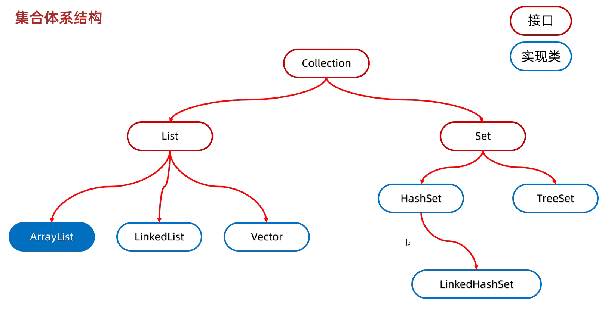</div> 

- List系列集合：添加的元素是有序的（指存和取的顺序一样）、可重复的、有索引的。  
- Set系列集合：添加的元素是无序（指存和取的顺序不一定一样）、不重复、无索引（不能通过索引获取元素）。  

Collection：Collection是单列集合的祖宗**接口**，它的功能是全部单列集合都可以继承使用的。
<div align="left"></div> 

- Collection集合遍历方式
  - 迭代器遍历：在遍历过程中需要删除元素，请使用迭代器
  - 增强for遍历：仅仅想遍历
  - Lambda表达式遍历：仅仅想遍历

### 迭代器遍历
<div align="left"></div> 

- 1.当强行获取超出索引的元素，会报错NoSuchElementException
- 2.迭代器遍历完毕，指针不会复位
- 3.循环中只能用一次next方法
- 4.迭代器遍历集合时不依赖索引，不能用集合的方法进行增加或者删除，删除可以用迭代器提供的方法remove()进行删除

### 增强for遍历
- 增强for的底层就是迭代器，为了简化迭代器的代码书写的。
- 它是JDK5之后才出现的，其内部原理就是一个Iterator迭代器
- 所有的单列集合和数组才能用增强for进行遍历，双列集合不能用增强for遍历

```java
for (元素的数据类型 变量名 : 数组或者集合){
}

for(String s : list){
  System.out.println(s);
}
``` 
- 增强for细节：
  - 修改增强for中的第三方变量，不会改变集合中原本的数据。


### Lambda表达式遍历
```java
default void forEach(Consumer<? super T> action)

coll.forEach(new Consumer<String>(){
  @Override
  public void accept(String s){
    System.out.println(s);
  }
});
// Lambda表达式形式
coll.forEach(s -> System.out.println(s));

/*forEach底层原理：遍历集合，依次得到每一个元素，把得到的每一个元素，传递给accept方法，s依次表示集合中的每一个数据*/
```
 
### List集合
- 有序：存和取的元素顺序一致
- 有索引：可以通过索引操作元素
- 可重复：存储的元素可以重复
- Collection的方法List都继承了
- List集合因为有索引，所以多了很多索引操作的方法

<div align="left">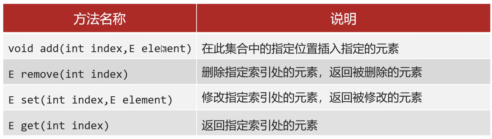</div> 

**注意：在调用方法时，如果方法出现了重载现象，优先调用实参和形参类型一致的那个方法**

List集合有五种遍历方式：
- 迭代器：在遍历过程中需要删除元素，请使用迭代器
- 列表迭代器（ListIterator，属于Iterator的子接口，add方法可以在遍历过程中添加元素）：在遍历过程中需要添加元素，请使用列表迭代器
- 增强for：仅仅想遍历
- Lambda表达式：仅仅想遍历
- 普通for（结合size方法和get方法以及循环）：遍历时想操作索引，可以用普通for

### ArrayList集合
<div align="left">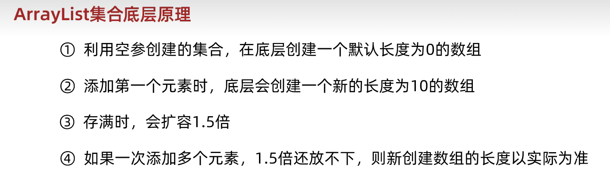</div>  

其中变量size既表示集合中元素的个数，也表示下一个元素应存储的位置。    
- ArrayList底层第一次扩容的情况。
<div align="left"></div>  
- ArrayList底层后续扩容的情况
<div align="left">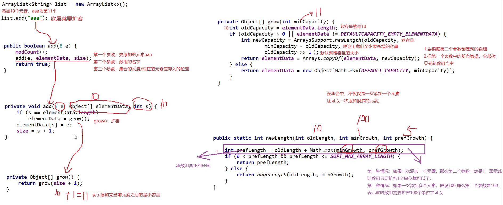</div>  

### LinkedList集合
- 底层数据结构是**双链表**，查询慢，增删快，但是如果操作的是首尾元素，速度也是极快的。
- LinkedList本身多了很多直接操作**首尾元素**的特有API。
<div align="left"></div>  
<div align="left"></div>  

### 迭代器底层源码分析
<div align="left"></div>  


### Set集合的实现类
- HashSet：无序、不重复、无索引
- LinkedHashSet：**有序**、不重复、无索引
- TreeSet：**可排序**、不重复、无索引

**Set接口中的方法上基本上与Collection的API一致。**

### HashSet底层原理
- HashSet：无序、不重复、无索引
- HashSet集合底层采取**哈希表**存储数据
- 哈希表是一种对于增删改查数据性能都较好的结构
- 哈希表组成
  - JDK8以前：**数组+链表**
  - JDK8开始：**数组+链表+红黑树**
- **哈希值**：对象的整数表现形式
  - 根据hashCode方法计算出来的int类型的整数
  - 该方法定义在Object类中，所有对象都可以调用，默认使用地址值进行计算
  - 一般情况下，会重写hashCode方法，利用对象内部的属性值计算哈希值
- 对象的哈希值特点：
  - 如果没有重写hashCode方法，不同对象计算出的哈希值是不同的，因为地址不同
  - 如果已经重写了hashCode方法，不同的对象只要属性值相同，计算出的哈希值就是一样的
  - 在小部分情况下，不同的属性值或者不同的地址值计算出来的哈希值也有可能是一样的（哈希碰撞）
<div align="center"></div>  

细节：
- JDK8以后，当链表长度**超过8**，而且数组长度**大于等于64**时，自动转换为红黑树
- 如果集合中存储的是自定义对象，必须要重写**hashCode**和**equals**方法

总结：
- 1. HashSet集合的底层数据结构是什么样的？
- 2. HashSet添加元素的过程？
- 3. HashSet为什么存和取的顺序不一样？
- 4. HashSet为什么没有索引？
- 5. HashSet是利用什么机制保证去重的？

### LinkedHashSet底层原理
- LinkedHashSet：**有序**、不重复、无索引
<div align="left"></div>  

### TreeSet
- TreeSet：**可排序**、不重复、无索引
- **可排序**：按照元素的默认规则（由小到大）排序。
- TreeSet集合底层是基于**红黑树的数据结构**实现排序的，增删改查性能都较好。
- 默认的规则
  - 对于数值类型：Integer，Double，默认按照从小到大的顺序进行排序
  - 对于字符、字符串类型：按照字符在ASCII码表中的数字升序进行排序
  - 对于自定义引用数据类型，有两种比较方式：
    - 方式一：**默认排序/自然排序**：Javabean类实现Comparable接口指定比较规则
    - 方式二：**比较器排序**：创建TreeSet对象时候，传递比较器Comparator指定规则
    - **使用原则**：默认使用第一种，如果第一种不能满足当前需求，就使用第二种
    - 注意：若方式一和方式二同时存在，运行时以方式二为准
  - 方法返回值的特点：
    - 负数：表示当前要添加的元素是小的，存左边
    - 正数：表示当前要添加的元素是大的，存右边
    - 0：表示当前要添加的元素已经存在，舍弃
<div align="left"></div>  

## 数据结构
<div align="left"></div> 

### 栈
栈的特点：**后进先出，先进后出**  
数据进入栈模型的过程称为：**压/进栈**  
数据离开栈模型的过程称为：**弹/出栈**

### 队列
队列的特点：**先进先出，后进后出**  
数据从**后端**进入队列模型的过程称为：**入队列**  
数据从**前端**离开队列模型的过程称为：**出队列**  

### 数组
数组的特点：数组是一种**查询快，增删慢**的模型
- **查询速度快**：查询数据通过地址值和索引定位，查询任意数据耗时相同。（元素在内存中是连续存储的）
- **删除效率低**：要将原始数据删除，同时后面每个数据前移
- **添加效率极低**：添加位置后的每个数据后移，再添加元素

### 链表
链表中的每个元素称为**结点**，每个结点都是独立的对象，在内存中是不连续的，有其独立的存储位置（地址），每个结点包含数据值和下一个结点的地址。  
**链表查询慢，无论查询哪个数据都要从头开始找。**  
**链表增删相对快。**  
<div align="left"></div>  
<div align="left"></div>  

### 树
专属名词：
- 节点：都是独立的对象
- 度：每一个节点的子节点数量，在二叉树中，任意节点的度 <=2
- 树高：树的总层数
- 根节点：最顶层的节点
- 父节点：当前节点的上一节点
- 左子节点：当前节点左下方的节点
- 右子节点：当前节点右下方的节点
- 根节点的左子树：由根节点左子节点扩散出来的子树
- 根节点的右子树：由根节点右子节点扩散出来的子树
<div align="left">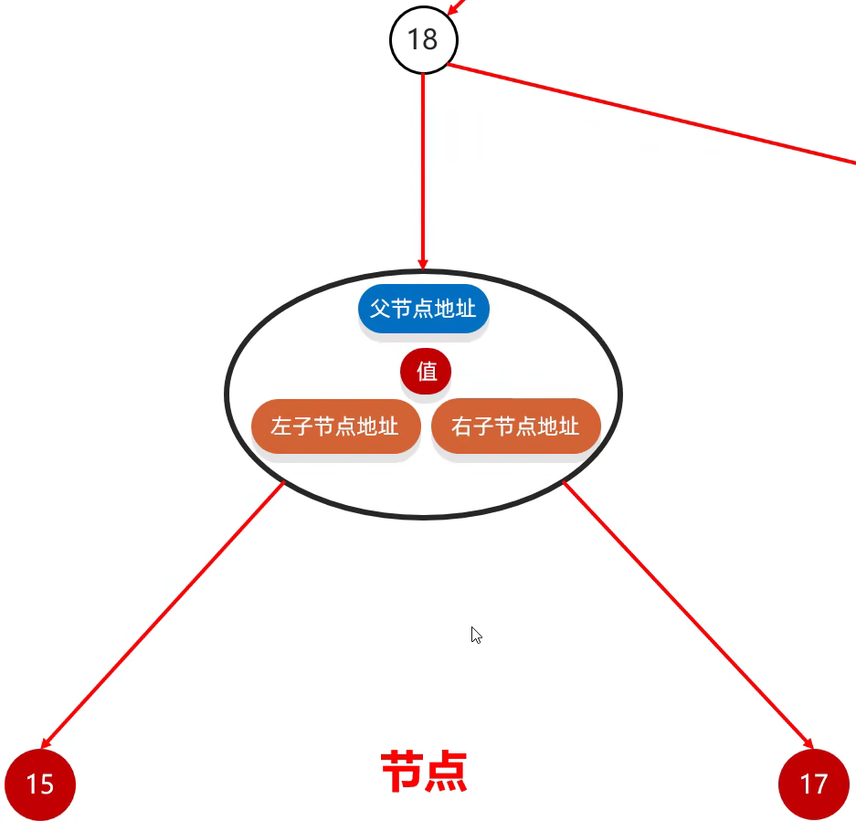</div>  

#### 二叉查找树（二叉排序树/二叉搜索树）
特点：
- 每一个节点上最多有两个子节点
- 任意节点左子树上的值都小于当前节点
- 任意节点右子树上的值都大于当前节点
<div align="left"></div>  

添加规则：**小的存左边，大的存右边，一样的不存**

#### 平衡二叉树（二叉查找树的改进版）
规则：**任意**节点左右子树**高度差**不超过1。  
平衡二叉树旋转机制：
- 规则1：左旋
<div align="left"></div>  
<div align="left"></div>  

- 规则2：右旋
<div align="left"></div> 
<div align="left"></div> 

- 触发时机：当添加一个节点之后，该树不再是一颗平衡二叉树

- 左左：节点添加在根节点左子树的左子树上，破坏了平衡
- 左右：节点添加在根节点左子树的右子树上，破坏了平衡
- 右右：节点添加在根节点右子树的右子树上，破坏了平衡
- 右左：节点添加在根节点右子树的左子树上，破坏了平衡
<div align="left"></div> 

#### 红黑树
- 红黑树是一种自平衡的二叉查找树，是计算机科学中用到的一种数据结构。
- 1972年出现，当时被称之为平衡二叉B树。后来，1978年被修改为如今的“红黑树”。
- 它是一种**特殊的二叉查找树**，红黑树的每一个节点上都有存储位表示节点的颜色。
- **每一个节点可以是红或者黑**；红黑树**不是高度平衡**的，它的平衡是通过“**红黑规则**”进行实现的。
- 红黑树的**增删改查**性能都很好
<div align="left"></div> 
<div align="left"></div> 


#### 二叉树遍历方式
- 前序遍历：从根节点开始，然后按照**当前节点，左子节点，右子节点**的顺序遍历
<div align="left"></div>  

- 中序遍历（**最重要**）：从最左边的子节点开始，然后按照**左子节点，当前节点，右子节点**的顺序遍历
<div align="left">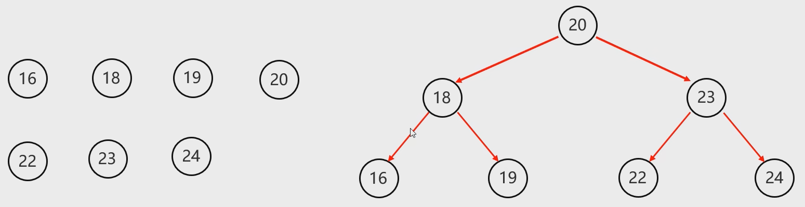</div> 

- 后序遍历：从最左边的子节点开始，然后按照**左子节点，右子节点，当前节点**的顺序遍历
<div align="left"></div> 

- 层序遍历：从根节点开始**一层一层的遍历**
<div align="left"></div> 

记忆方式：**当前节点**在前、中、后的顺序分为前序、中序、后序，层序就是一层一层遍历


## 泛型
泛型：是JDK5中引入的特性，可以在编译阶段约束操作的数据类型，并进行检查。   
**泛型的格式**：<数据类型>  
注意：泛型只能支持引用数据类型。  
使用泛型的原因：如果我们没有给集合指定类型，默认认为所有的数据类型都是Object类型，此时可以往集合中添加任意的数据类型。但带来一个坏处：我们在获取数据的时候，无法使用他的特有行为。  
扩展知识点：Java中的泛型是伪泛型  

### 泛型的好处
- 统一数据类型
- 把运行时期的问题提前到了编译期间，避免了强制类型转换可能出现的异常，因为在编译阶段类型就能确定下来。

### 泛型的细节
- 泛型中不能写基本数据类型
- 指定泛型的具体类型后，传递数据时，可以传入该类类型或者其子类类型
- 如果不写泛型，类型默认是**Object**

### 泛型类
如果一个类不确定类型，那么这个类就可以定义为泛型类，在类名后面定义泛型。

### 泛型方法
方法中形参类型不确定时，
- 1. 可以使用类名后面定义的泛型<E>
- 2. 在方法申明上定义自己的泛型

```java
修饰符 <类型> 返回值类型 方法名(类型 变量名){
}

public <T> void show(T t){
}
//此处可以理解为变量，但是不是用来记录数据的，而是记录类型的，可以写成：T、E、K、V等
```

### 泛型接口
```java
修饰符 interface 接口名<类型>{
}

public interface List<E>{
}
```

泛型接口的两种使用方式：
1. 实现类给出具体的类型
2. 实现类延续泛型，创建实现类对象时再确定类型

### 泛型的继承和通配符
- 泛型不具备继承性（不能通过多态传递子类对象），但是数据具备继承性（指定泛型的具体类型后，传递数据时，可以传入该类类型或者其子类类型）  **还需理解**
```java
public static void method(ArrayList<Animal> list){
}//在调用method方法时只能是Animal类型，不能传递其子类，因为泛型不具备继承性

ArrayList<Ye> list1 = new ArrayList<>();
list1.add(new Ye());//数据具备继承性
list1.add(new Fu());
list1.add(new Zi());
```

- 泛型的通配符：
  - ?也表示不确定的类型，可以进行类型范围的限定
  - ? extends E ：表示可以传递E或者E的所有的子类类型
  - ? super E ：表示可以传递E或者E所有的父类类型
  - 应用场景：如果在定义类、方法、接口的时候，如果类型不确定，就可以定义泛型类、泛型方法、泛型接口。如果类型不确定，但是能知道以后只能传递某个继承体系中的，就可以使用泛型的通配符。