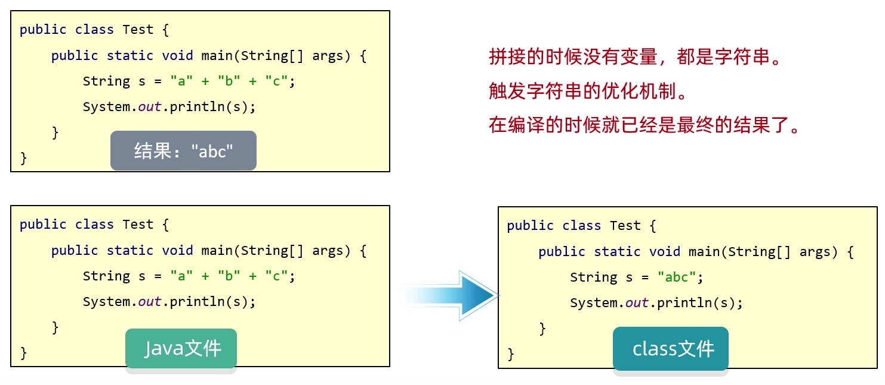
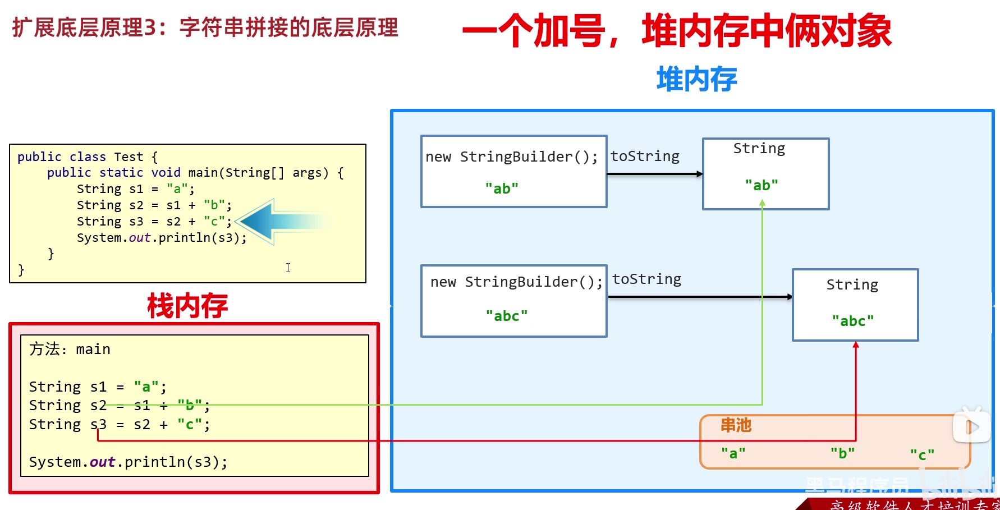
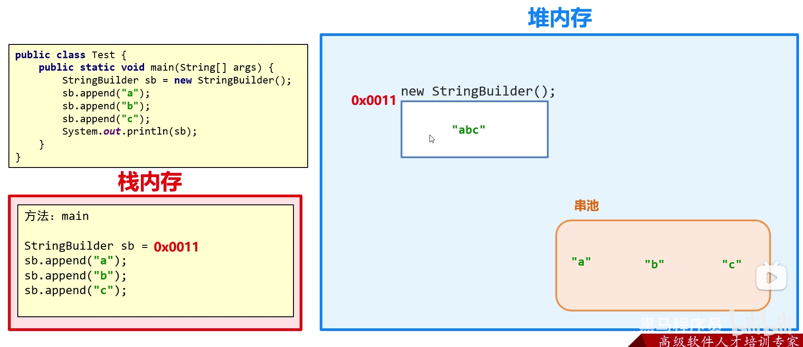
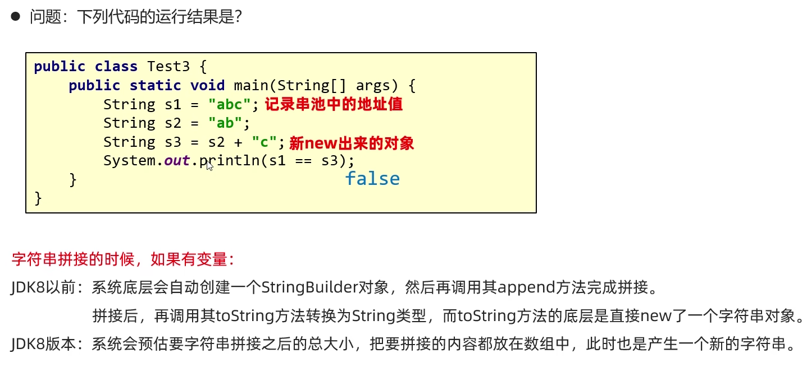
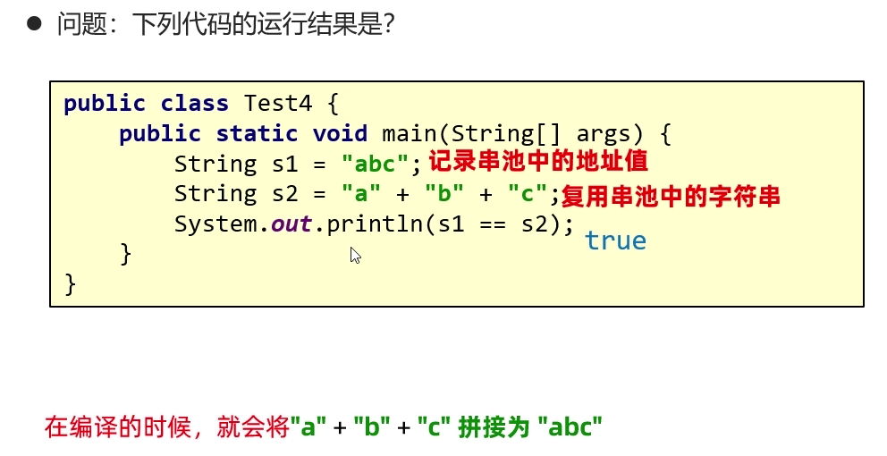
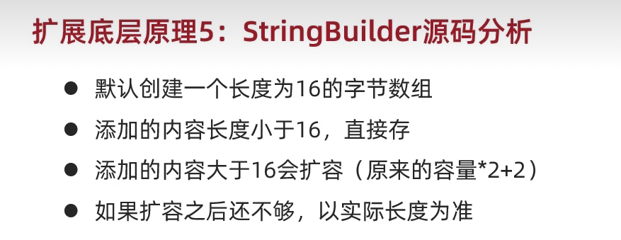

## 字符串原理

### 字符串存储的内存原理

- 直接赋值会复用字符串常量池中的
- new 出来的不会复用，而是开辟一个新的空间

### ==号比较的是什么

- 基本数据类型比较数据值
- 引用数据类型比较地址值

### 字符串拼接的底层原理

- 等号右边没有变量参与拼接时

 

  

- 等号右边有变量参与拼接时(JDK7及JDK7以前)

 

在JDK8以后进行字符串拼接时，程序先预估需要拼接的字符串的长度创建了一个数组来存储，最后再将数组变为字符串。    
结论：
- 如果没有变量参与，都是字符串直接相加，编译之后就是拼接之后的结果，会复用串池中的字符串
- 如果有变量参与，每一行拼接的代码，都会在内存中创建新的字符串，浪费内存  

建议：如果很多字符串变量拼接，不要直接+。在底层会创建多个对象，浪费时间，浪费性能。

### StringBuilder 类

StringBuilder 是 java 已经写好的类，java 在底层对其做了一些特殊处理，打印对象不是地址值而是属性值。

### StringBuilder 提高效率原理图

 

- 所有要拼接的内容都会往StringBuilder中放，不会创建很多无用的空间，节约内存

 

 

### StringBuilder源码分析

 