## 数据结构

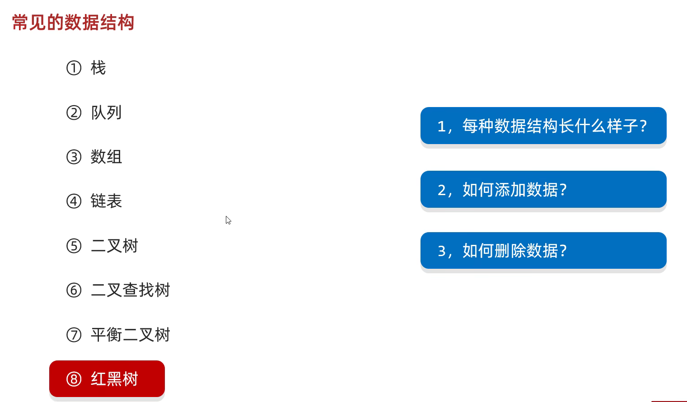
 

### 栈

栈的特点：**后进先出，先进后出**  
数据进入栈模型的过程称为：**压/进栈**  
数据离开栈模型的过程称为：**弹/出栈**

### 队列

队列的特点：**先进先出，后进后出**  
数据从**后端**进入队列模型的过程称为：**入队列**  
数据从**前端**离开队列模型的过程称为：**出队列**  

### 数组

数组的特点：数组是一种**查询快，增删慢**的模型
- **查询速度快**：查询数据通过地址值和索引定位，查询任意数据耗时相同。（元素在内存中是连续存储的）
- **删除效率低**：要将原始数据删除，同时后面每个数据前移
- **添加效率极低**：添加位置后的每个数据后移，再添加元素

### 链表

链表中的每个元素称为**结点**，每个结点都是独立的对象，在内存中是不连续的，有其独立的存储位置（地址），每个结点包含数据值和下一个结点的地址。  
**链表查询慢，无论查询哪个数据都要从头开始找。**  
**链表增删相对快。**  

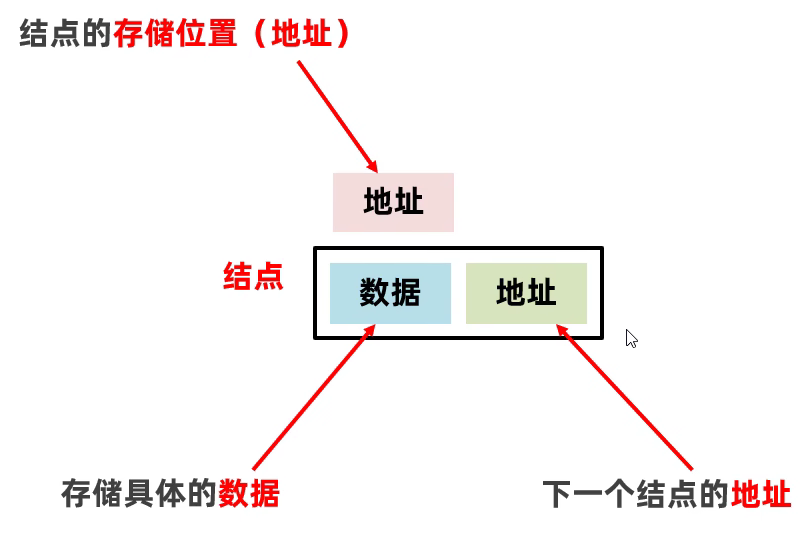
  

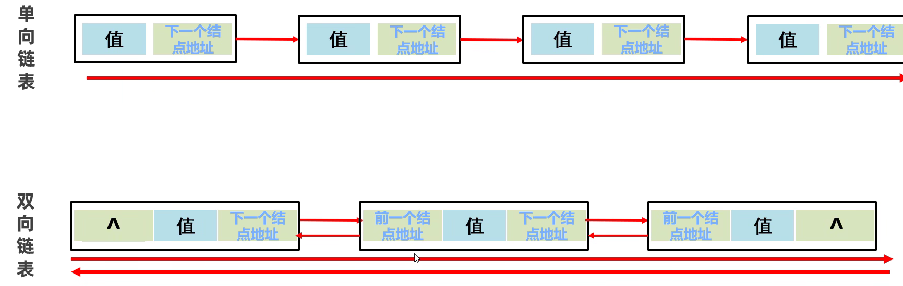
  

### 树

专属名词：
- 节点：都是独立的对象
- 度：每一个节点的子节点数量，在二叉树中，任意节点的度 <=2
- 树高：树的总层数
- 根节点：最顶层的节点
- 父节点：当前节点的上一节点
- 左子节点：当前节点左下方的节点
- 右子节点：当前节点右下方的节点
- 根节点的左子树：由根节点左子节点扩散出来的子树
- 根节点的右子树：由根节点右子节点扩散出来的子树

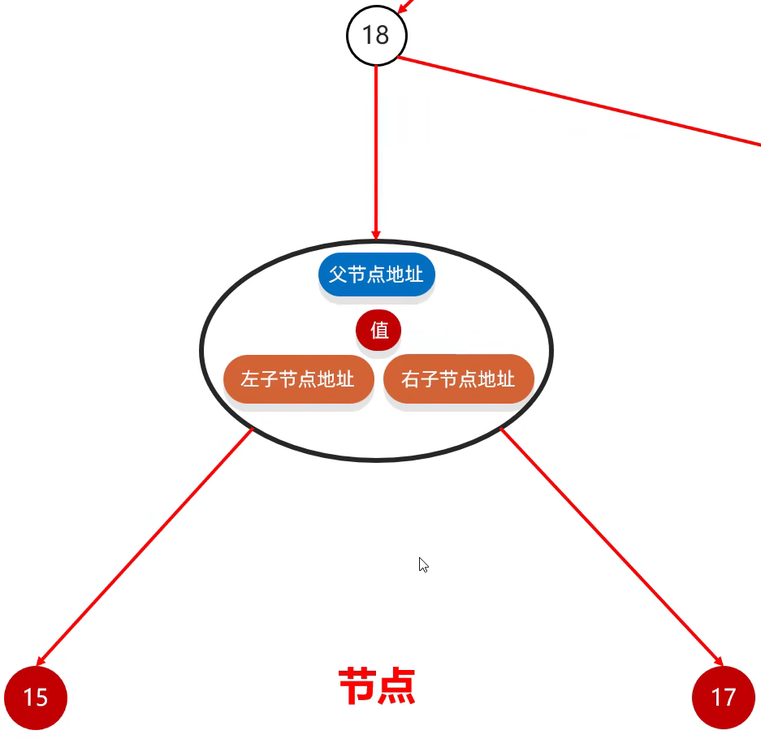
  

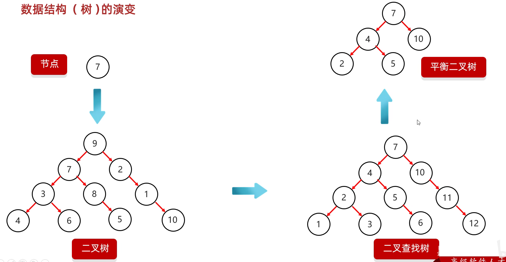
  

#### 二叉查找树（二叉排序树/二叉搜索树）

特点：
- 每一个节点上最多有两个子节点
- 任意节点左子树上的值都小于当前节点
- 任意节点右子树上的值都大于当前节点

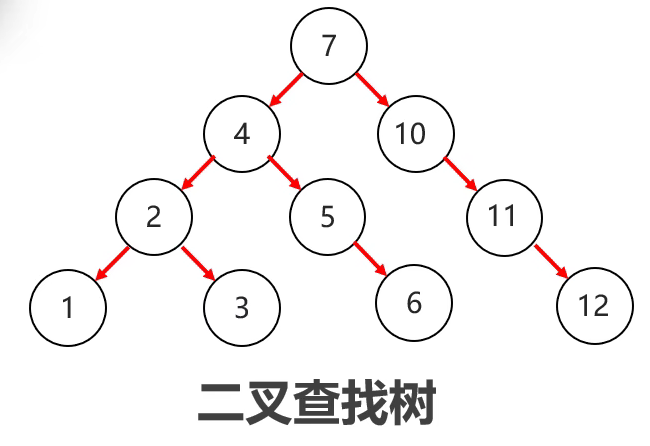
  

添加规则：**小的存左边，大的存右边，一样的不存**

#### 平衡二叉树（二叉查找树的改进版）

规则：**任意**节点左右子树**高度差**不超过1。  
平衡二叉树旋转机制：
- 规则1：左旋

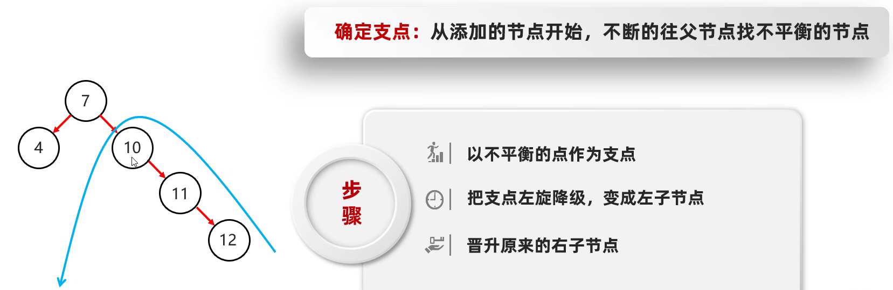
  

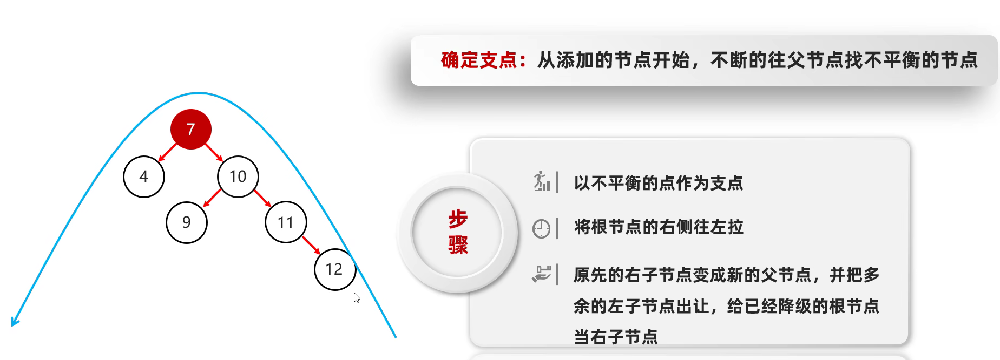
  

- 规则2：右旋

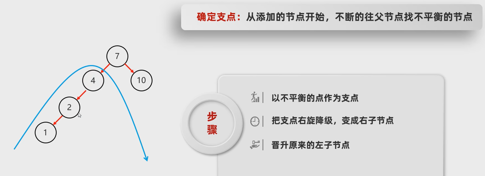
 

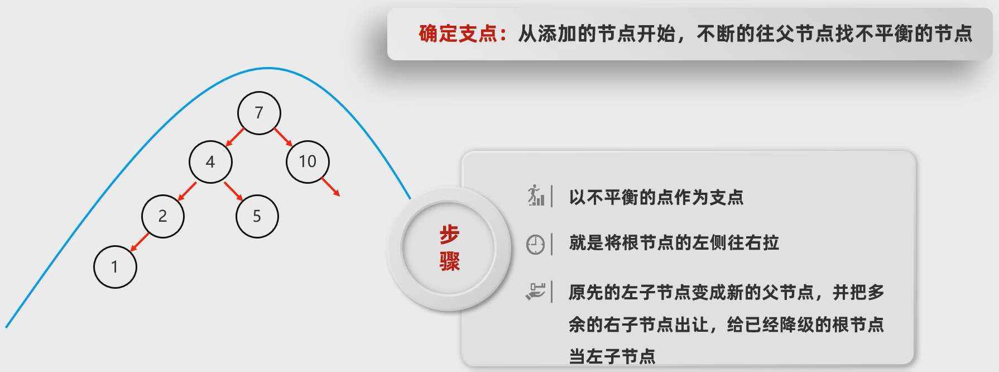
 

- 触发时机：当添加一个节点之后，该树不再是一颗平衡二叉树

- 左左：节点添加在根节点左子树的左子树上，破坏了平衡
- 左右：节点添加在根节点左子树的右子树上，破坏了平衡
- 右右：节点添加在根节点右子树的右子树上，破坏了平衡
- 右左：节点添加在根节点右子树的左子树上，破坏了平衡

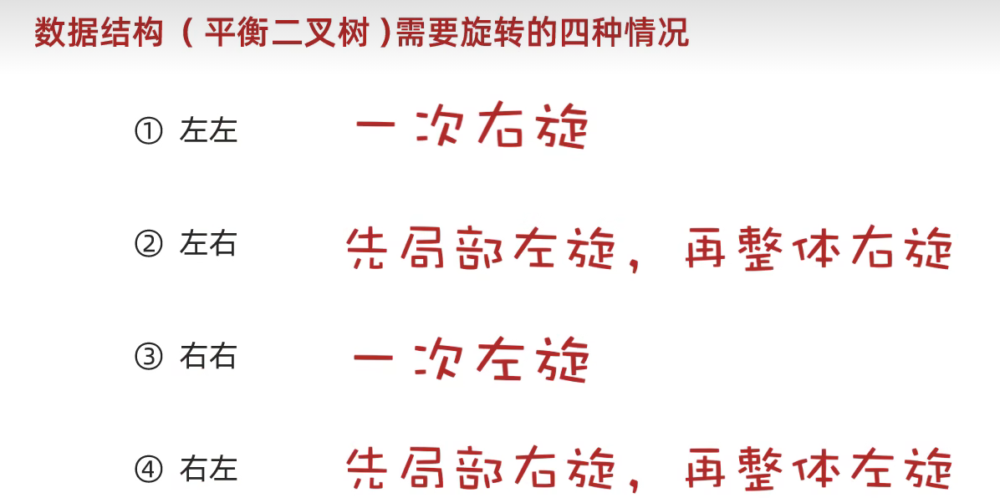
 

#### 红黑树

- 红黑树是一种自平衡的二叉查找树，是计算机科学中用到的一种数据结构。
- 1972年出现，当时被称之为平衡二叉B树。后来，1978年被修改为如今的“红黑树”。
- 它是一种**特殊的二叉查找树**，红黑树的每一个节点上都有存储位表示节点的颜色。
- **每一个节点可以是红或者黑**；红黑树**不是高度平衡**的，它的平衡是通过“**红黑规则**”进行实现的。
- 红黑树的**增删改查**性能都很好

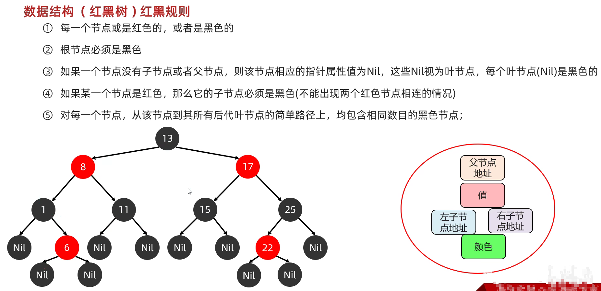
 

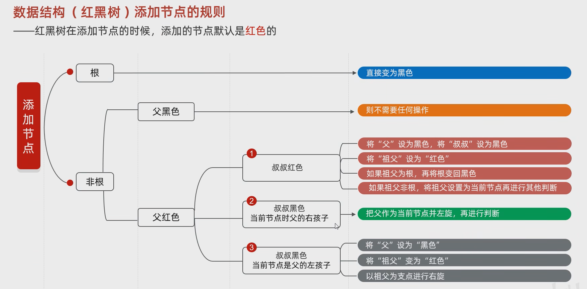
 

#### 二叉树遍历方式

- 前序遍历：从根节点开始，然后按照**当前节点，左子节点，右子节点**的顺序遍历

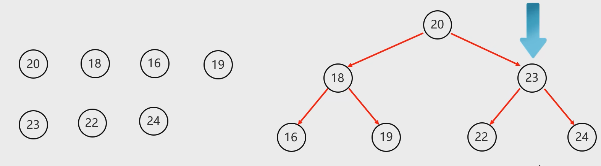
  

- 中序遍历（**最重要**）：从最左边的子节点开始，然后按照**左子节点，当前节点，右子节点**的顺序遍历

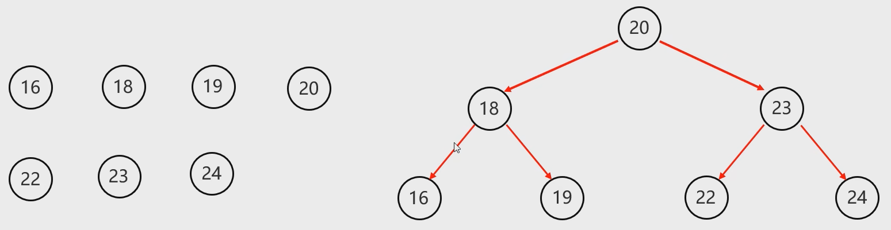
 

- 后序遍历：从最左边的子节点开始，然后按照**左子节点，右子节点，当前节点**的顺序遍历

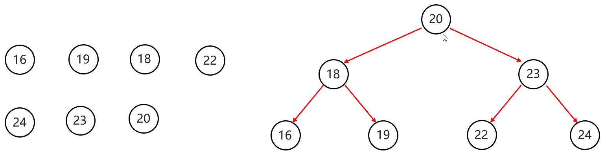
 

- 层序遍历：从根节点开始**一层一层的遍历**

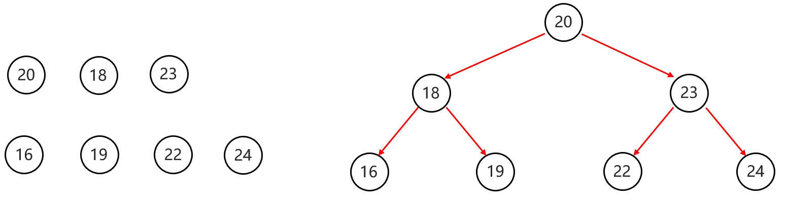
 

记忆方式：**当前节点**在前、中、后的顺序分为前序、中序、后序，层序就是一层一层遍历