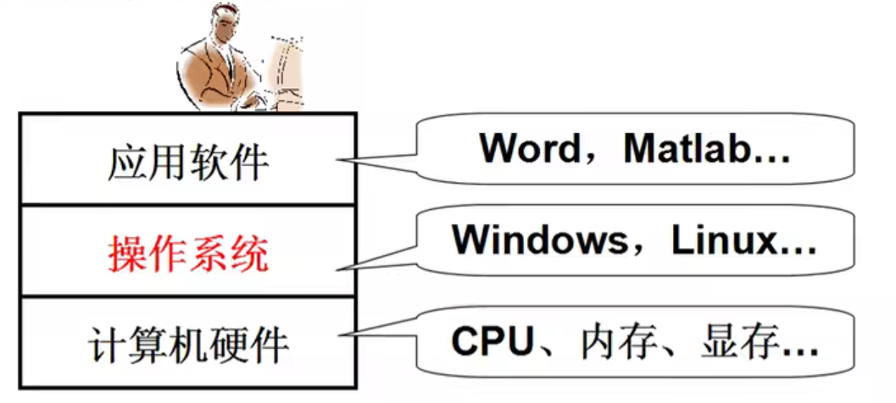
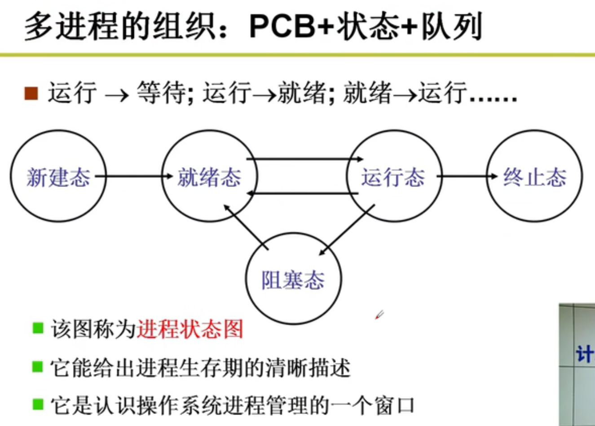
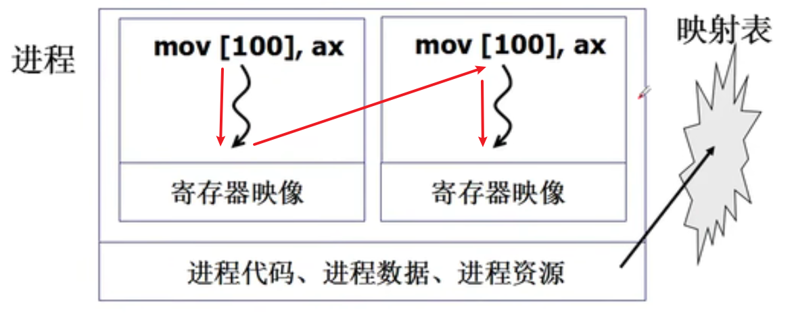

## 什么是操作系统
- 是计算机硬件和应用之间的一层软件
  - 方便我们使用硬件，如使用显存
  - 高效的使用硬件，如开多个终端（窗口）
<div align="center"></div> 

- 管理哪些硬件
  - **CPU管理**、**内存管理**、**终端管理**、**磁盘管理**、**文件管理**
  - 网络管理、电源管理、多核管理

- 计算机怎么工作？**取指执行**

- 计算机的第一段引导程序：bootsect.s
- 执行流程：bootsect.s -> setup.s -> head.s -> main.c
- head.s是system模块（目标代码）中的第一部分代码


## 操作系统接口
- 连接谁？连接操作系统和应用软件
- 如何连接？C语言程序
- 接口表现为函数调用，又由系统提供，所以称为**系统调用(system call)**

### 系统调用的实现
- 将内核程序和用户程序**隔离**
  - 区分**内核态和用户态**：一种处理器“硬件设计”方式实现。
    - 内核态可以访问任何数据，用户态只能访问用户段数据。对于指令跳转也一样，实现了隔离
    - 当前程序执行在什么态（哪层环）？由于CS:IP是当前指令，所以用CS的最低两位来表示（CPL）：0是内核态，3是用户态
    - 目标数据特权级在什么态？在GDT表中的表项DPL：0是内核态，3是用户态
- 硬件提供了“主动进入内核的方法”
  - 对于Intel x86，就是中断指令`int 0x80`（通过IDT表获取中断处理函数入口/地址）
    - **int指令将使CS中的CPL改为0，“进入内核”**
    - int中断是用户程序发起的调用内核代码的唯一方式
- 系统调用的核心：
  - 用户程序中包含一段包含int指令的代码
  - 操作系统写中断处理，获取想调程序的编号
  - 操作系统根据编号执行相应代码

## CPU管理
### 管理CPU的最直观方法（利用效率低）
设好PC初值就完事！（因为CPU不断自动地取指执行）

### 管理好CPU核心（提高CPU利用效率）
- 一个CPU上交替的执行多个程序：**并发**
- 怎么做？
  - 修改寄存器PC
  - 记录程序信息：每个程序有一个存放信息的结构：PCB(Process Control Block)
- 运行中的程序和静态程序不一样！
  - **进程是进行（执行）中的程序**，它跟静态程序不一样，有开始和结束，需要记录ax，bx等一些信息，这些信息记录在PCB中

## 多进程图像
多个进程（PID）使用CPU的图像  
多进程图像从启动开始到关机结束  

### 多进程图像：多进程如何组织？
将多个进程对应的PCB分别放在多个地方（正在执行的、就绪队列、磁盘等待队列）  
多进程的组织：PCB + 状态 + 队列
<div align="center"></div> 

### 多进程图像：多进程如何交替？
交替的三个部分：队列操作 + 调度 + 切换
```
eg.
启动磁盘读写；
pCur.state = "W";
将pCur放到DiskWaitQueue
schedule();

schedule(){
  pNew = getNext(ReadyQueue); // 调度
  switch_to(pCur, pNew); // 保存当前进程现场（记录PCB），切换到下一个进程
}
```

### 多进程图像：多进程如何影响？
- 多个进程同时存在于内存有可能会出现内存相互访问的问题
- 解决的方法：**限制对地址的读写**，**进程的内存进行映射**
- 多进程的地址空间分离：**内存管理的主要内容**


### 多进程图像：多进程如何合作？
核心在于进程同步（合理的推进顺序）


## 用户级线程
- **进程 = 资源 + 指令执行序列**
  - 将资源和指令分开
  - 一个资源 + 多个指令执行序列
- 线程：保留了并发的优点，避免了进程切换代价。**实质就是映射表不变而PC指针改变**
  - 线程切换时，TCB(Thread Control Block)记录栈的地址，栈记录当前线程的信息，包括返回地址，每个线程有自己的栈
<div align="center"></div> 

- **Yield**：属于用户级，但用户不可见，调度点由系统决定
- **ThreadCreate**：是系统调用，会进入内核，内核管理TCB，内核负责切换线程

## 核心级线程
- 多处理器：有多个CPU，每个CPU有它自己的 cache 和 MMU（内存管理单元，即映射表）
- 多核：有多个CPU，但多个CPU共用一个 cache 和 MMU （即每个CPU相当于一个线程），多核可以**并行**（注意区别**并发**）

### 和用户级相比，核心级线程有什么不同？
- **ThreadCreate**：是系统调用，会进入内核，内核管理TCB，内核负责切换线程
- **如何让切换成型？内核栈，TCB**
  - 用户栈是否还要用？执行的代码仍然在用户态，还要进行函数调用
  - **一个栈到一套栈（用户栈和内核栈）；两个栈到两套栈**

### 核心级线程切换过程
- 当前用户态线程进入内核态（由中断进入）
- 内核栈保存当前用户态线程的上下文信息，包括程序计数器PC、寄存器、用户栈指针
- 当前内核态线程的TCB记录当前内核栈的地址，将自己变为阻塞态或就绪态
- 内核从就绪队列中选择下一运行的内核态线程，并从其TCB中得到内核栈指针寄存器（esp寄存器），即内核栈地址
- 从内核栈中弹出对应的用户态线程的上下文信息，包括PC、寄存器、用户栈指针
- 注意：若是进程的切换还需多上一步：地址映射表的切换（内存管理的内容）


## CPU调度策略（进程切换时怎么选择就绪队列中的进程）
**需要折中，需要综合**  
- 吞吐量和响应时间之间有矛盾
  - 响应时间小 -> 切换次数多 -> 系统内耗大 -> 吞吐量小
- 前台任务和后台任务的关注点不同：前台任务关注响应时间，后台任务关注周转时间
  - 响应时间：从提交请求到产生响应所用的时间
  - 周转时间：从作业（进程）提交给系统开始，直至其完成并退出系统为止所经历的时间
- IO约束型任务和CPU约束型任务有各自的特点（一般IO约束型优先级较高一点）

### 各种CPU调度算法
- Fist Come，First Served (FCFS) （不算算法）
- **SJF**：短作业优先，平均周转时间最短
- **RR**：轮转调度，按时间片来轮转调度
  - 属于折中：时间片10-100ms，切换时间0.1-1ms(1%)
- **优先级**


## 进程同步与信号量
- 进程合作：多进程共同完成一个任务
- 阻塞是进程同步的基础
- 信号量：一种特殊整型变量，用来记录可使用资源的数量，信号用来sleep和wakeup

### 信号量临界区保护
- 为什么需要保护？共同修改信号量会引起问题
- 竞争条件(Race Condition)：和调度有关的共享数据语义错误
  - 错误由多个进程并发操作共享数据引起
  - 错误和调度顺序有关，难于发现和调试
- 解决竞争条件的直观想法：上锁，在写共享变量时阻止其他进程访问
- **临界区(Critical Section)**：一次只允许一个进程进入的该进程的那一段代码，**读写信号量的代码一定是临界区**
  - **基本原则：互斥进入**：如果一个进程在临界区中执行，则其他进程不允许进入
    - 这些进程间的约束关系称为**互斥(mutual exclusion)**
    - 这保证了是临界区
  - 好的临界区保护原则
    - **有空让进**：若干进程要求进入空闲临界区时，应尽快使一进程进入临界区
    - **有限等待**：从进程发出进入请求到允许进入，不能无限等待

### 信号量临界区保护解法
- 软件解法
  - 两个进程：**PeterSon算法**：标记和轮转的结合
  - 多个进程：**面包店算法**：仍然是标记和轮转的结合，每个进程都获得一个序号，序号最小的进临界区
- 硬件解法
  - 临界区**只允许一个进程进入**，另一个进程进入意味着**被调度**，因此只要关闭中断入口即可，但这种方法只有单核才有效，多CPU情况下不好使
  - 硬件原子指令法：可以适用于多CPU的情况，但需要在实现时考虑不同CPU之间的缓存同步和多CPU的竞争情况。

### 信号量的代码实现
- 信号量包括value和等待的PCB队列，需要被各个进程都看到，信号量应该在内核里实现，通过系统调用来获取。


## 死锁处理
**死锁**：多个进程由于**互相等待对方持有的资源**而造成的谁都无法执行的情况叫**死锁**

### 死锁的成因
- 资源**互斥**使用，一旦占有别人无法使用
- 进程**占有**了一些资源，又不释放，再去**申请**其他资源
- 各自占有的资源和互相申请的资源形成了**环路等待**

### 死锁的四个必要条件
- **互斥使用(Mutual exclusion)**，资源的固有特性
- **不可抢占(No preemption)**，资源只能自愿放弃
- **请求和保持(Hold and wait)**，进程必须占有资源，再去申请
- **循环等待(Circular wait)**，在资源分配图中存在一个环路

### 死锁处理方法 
- **死锁预防**：破坏死锁出现的条件
  - 在进程执行前，**一次性申请所有需要的资源**，不会占有资源再去申请其他资源
    - 缺点1：需要预知未来，编程困难
    - 缺点2：许多资源分配后很长时间后才使用，资源利用率低
  - 对资源类型进行排序，**资源申请必须按序进行**，不会出现环路等待
    - 缺点：仍然造成资源浪费
- **死锁避免**：检测每个资源请求，如果造成死锁就拒绝
  - 如果系统中的所有进程存在一个可完成的执行序列P1，……，Pn（**安全序列**），则称系统处于**安全状态**，判断的算法为**银行家算法**
- **死锁检测 + 恢复**：检测到死锁出现时，让一些进程回滚，让出资源
  - 定时检测或者发现资源利用率低时检测
- **死锁忽略**：就好像没有出现死锁一样，许多通用操作系统，如Windows和Linux，都采用此方法，可以通过重启处理

## 内存使用与分段
- **内存使用：将程序放到内存中，PC指向开始地址**
- 在内存中找到一段空闲内存，将程序载入到这段空闲内存中，重定位后再设置好PC，不断取指执行
- 重定位：修改程序中的逻辑地址（是相对地址），修改为物理内存中的实际地址（绝对地址）
- 什么时候完成重定位？ （嵌入式系统可以在编译时）
  - 编译时重定位的程序只能放在内存固定位置
  - 载入时重定位的程序一旦载入内存就不能动了
  - 重定位最合适的时机——**运行时重定位**
  - 理由：程序载入后还需要移动，比如进程睡眠时要换出内存给另一进程，即**交换**，充分利用内存
- 运行时重定位：在运行每条指令时才完成重定位
  - 每执行一条指令都要从逻辑地址算出物理地址：**地址翻译**，基地址base + 偏移offset
  - 每个进程都有各自的基地址，放在了PCB里，执行指令时第一步先从PCB中取出这个基地址

### 分段
- 程序**由若干部分（段）组成，每个段有各自的特点、用途**：代码段只读，代码/数据段不会动态增长
  - 符合用户观点：用户可独立考虑每个段（**分治**）
  - 怎么定位具体指令（数据）：**<段号，段内偏移>**，如 `mov [es:bx], ax`
- 不是将整个程序，是将各段分别放入内存
- 每个段都有基址，可在段表中查到，而每个进程都有一个段表LDT。对于操作系统，也可以认为是一个进程，它的段表即为GDT表。
<div align="center"></div> 


## 内存分区与分页
