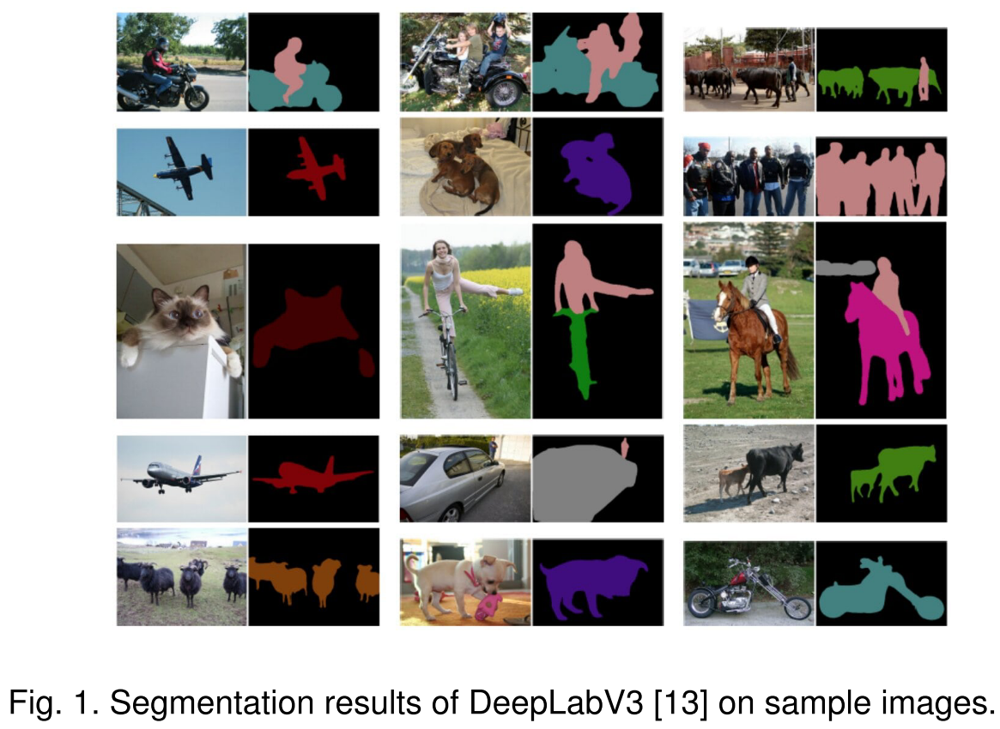
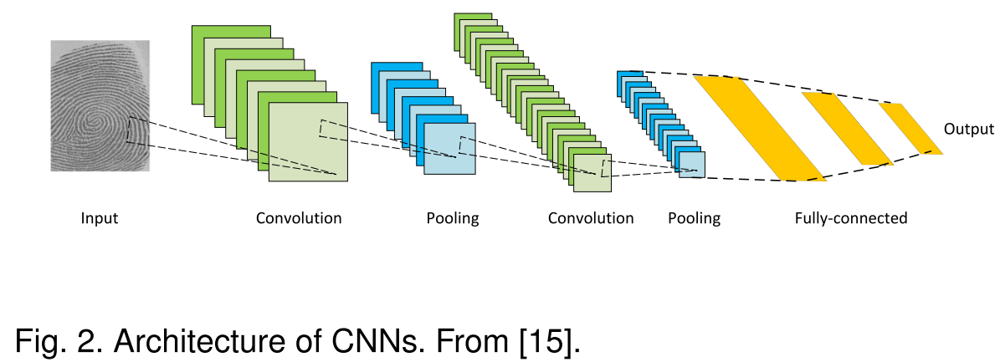
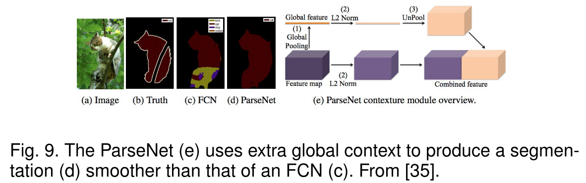
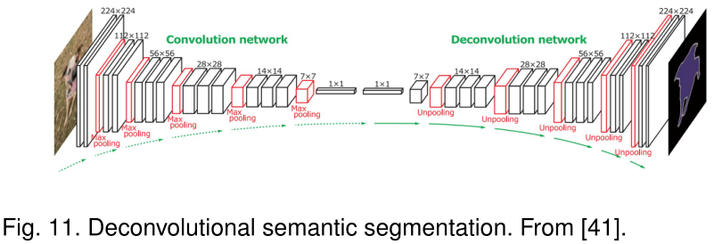
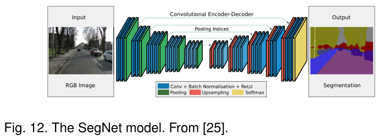

# Image Segmentation Using Deep Learning: A Survey (2021)

## introduction

图像分割可以分为语义分割、实例分割，以及全景分割（两者同时进行）。  
语义分割使用语义标签（如人、车、树、天空）对所有图像像素进行像素级标记。因此通常比整体图像分类要求更高，后者预测整体图像的单个标签。  
实例分割通过检测和描绘图像中每个感兴趣的对象扩展了语义分割的范围。  

图像分割的方法：  
早期：阈值法(thresholding)、基于直方图的捆绑(histogram-based bundling)、区域增长(region-growing)、k均值聚类(k-means clustering)、分水岭方法(watershed methods)  
更高级的算法：活动轮廓(active contours)、图割(graph cuts)、有条件和马尔可夫随机场(active contours)、基于稀疏性的方法(sparsity-based methods)  
近些年来，深度学习方法在图像分割方面取得了卓越的表现，经常能够在流行的基准上达到最高的准确率。  

这篇综述是引文`14`的修订版本，涵盖了基于深度学习的图像分割的最新文献，包括了迄今为止提出的100多种图像分割方法。这些文献分为以下几类：
- 全卷积网络（fully convolutional network）
- 带有图形模型的卷积模型（sparsity-based methods）
- 基于编码解码器的模型（Encoder-decoder based models）
- 基于多尺度金字塔网络的模型（Multiscale and pyramid network based models）
- 基于R-CNN的模型（实例分割）
- 空洞卷积模型和DeepLab算法合集（Dilated convolutional models and DeepLab family）
- 基于递归神经网络的模型（Dilated convolutional models and DeepLab family）
- 基于注意力机制的模型（Attention-based models）
- 生成模型和对抗训练（Generative models and adversarial training）
- 带有活动轮廓模型的卷积模型（Convolutional models with active contour models）
- 其他模型

## 深度神经网络(DNN)架构

概括了计算机视觉领域比较突出的深度神经网络架构，包括卷积神经网络、递归（循环）神经网络和长短期记忆、编码器-解码器和自动编码器模型、以及生成对抗网络。（不包括变换网络、胶囊网络、门控循环单元、空间变换网络等其他算法）

### 卷积神经网络（CNNs）

CNNs 最开始由 Fukashima 在他关于 “Neocognitron” 的开创性论文中提出。  
后来，Waibel等人 提出了一个在时间感受野和反向传播训练中共享权重的 CNNs ，用来进行音素识别。  
LeCun 等人开发了一个实用的 CNN 架构用于文档识别。

CNNs 通常包括三个层：
- 卷积层，利用卷积核提取特征
- 非线性层，对特征图应用激活函数，使网络能够拟合非线性函数
- 池化层，通过将特征图的小邻域替换成这些邻域的统计特性（如均值、最大值等）来降低空间分辨率

在这些层中的神经元是局部连接的，也就是说，每个神经元是从上一层单元的小邻域（即感受野）接收加权输入。通过层层叠加形成多分辨率金字塔，更高（深）层次的层从更加宽广的感受野中提取特征。CNNs 的主要计算优势是在同一层中的所有感受野共享权值，参数相较于全连接神经网络来说更加的少。比较出名的 CNN 算法有 AlexNet, VGGNet, ResNet。

### 递归神经网络（RNNs）和 长短期记忆网络（LSTM）

RNNs 通常用于处理序列数据，如语音、文本、视频和时间序列。  
如Fig3所示，在任意时刻 $t$ 模型收集输入 $x_t$ 和上一时刻所得到的隐藏状态 $h_{t-1}$，并输出目标值 $O_t$ 和隐藏状态 $h_t$  

RNNs 对于长序列来说是有问题的，因为在许多实际应用中，它们不能捕获长期的依赖关系，并且经常会遇到梯度丢失或爆炸的问题。  
然而，一种被称为长短期记忆网络（LSTM）的 RNN 可以避免上述问题。如Fig4所示，LSTM　架构包括了三个门（输入门、输出门和遗忘门），它们调节信息流进出存储单元，存储单元可以在任意时间间隔内存储值。

### 编码器-解码器和自动编码器模型

编码器-解码器是一类通过两级网络将数据点从输入域映射到输出域的模型。 

编码器通过一个编码函数 $z=g(x)$ 将输入 $x$ 压缩到隐藏空间表示 $z$，而解码器则是通过解码函数 $y=f(z)$ 从 $z$ 中预测输出 $y$ 。隐藏的或者说特征的表示从输入中捕获对于预测输出有用的语义信息。  
这种模型在自然语言处理（NLP）中的序列到序列建模，以及在图像到图像的转化中很流行。在图像到图像的转化中，输出可以是增强图像（比如说去模糊或者超分辨率）或者分割图。  
自动编码器是编码器-解码器模型的一个特殊例子，它的输入和输出是相同的。

### 生成对抗网络（GANs）

GANs 是深度学习模型中一个较新的种类。它们由两个网络组成——生成器和分类器。

在传统的 GANs 中，生成器网络 $G$ 学习从噪声 $z$ （具有先验分布）到目标分布 $y$ 的映射，该目标分布与“真实”样本相似。分类器网络 $D$ 尝试将生成的“假”样本与“真实”样本区分出来。  
GANs 可以被描述为生成器 $G$ 和分类器 $D$ 之间的极大极小博弈，分类器 $D$ 在区分真假样本时试图最小化其分类误差从而使损失函数最大，生成器 $G$ 则试图最大化分类器 $D$ 的分类误差从而使损失函数最小化。  
GAN 的扩展包括了卷积生成对抗网络（Convolutional-GANs）、有条件的生成对抗网络（conditional-GANs）、以及 Wasserstein-GANs。

## 基于深度学习的图像分割模型

本节是对许多基于学习的分割方法的调查，根据它们的模型架构分为10类。在这些方法中，几种架构的特征是常见的，例如编码器和解码器、跳跃连接、多尺度架构、以及近来使用的空洞卷积。根据模型在架构上的贡献来对模型进行分组是非常方便的。

### 全卷积模型

Long 等人提出了全卷积网络（FCNs），是基于深度学习的图像语义分割模型的一个里程碑。

FCN 仅包含了卷积层，这使得它可以输出与输入图像同样大小的分割图。  
为了处理任意大小的图像，作者改进了现有的 CNN 架构如 VGG16 和GoogLeNet，通过去除所有的全连接层使得模型输出一个空间分割图而不是分类的分数。
通过跳跃连接，模型最后几层的特征图进行上采样并与前面层的特征图融合，模型结合了语义信息（从深层）和表观信息（从浅层），进而能够得到准确而详细的分割图。经过在PASCAL VOC, NYUDv2, 和 SIFT Flow 上的测试，证明该模型实现了最先进的分割性能。

FCNs 已经应用于许多的分割问题，如脑部肿瘤分割、皮肤病变细分以及虹膜分割。  
传统的 FCNs 模型虽然证明了深度神经网络 DNNs 可以在可变大小图像上以端到端的方式进行语义分割，但它有一些局限性：
- 对于实时推理来说计算代价太大；
- 它不能以有效的方式考虑全局的上下文信息；
- 它不容易推广到3D图像；

一些研究者尝试克服 FCNs 的这些缺点。例如，Liu 等人提出了 ParseNet，通过使用一层的平均特征来增强每个位置的特征，从而将全局上下文信息加入到 FCNs 中。

将一层的特征图进行池化，产生一个上下文向量，将这个上下文向量正则化和反池化，从而产生一个与初始特征图相同大小的新特征图，之后将其与其他特征图连接起来。相当于 FCNs 的卷积层被上述所描述的模块所代替。

### 带有图形模型的卷积神经网络

如前所述，FCNs 忽略了可能有用的场景级语义上下文信息。为了得到更多的上下文信息，有几种方法将概率图形模型结合到深度学习框架中，如条件随机场（CRFs）和马尔可夫随机场（MRFs）。  
由于 CNN 的不变特性，使得它适合于分类等高级任务，但来自深度卷积神经网络的后面层不能够很好的定位以进行准确的图像分割。为了克服这个缺点，Chen等人提出了一种结合卷积神经网络 CNNs 和全连接条件随机场 fully-connected CRFs 的图像语义分割算法。

实验结果表明，相较于以前的方法，他们的方法能够更准确地定位图像的分割边界。  
Schwing 和 Urtasun 提出了一种用于图像分割的全连接深度结构网络。他们联合训练了卷积神经网络和全连接条件随机场进行图像语义分割，并且在具有挑战性的 PASCAL VOC 2012 数据集上取得了令人振奋的结果。zheng 等人提出了一种相似的语义分割方法。  
在相关工作中，Lin 等人提出了一种基于上下文深度条件随机场的高效语义分割模型。他们探索了“patch-patch”上下文信息和“patch-background”上下文信息，通过使用上下文信息来改进语义分割。  
Liu 等人提出了一种语义分割算法，该算法将丰富的信息整合到马尔可夫随机场中，包括高阶关系和标签上下文信息的混合。不同于之前通过迭代算法优化马尔科夫随机场，他们提出了一个 CNN 模型，命名为解析网络（Parsing Network），该网络可以一次性实现确定的端到端计算。

### 基于编码器-解码器的模型

大多数流行的基于深度学习的分割模型使用一些编码器-解码器架构。我们将这些模型分为两类：一类是用于一般图像分割的模型，另一类是用于医学图像分割的模型。

#### 一般的图像分割

Noh 等人介绍了基于反卷积（又称转置卷积）的语义分割算法。

他们的模型，反卷积网络（DeConvNet），由两个部分组成，一个部分是采用VGG-16网络卷积层的编码器，另一部分是多层反卷积网络，输入特征向量并生成一个像素级精确的类概率图。这个多层反卷积网络包括反卷积层和非池化层，用于识别像素级标签和预测分割掩码。　　

Badrinarayanan　等人提出了 SegNet，一种用于图像分割的全卷积编码器-解码器架构。

与反卷积网络相似，SegNet 的核心可训练分割引擎由一个编码器网络和相应的解码器网络组成。编码器网络的拓扑结构与 VGG-16 的13层卷积层相同，解码器网络后面跟着一个像素级分类层。 SegNet 网络的主要创新之处在于它的解码器对其低分辨率输入特征图进行上采样，具体来说，在编码器的最大池化步骤计算得到的池化指标被用来拟合非线性上采样。  
基于编码器-解码器的模型的缺点在于细粒度图像信息的丢失，原因是在编码过程中分辨率的损失。  
HRNet 解决了这个缺点。HRNet 不像在 DeConvNet、SegNet 和其他模型中那样恢复高分辨率表示，而是通过编码过程来维持高分辨率表示，这个编码过程并行连接高分辨率到低分辨率的卷积流并在不同分辨率之间反复进行信息交换。有四个阶段：第一个阶段由高分辨率的卷积组成，而第2/3/4阶段重复2/3/4分辨率的块。最近有几个语义分割模型采用 HRNet 作为主干。

其他一些工作采用转置卷积或编码器-解码器进行图像分割，如堆叠反卷积网络 Stacked Deconvolutional Network (SDN)，LinkNet，W-Net，以及用于 RGB-D 分割的局部（位置）敏感反卷积网络 locality-sensitive deconvolution networks 。

#### 医学和生物医学的图像分割

受 FCNs 和编码器-解码器网络启发的几个模型最初是为了医学或生物医学图像的分割，但现在也用于医学领域之外。  
Ronneberger 等人提出了一种高效分割生物显微图像的算法 U-Net 。

U-Net 架构包括两个部分，一个是获取上下文的收缩路径，另一个是支持精确定位的对称扩展路径。U-Net 训练策略依赖于使用数据增强来有效地从注释很少的图像中学习。它由30张透射光学显微镜图像训练，并在2015年 ISBI　细胞追踪挑战赛中以很大的优势获胜。　　
U－Net 的许多扩展已经开发出来用于不同类型的图像和问题领域。例如，Zhou 等人开发了一个嵌套的 U-Net 算法，Zhang 等人开发了一个基于 U-Net 的道路分割算法，Cicek 等人提出了一个用于 3D 图像的 U-Net 架构。  
V-Net 算法是由 Milletari 等人提出来的用于 3D 医学图像分割的算法，它是另一种出名的基于 FCNs 的模型。

作者引入了一个新的基于 Dice 系数的损失函数，使模型能够处理前景和背景中体素数量严重不平衡的情况。这个网络在前列腺的 MRI 图像上进行端到端的训练，并学习一次预测整个体积的分割。   
其他一些在医学图像分割上有关的工作包括 Progressive Dense V-Net 等从胸部 CT 图像中自动分割肺叶，以及 3D-CNN 编码器用于病灶分割。

### 基于多尺度和金字塔网络模型

多尺度分析是图像处理中的一个成熟思想，已被应用于各种神经网络结构中。在这方面中最出名的模型之一是特征金字塔网络（FPN），这个算法是由 Lin 等人提出来的用于目标检测的，但也应用于图像分割。利用深度卷积神经网络所固有的多尺度金字塔层次结构来构建具有少量额外成本的特征金字塔。为了合并低分辨率和高分辨率的特征， FPN 由自下而上路径、自上而下路径和横向连接组成。然后对连接的特征图用 3×3 的卷积核卷积处理，以产生每个阶段的输出。最后，自上而下路径的每个阶段生成一个预测来检测一个对象。对于图像分割，作者使用两个多层感知器（MLPs）来生成掩码。  
Zhao 等人开发了金字塔场景解析网络 Pyramid Scene Parsing Network （PSNP），这是一个多尺度网络，可以更好地学习场景的全局上下文信息。

利用扩展后的残差网络（ResNet）作为特征提取器，从输入图像中提取多个模式。然后，这些特征图被输入一个金字塔池化模块，以区分不同尺度的模式，每一种模式对应于一个金字塔级别，之后由 1×1 的卷积层处理以减小它们的维数。金字塔层的输出被上采样，并与原始的特征图连接，以捕获局部和全局的上下文信息。最后，使用一个卷积层来生成像素预测。

Ghiasi 和 Fowlkes 开发了一个基于拉普拉斯金字塔的多分辨率重建架构，通过使用来自高分辨率特征图和乘法门的跳跃连接，来不断完善由低分辨率图重构的分割边界。结果表明，虽然卷积特征图的表观空间分辨率较低，但高维特征表示包含重要的亚像素信息。  
其他模型使用多尺度分析来分割图像，其中包括动态多尺度滤波器网络 Dynamic Multiscale Filters Network (DM-Net)，上下文对比网络和门控多尺度聚合 Context Contrasted Network and gated multiscale aggregation (CCN)，自适应金字塔上下文网络 Adaptive Pyramid Context Network (APC-Net)，多尺度上下文交织 MultiScale Context Intertwining (MSCI)，以及突出的对象分割。

### 基于 R-CNN 模型

