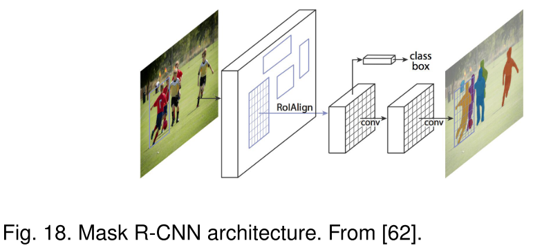
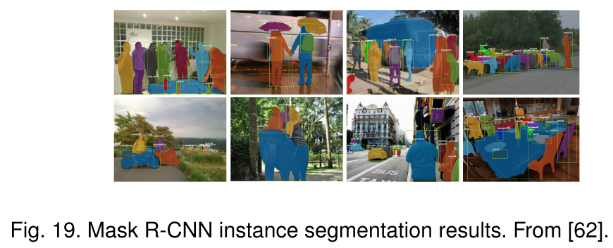
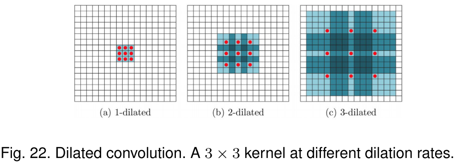
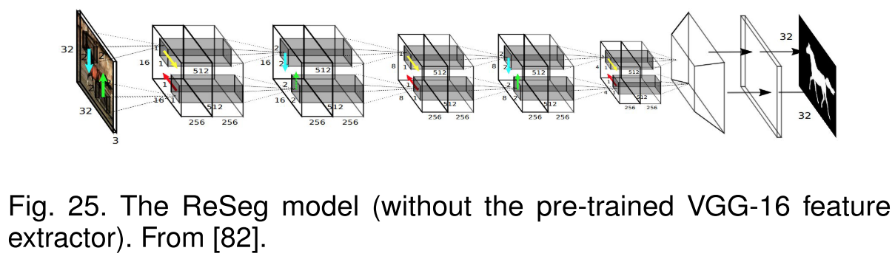
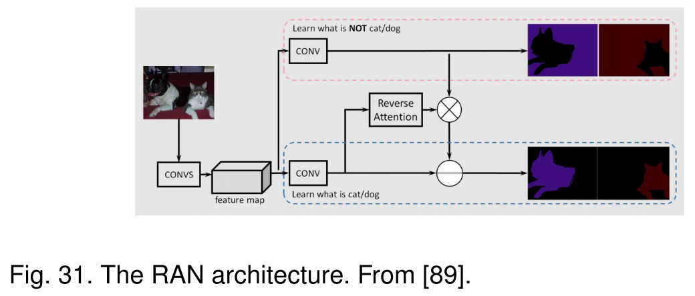
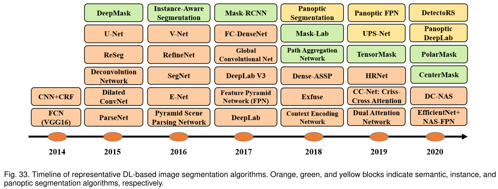

# Image Segmentation Using Deep Learning: A Survey (2021)

## introduction

图像分割可以分为语义分割、实例分割，以及全景分割（两者同时进行）。  
语义分割使用语义标签（如人、车、树、天空）对所有图像像素进行像素级标记。因此通常比整体图像分类要求更高，后者预测整体图像的单个标签。  
实例分割通过检测和描绘图像中每个感兴趣的对象扩展了语义分割的范围。  

图像分割的方法：  
早期：阈值法(thresholding)、基于直方图的捆绑(histogram-based bundling)、区域增长(region-growing)、k均值聚类(k-means clustering)、分水岭方法(watershed methods)  
更高级的算法：活动轮廓(active contours)、图割(graph cuts)、有条件和马尔可夫随机场(active contours)、基于稀疏性的方法(sparsity-based methods)  
近些年来，深度学习方法在图像分割方面取得了卓越的表现，经常能够在流行的基准上达到最高的准确率。  

这篇综述是引文`14`的修订版本，涵盖了基于深度学习的图像分割的最新文献，包括了迄今为止提出的100多种图像分割方法。这些文献分为以下几类：
- 全卷积网络（fully convolutional network）
- 带有图形模型的卷积模型（sparsity-based methods）
- 基于编码解码器的模型（Encoder-decoder based models）
- 基于多尺度金字塔网络的模型（Multiscale and pyramid network based models）
- 基于R-CNN的模型（实例分割）
- 空洞卷积模型和DeepLab算法合集（Dilated convolutional models and DeepLab family）
- 基于递归神经网络的模型（Dilated convolutional models and DeepLab family）
- 基于注意力机制的模型（Attention-based models）
- 生成模型和对抗训练（Generative models and adversarial training）
- 带有活动轮廓模型的卷积模型（Convolutional models with active contour models）
- 其他模型

## 深度神经网络(DNN)架构

概括了计算机视觉领域比较突出的深度神经网络架构，包括卷积神经网络、递归（循环）神经网络和长短期记忆、编码器-解码器和自动编码器模型、以及生成对抗网络。（不包括变换网络、胶囊网络、门控循环单元、空间变换网络等其他算法）

### 卷积神经网络（CNNs）

CNNs 最开始由 Fukashima 在他关于 “Neocognitron” 的开创性论文中提出。  
后来，Waibel等人 提出了一个在时间感受野和反向传播训练中共享权重的 CNNs ，用来进行音素识别。  
LeCun 等人开发了一个实用的 CNN 架构用于文档识别。

CNNs 通常包括三个层：
- 卷积层，利用卷积核提取特征
- 非线性层，对特征图应用激活函数，使网络能够拟合非线性函数
- 池化层，通过将特征图的小邻域替换成这些邻域的统计特性（如均值、最大值等）来降低空间分辨率

在这些层中的神经元是局部连接的，也就是说，每个神经元是从上一层单元的小邻域（即感受野）接收加权输入。通过层层叠加形成多分辨率金字塔，更高（深）层次的层从更加宽广的感受野中提取特征。CNNs 的主要计算优势是在同一层中的所有感受野共享权值，参数相较于全连接神经网络来说更加的少。比较出名的 CNN 算法有 AlexNet, VGGNet, ResNet。

### 递归神经网络（RNNs）和 长短期记忆网络（LSTM）

RNNs 通常用于处理序列数据，如语音、文本、视频和时间序列。  
如Fig3所示，在任意时刻 $t$ 模型收集输入 $x_t$ 和上一时刻所得到的隐藏状态 $h_{t-1}$，并输出目标值 $O_t$ 和隐藏状态 $h_t$  

RNNs 对于长序列来说是有问题的，因为在许多实际应用中，它们不能捕获长期的依赖关系，并且经常会遇到梯度丢失或爆炸的问题。  
然而，一种被称为长短期记忆网络（LSTM）的 RNN 可以避免上述问题。如Fig4所示，LSTM　架构包括了三个门（输入门、输出门和遗忘门），它们调节信息流进出存储单元，存储单元可以在任意时间间隔内存储值。

### 编码器-解码器和自动编码器模型

编码器-解码器是一类通过两级网络将数据点从输入域映射到输出域的模型。 

编码器通过一个编码函数 $z=g(x)$ 将输入 $x$ 压缩到隐藏空间表示 $z$，而解码器则是通过解码函数 $y=f(z)$ 从 $z$ 中预测输出 $y$ 。隐藏的或者说特征的表示从输入中捕获对于预测输出有用的语义信息。  
这种模型在自然语言处理（NLP）中的序列到序列建模，以及在图像到图像的转化中很流行。在图像到图像的转化中，输出可以是增强图像（比如说去模糊或者超分辨率）或者分割图。  
自动编码器是编码器-解码器模型的一个特殊例子，它的输入和输出是相同的。

### 生成对抗网络（GANs）

GANs 是深度学习模型中一个较新的种类。它们由两个网络组成——生成器和分类器。

在传统的 GANs 中，生成器网络 $G$ 学习从噪声 $z$ （具有先验分布）到目标分布 $y$ 的映射，该目标分布与“真实”样本相似。分类器网络 $D$ 尝试将生成的“假”样本与“真实”样本区分出来。  
GANs 可以被描述为生成器 $G$ 和分类器 $D$ 之间的极大极小博弈，分类器 $D$ 在区分真假样本时试图最小化其分类误差从而使损失函数最大，生成器 $G$ 则试图最大化分类器 $D$ 的分类误差从而使损失函数最小化。  
GAN 的扩展包括了卷积生成对抗网络（Convolutional-GANs）、有条件的生成对抗网络（conditional-GANs）、以及 Wasserstein-GANs。

## 基于深度学习的图像分割模型

本节是对许多基于学习的分割方法的调查，根据它们的模型架构分为10类。在这些方法中，几种架构的特征是常见的，例如编码器和解码器、跳跃连接、多尺度架构、以及近来使用的空洞卷积。根据模型在架构上的贡献来对模型进行分组是非常方便的。

### 全卷积模型

Long 等人提出了全卷积网络（FCNs），是基于深度学习的图像语义分割模型的一个里程碑。

FCN 仅包含了卷积层，这使得它可以输出与输入图像同样大小的分割图。  
为了处理任意大小的图像，作者改进了现有的 CNN 架构如 VGG16 和GoogLeNet，通过去除所有的全连接层使得模型输出一个空间分割图而不是分类的分数。
通过跳跃连接，模型最后几层的特征图进行上采样并与前面层的特征图融合，模型结合了语义信息（从深层）和表观信息（从浅层），进而能够得到准确而详细的分割图。经过在PASCAL VOC, NYUDv2, 和 SIFT Flow 上的测试，证明该模型实现了最先进的分割性能。

FCNs 已经应用于许多的分割问题，如脑部肿瘤分割、皮肤病变细分以及虹膜分割。  
传统的 FCNs 模型虽然证明了深度神经网络 DNNs 可以在可变大小图像上以端到端的方式进行语义分割，但它有一些局限性：
- 对于实时推理来说计算代价太大；
- 它不能以有效的方式考虑全局的上下文信息；
- 它不容易推广到3D图像；

一些研究者尝试克服 FCNs 的这些缺点。例如，Liu 等人提出了 ParseNet，通过使用一层的平均特征来增强每个位置的特征，从而将全局上下文信息加入到 FCNs 中。

将一层的特征图进行池化，产生一个上下文向量，将这个上下文向量正则化和反池化，从而产生一个与初始特征图相同大小的新特征图，之后将其与其他特征图连接起来。相当于 FCNs 的卷积层被上述所描述的模块所代替。

### 带有图形模型的卷积神经网络

如前所述，FCNs 忽略了可能有用的场景级语义上下文信息。为了得到更多的上下文信息，有几种方法将概率图形模型结合到深度学习框架中，如条件随机场（CRFs）和马尔可夫随机场（MRFs）。  
由于 CNN 的不变特性，使得它适合于分类等高级任务，但来自深度卷积神经网络的后面层不能够很好的定位以进行准确的图像分割。为了克服这个缺点，Chen等人提出了一种结合卷积神经网络 CNNs 和全连接条件随机场 fully-connected CRFs 的图像语义分割算法。

实验结果表明，相较于以前的方法，他们的方法能够更准确地定位图像的分割边界。  
Schwing 和 Urtasun 提出了一种用于图像分割的全连接深度结构网络。他们联合训练了卷积神经网络和全连接条件随机场进行图像语义分割，并且在具有挑战性的 PASCAL VOC 2012 数据集上取得了令人振奋的结果。zheng 等人提出了一种相似的语义分割方法。  
在相关工作中，Lin 等人提出了一种基于上下文深度条件随机场的高效语义分割模型。他们探索了“patch-patch”上下文信息和“patch-background”上下文信息，通过使用上下文信息来改进语义分割。  
Liu 等人提出了一种语义分割算法，该算法将丰富的信息整合到马尔可夫随机场中，包括高阶关系和标签上下文信息的混合。不同于之前通过迭代算法优化马尔科夫随机场，他们提出了一个 CNN 模型，命名为解析网络（Parsing Network），该网络可以一次性实现确定的端到端计算。

### 基于编码器-解码器的模型

大多数流行的基于深度学习的分割模型使用一些编码器-解码器架构。我们将这些模型分为两类：一类是用于一般图像分割的模型，另一类是用于医学图像分割的模型。

#### 一般的图像分割

Noh 等人介绍了基于反卷积（又称转置卷积）的语义分割算法。

他们的模型，反卷积网络（DeConvNet），由两个部分组成，一个部分是采用VGG-16网络卷积层的编码器，另一部分是多层反卷积网络，输入特征向量并生成一个像素级精确的类概率图。这个多层反卷积网络包括反卷积层和非池化层，用于识别像素级标签和预测分割掩码。　　

Badrinarayanan　等人提出了 SegNet，一种用于图像分割的全卷积编码器-解码器架构。

与反卷积网络相似，SegNet 的核心可训练分割引擎由一个编码器网络和相应的解码器网络组成。编码器网络的拓扑结构与 VGG-16 的13层卷积层相同，解码器网络后面跟着一个像素级分类层。 SegNet 网络的主要创新之处在于它的解码器对其低分辨率输入特征图进行上采样，具体来说，在编码器的最大池化步骤计算得到的池化指标被用来拟合非线性上采样。  
基于编码器-解码器的模型的缺点在于细粒度图像信息的丢失，原因是在编码过程中分辨率的损失。  
HRNet 解决了这个缺点。HRNet 不像在 DeConvNet、SegNet 和其他模型中那样恢复高分辨率表示，而是通过编码过程来维持高分辨率表示，这个编码过程并行连接高分辨率到低分辨率的卷积流并在不同分辨率之间反复进行信息交换。有四个阶段：第一个阶段由高分辨率的卷积组成，而第2/3/4阶段重复2/3/4分辨率的块。最近有几个语义分割模型采用 HRNet 作为主干。

其他一些工作采用转置卷积或编码器-解码器进行图像分割，如堆叠反卷积网络 Stacked Deconvolutional Network (SDN)，LinkNet，W-Net，以及用于 RGB-D 分割的局部（位置）敏感反卷积网络 locality-sensitive deconvolution networks 。

#### 医学和生物医学的图像分割

受 FCNs 和编码器-解码器网络启发的几个模型最初是为了医学或生物医学图像的分割，但现在也用于医学领域之外。  
Ronneberger 等人提出了一种高效分割生物显微图像的算法 U-Net 。

U-Net 架构包括两个部分，一个是获取上下文的收缩路径，另一个是支持精确定位的对称扩展路径。U-Net 训练策略依赖于使用数据增强来有效地从注释很少的图像中学习。它由30张透射光学显微镜图像训练，并在2015年 ISBI　细胞追踪挑战赛中以很大的优势获胜。　　
U－Net 的许多扩展已经开发出来用于不同类型的图像和问题领域。例如，Zhou 等人开发了一个嵌套的 U-Net 算法，Zhang 等人开发了一个基于 U-Net 的道路分割算法，Cicek 等人提出了一个用于 3D 图像的 U-Net 架构。  
V-Net 算法是由 Milletari 等人提出来的用于 3D 医学图像分割的算法，它是另一种出名的基于 FCNs 的模型。

作者引入了一个新的基于 Dice 系数的损失函数，使模型能够处理前景和背景中体素数量严重不平衡的情况。这个网络在前列腺的 MRI 图像上进行端到端的训练，并学习一次预测整个体积的分割。   
其他一些在医学图像分割上有关的工作包括 Progressive Dense V-Net 等从胸部 CT 图像中自动分割肺叶，以及 3D-CNN 编码器用于病灶分割。

### 基于多尺度和金字塔网络模型

多尺度分析是图像处理中的一个成熟思想，已被应用于各种神经网络结构中。在这方面中最出名的模型之一是特征金字塔网络（FPN），这个算法是由 Lin 等人提出来的用于目标检测的，但也应用于图像分割。利用深度卷积神经网络所固有的多尺度金字塔层次结构来构建具有少量额外成本的特征金字塔。为了合并低分辨率和高分辨率的特征， FPN 由自下而上路径、自上而下路径和横向连接组成。然后对连接的特征图用 3×3 的卷积核卷积处理，以产生每个阶段的输出。最后，自上而下路径的每个阶段生成一个预测来检测一个对象。对于图像分割，作者使用两个多层感知器（MLPs）来生成掩码。  
Zhao 等人开发了金字塔场景解析网络 Pyramid Scene Parsing Network （PSNP），这是一个多尺度网络，可以更好地学习场景的全局上下文信息。

利用扩展后的残差网络（ResNet）作为特征提取器，从输入图像中提取多个模式。然后，这些特征图被输入一个金字塔池化模块，以区分不同尺度的模式，每一种模式对应于一个金字塔级别，之后由 1×1 的卷积层处理以减小它们的维数。金字塔层的输出被上采样，并与原始的特征图连接，以捕获局部和全局的上下文信息。最后，使用一个卷积层来生成像素预测。

Ghiasi 和 Fowlkes 开发了一个基于拉普拉斯金字塔的多分辨率重建架构，通过使用来自高分辨率特征图和乘法门的跳跃连接，来不断完善由低分辨率图重构的分割边界。结果表明，虽然卷积特征图的表观空间分辨率较低，但高维特征表示包含重要的亚像素信息。  
其他模型使用多尺度分析来分割图像，其中包括动态多尺度滤波器网络 Dynamic Multiscale Filters Network (DM-Net)，上下文对比网络和门控多尺度聚合 Context Contrasted Network and gated multiscale aggregation (CCN)，自适应金字塔上下文网络 Adaptive Pyramid Context Network (APC-Net)，多尺度上下文交织 MultiScale Context Intertwining (MSCI)，以及突出的对象分割。

### 基于 R-CNN 模型

区域卷积神经网络 Regional CNN (R-CNN) 和它的扩展在目标检测应用上已经证明非常成功了。特别是 Faster R-CNN 架构使用一个区域建议网络 Refion Proposal network (RPN) ，该网络用于推荐候选区域。

RPN 网络提取出感兴趣的区域(ROI)，ROIPool 层从这些推荐中计算特征，来推断对象的边界框坐标和类别。R-CNN 的一些扩展也已经被应用于实例分割问题，即同时进行目标检测和语义分割任务。  
He 等人提出了 Mask R-CNN ，在许多 COCO 对象实力分割挑战上优于以前的基准，有效地检测图像中的目标，同时为每个实例生成一个高质量的分割掩码。

本质上，它是一个具有三个输出分支的 Faster R-CNN ，第一个分支计算边界框的坐标，第二个分支计算相关的类，第三个分支计算用于分割对象的二进制掩码。 Mask R-CNN 的损失函数将边界框坐标的损失、预测类的损失、分割掩码的损失结合起来，共同训练它们。  
Liu 等人提出了一个基于 Mask R-CNN 和 FPN 模型的路径聚合网络 Path Aggregation Network (PANet)。

网络的特征提取器使用一个具有新的增强自底向上路径的 FPN 骨干网，改进了下层特征的传播。第三条通路的每一阶段都将前一阶段的特征图作为输入，并用 3×3 卷积层对其进行处理。横向连接将输出添加到自顶向下路径的同阶段特征图中，这些特征图为下一阶段提供了信息。

Dai 等人开发了一个用于实例感知语义分割 instance-aware semantic segmentation 的多任务网络，该网络由三个网络组成，分别用于区分实例、估计掩码和分类对象。这些网络形成一个级联结构并能共享它们的卷积特征。  
Hu 等人提出了一种新的部分监督训练范式和新的权值传递函数，使得实例分割模型可以在大量的类别集合上训练，这些类别集合都有标注框，但只有一小部分有掩码标注。  
Chen 等人开发了一个实例分割模型 MaskLab ，通过基于 Faster R-CNN 的语义和方向特征来改善目标检测。这个模型产生三个输出，框检测、用于在逐像素分类的语义分割、用于预测每个像素指向实例中心的方向的方向预测。基于 Faster R-CNN 的目标检测器，预测框提供了目标实例的精确定位。在每个感兴趣区域 ROI ，MaskLab 通过结合语义和方向预测来进行前景/背景分割。

Chen 等人提出了基于密集滑动窗口实例分割的 Tensormask 。作者将密集实例分割看作是对四维张量的预测任务，并提出了一个通用框架，该框架允许新的运算符作用在四维张量上。他们证明张量方法可以带来比基线大的收益，其结果可以与 Mask R-CNN 相媲美。  
基于 R-CNN 的其他实例分割模型也已开发出很多，如用于掩码建议的模型，包括 R-FCN ，DeepMask，Polar-Mask，边界感知实例分割 boundary-aware instance segmentation，以及 CenterMask。另一种用来解决实例分割问题的很有前途的方法是通过学习自底向上的分组线索，如深度分水岭变换 deep watershed transform，实时实例分割 real-time instance segmentation，以及通过深度度量学习的语义实例分割 semantic instance segmentation via deep metric learning。

### 空洞卷积模型

空洞卷积为卷积层引入了另一个参数，即膨胀率。例如，在只使用9个参数的情况下，一个膨胀率为2的3×3卷积核的感受野大小与一个5×5的卷积核相同，（注：正常的情况下2个3×3卷积核的感受野大小与一个5×5卷积核一样）从而在不增加计算成本的情况下扩大了感受野。

空洞卷积在实时分割领域很受欢迎，许多最近的出版物都报道了这种技术的使用，其中最重要的包括 **DeepLab family , multiscale context aggregation , Dense Upsampling Convolution and Hybrid Dilated Convolution (DUC-HDC) , densely connected Atrous Spatial Pyramid Pooling (DenseASPP) , the Efficient Network (ENet)。**     

由 Chen 等人开发的 DeepLabv1 和 DeepLabv2 是目前最流行的图像分割模型之一。DeepLabv2 有三个关键特征。

首先，使用空洞卷积来解决网络中由于最大池化和步进导致的分辨率下降问题。第二个是 Atrous Spatial Pyramid Pooling (ASPP) ,它通过使用不同采样率的滤波器来探测输入的卷积特征层，从而捕捉目标和多尺度图像的上下文，以更好地分割多尺度的目标。第三个是为了改进目标边界的定位，结合了 deep CNN 的方法，如全卷积 VGG-16 或者 ResNet 101，以及概率图形模型 Probabilistic graphical models ，特别是全连接条件随机场 fully-connected CRFs。  
随后，Chen 等人提出了 DeepLabv3 ，结合了空洞卷积的级联和并行模块。在 ASPP 中对并行卷积模块进行分组。在 ASPP 中增加了一个 1×1 的卷积和批处理归一化。所有的输出都被连接起来，并通过另一个 1×1 卷积处理，以创建每个像素 logits 的最终输出。  
之后， Chen 等人发布了 DeepLabv3+ ，该模型使用了编码器-解码器体系结构，其中包括扩展可分离卷积，由深度卷积（对输入的每个通道进行空间卷积）和点卷积（以深度卷积作为输入的1×1卷积）组成。他们使用 DeepLabv3 的框架作为编码器。最相关的模型具有一个改进的 Xception 主干，具有更多层，使用扩展的深度可分离卷积而不是最大池化和批处理归一化。

### 基于 RNN 的模型

虽然 CNN 很适合解决计算机视觉的问题，但它们并不是唯一的可能性。RNN 在建模像素之间长期/短期依赖以改进分割图的估计是有用的。使用 RNN ，像素可以连接在一起并顺序处理，以建模全局上下文和改进语义分割。然而，图像等二维结构对 RNN 来说是一个挑战。

Visin 等人提出了一种基于 RNN 的语义分割模型，成为 ReSeg ，该模型主要基于用于图像分类的 ReNet。每个 ReNet 层由四个 RNN 组成，它们在水平和垂直方向上扫描图像，编码 patches/activation ，并提供相关的全局信息。使用 ReSeg 模型进行图像分割， ReNet 层被叠加在预先训练的 VGG-16 的卷积层上面，提取通用的局部特征，然后经过上采样层的处理，在最终预测中恢复原始图像分辨率。  
Byeon 等人使用二维 LSTM 网络对自然场景图像进行逐像素分割和分类，该网络学习纹理和标签的复杂空间依赖性，在一个模型中进行分类、分割和上下文集成。

Liang 等人提出了一种基于 graph-LSTM network 的语义分割模型，其中基于超像素映射的 graph-LSTM 层增强了卷积层，提供了更全局的上下文结构。这些层将 LSTM 从均匀的数组结构数据推广到非均匀的图结构数据，它们将每个任意形状的超像素作为语义一致的节点，超像素之间的邻接关系对应于边，从而形成一个无向图。

Xiang 和 Fox 提出了联合三维场景映射和语义标注的数据关联递归神经网络(Data Associated Recurrent Neural Networks, DA-RNNs)。DA-RNN 采用一种新的递归神经网络结构对 RGB-D 视频进行语义标注。网络的输出与 Kinect-Fusion 等映射技术相结合，将语义信息注入到重建的三维场景中。  
Hu 等人开发了一种语义分割算法，该算法结合对图像进行编码的 CNN 和对其语言描述进行编码的 LSTM。为了从语言输入得到图像分割，他们提出了端到端可训练的递归卷积模型，这个模型联合学习处理视觉和语言信息。这与传统的基于预定义语义类集的语义分割不同，例如，短语“坐在右边长凳上的两个人”只需要分割坐在右边长凳上的两个人，而不需要其他人坐在另一条长凳上或站着。图29为该模型的分割结果示例。

基于 RNN 的模型的一个缺点是，它们通常会比 CNN 的对应模型慢，因为它们的顺序性质不适合并行化。

### 基于注意力的模型

这些年来，注意力机制一直在计算机视觉中被探索，所以发现了将其应用于语义分割的出版物也毫不奇怪。

Chen 等人提出了一种注意力机制，该机制学习在每个像素位置软加权多尺度特征。他们采用了一个强大的语义分割模型，并结合多尺度图像和注意力模型对其进行训练。模型给背景中的人以及占图像较大部分的孩子分配了大的特征权重（背景中人采用1.0，孩子采用0.5）。注意机制的性能优于平均池化和最大池化，它使模型能够评估不同位置和比例下要素的重要性。  
与训练卷积分类器来学习被标记对象的代表性语义特征不同，Huang 等人提出了一种反向注意网络 Reverse Attention Network (RAN) 用于语义分割，该网络也应用了反向注意机制。因此，训练模型来捕获相反的概念——与目标类别不相关的特征。RAN 网络同时执行直接和反向注意学习过程。  

Li 等人开发了一种用于语义分割的金字塔注意力网络，该网络利用全局上下文信息进行语义分割。他们避免了复杂的空洞卷积和解码器网络，结合注意力机制和空间金字塔来提取精确的密集特征，用于像素标记。Fu 等人提出了一种用于场景分割的双注意力网络，该网络基于自注意机制可以捕获丰富的上下文依赖关系。具体来说，他们在扩展的 FCN 上附加了两种类型的注意力模块，FCN分别在空间和通道维度上模拟语义的相互依赖。位置注意力模块通过选择性地聚合每个位置的特征来进行加权。  
其他著作也探索了语义分割的注意力机制，例如 OCNet ，它提出了一种基于自注意力的对象上下池，以及分裂注意力网络 Split-Attention Networks ，高度驱动注意力网络 Height-driven Attention Networks，最大期望注意力网络 Expectation-Maximization Attention (EMANet)，交叉注意网络 Criss-Cross Attention Network (CCNet)，带有递归注意力的端到端实例分割 end-to-end instance segmentation with recurrent attention，用于场景解析的点向空间注意力网络 a point-wise spatial attention network for scene parsing ，以及判别特征网络 Discriminative Feature Network (DFN)。  

### 生成模型和对抗训练

生成对抗网络 GAN 已经被广泛应用于计算机视觉的任务当中，不排除图像分割。

Luc 等人提出了一种针对语义分割的对抗训练方法，他们训练了一个卷积语义分割网络(图32)，以及一个对抗网络用于区分地面真实分割地图和分割网络生成的地图。他们表明，在 Stanford Background 和 PASCAL VOC 2012 的数据集上，对抗训练方法的准确率有所提高。  
Souly 等人提出了使用 GAN 的半弱监督语义分割。他们的模型包括一个生成器网络，为多类分类器提供额外的训练示例，多类分类器在 GAN 框架中充当鉴别器，从可能的标签类别中为样本分配一个标签或将其标记为假样本(额外类)。  
Hung 等人开发了一个使用对抗网络进行半监督语义分割的框架。他们设计了一个FCN判别器，通过考虑空间分辨率来区分概率预测图和地面真实分割分布。该模型的损失函数有三个项:分割地面真实的交叉熵损失、鉴别器网络的对抗性损失和基于鉴别器置信图输出的半监督损失。  
Xue 等人提出了一种基于多尺度 L1 损失的对抗网络用于医学图像分割。他们使用 FCN 作为分割器来生成分割标签图，并提出了一种新的具有多尺度 L1 损失函数的对抗批判网络，以迫使批判器和分割器学习全局和局部特征，捕捉像素之间的长距离和短距离空间关系。  
其他基于对抗训练的方法包括使用 GANs 的细胞图像分割，以及物体不可见部分的分割和生成。

### 带有活动轮廓模型的卷积神经网络模型

FCNs 和 活动轮廓模型 (ACMs) 之间的协同作用的探索最近引起了研究者们的研究兴趣。  
一种方法是根据 ACM 原理制定新的损耗函数。例如，受全局能量公式的启发，Chen 等人提出了一个监督损失层，该层在 FCN 训练过程中融合了预测掩模的面积和大小信息，解决了心脏 MRI 中心室分割的问题。类似地，Gur 等人提出了一种基于无边缘形态活动轮廓的无监督损失函数用于微血管图像分割。  
另一种不同的方法最初只是设法利用 ACM 作为 FCN 输出的后处理器，并且有几项工作试图通过对 FCN 进行预训练来进行适度的共同学习。用于自然图像语义分割任务的ACM 后处理器的一个例子是 Le 等人提出来的一种方法，其中水平集 ACM 被作为 RNN 实现。Rupprecht 等人提出的深度活动轮廓 Deep Active Contours 是另一个例子。对于医学图像分割，Hatamizadeh 等人提出了一种综合的深度活动损伤分割模型 (DALS)，该模型通过训练 FCN 主干来预测一种新的局部参数化水平集能量泛函数的参数函数。在另一项相关研究中，Marcos 等人提出了深度结构化活动轮廓(Deep Structured Active Contours, DSAC)，该方法将 ACMs 和预训练的 FCNs 结合在一个结构化预测框架中，用于构建航空图像的实例分割(尽管需要手动初始化)。对于同样的应用，Cheng 等人提出了 Deep Active Ray Network (DarNet)，它与 DSAC 类似，但为了防止轮廓自交，采用了不同的基于极坐标的显式 ACM 公式。  
Hatamizadeh 等人最近提出了一种真正的端到端反向传播可训练、完全集成的 FCN-ACM 组合，称为可训练深度活动轮廓 (Trainable Deep Active Contours,TDAC)。他们以附加卷积层的形式实现了局部参数化水平集 ACM ，该卷积层跟在 FCN 主干的层之后，利用 Tensorflow 的自动区分机制在整个 DCAC 框架中反向传播训练误差梯度。该全自动化模型在训练和分割过程中都不需要干预，可以自然地分割感兴趣的多个对象实例，并可以处理包括尖角在内的任意物体形状。  

### 其他模型

其他流行的图像分割DL架构包括:背景编码网络(EncNet) 使用一个基本的特征提取器，并将特征地图提供给一个背景编码模块。RefineNet 是一种多路径细化网络，明确利用向下采样过程中可用的所有信息，利用远程剩余连接实现高分辨率预测。Seednet 引入了一种深度强化学习的自动种子生成技术，通过学习来解决交互式分割问题。对象-上下文表示Object-Contextual Represen-tations (OCR) 学习对象区域以及每个像素与每个对象区域之间的关系，用对象-上下文表示来增强表示像素。  
其他模型和方法包括 BoxSup、Graph Convolutional Networks (GCN)、Wide ResNet、Exfuse(增强低阶和高阶特征融合)、Feedforward-Net、用于测地视频分割的显著性感知模型、Dual Image segmentation (DIS)、FoveaNet、Ladder DenseNet、双边分割网络(BiSeNet)、场景解析语义预测指导(SPGNet)、门控形状cnn、自适应上下文网络(AC-Net)、动态结构化语义传播网络(DSSPN)、符号图推理(SGR)、CascadeNet ， Scale-Adaptive Convolutions (SAC) ， Unified perception parsing Network (UperNet)， retraining and self-training segmentation ， density connected neural architecture search ， hierarchical multiscale attention ， Efficient RGB-D Semantic segmentation (ESA-Net) ， Iterative Pyramid Contexts ，学习动态路由用于语义分割。  
全景分割越来越流行。该方向的研究包括Panoptic Feature Pyramid Network (PFPN)、attention-guided Network for Panoptic segmentation、seamless scene segmentation、Panoptic Deeplab、unified Panoptic segmentation Network、efficient Panoptic segmentation。  
图33给出了2014年以来最具代表性的DL图像分割模型的时间轴。

## 数据集

### 2D图像数据集

- **PASCAL Visual Object classes (VOC)**：计算机视觉中最受欢迎的数据集之一
- **PASCAL Context**
- **Microsoft Common Objects in Context (MSCOCO)**
- **Cityscapes**
- **ADE20K/MIT Scene Parsing (SceneParse150)**
- **SiftFlow**
- **Stanford Background**
- **Berkeley Segmentation Dataset (BSD)**
- **Youtube-Objects**
- **Cam Vid**
- **KITTI**
- **Semantic Boundaries Dataset (SBD)**
- **PASCAL Part**
- **SYNTHIA**
- **Adobe's Portrait Segmentation**

### 2.5D数据集

- **NYU-Depth V2**
- **SUN-3D**
- **SUN RGB-D**
- **ScanNet**
- **Stanford 2D-3D**
- **UW RGB-D Object Dataset**

## 深度学习分割模型的性能表现

在本节中，我们总结了用于评估分割模型性能的常用指标，并报告了基于深度学习的分割模型在基准数据集上的性能。

### 图像分割模型的度量

理想情况下，应该从多个方面评估图像分割模型，比如定量精度、视觉质量、速度(推断时间)和存储需求(内存占用)。然而，迄今为止，大多数研究人员都专注于量化模型准确性的指标。以下是最受欢迎的指标：

- **Pixel accuracy**  
像素精度是正确分类的像素除以总像素数的比率。对于 $K+1$ 个类（$K$ 个前景类和 $1$ 个背景类），像素精度定义为  

$$PA=\frac{\sum_{i=0}^K p_{ii}}{\sum_{i=0}^K\sum_{j=0}^K p_{ij}}$$ 

其中，分子中的每一项均为各个类别正确分类的像素个数；分母中的每一个括号项中为预测为该类别的所有像素数。其中 $p_{ij}$是类别 $i$ 的像素被预测为属于类别 $j$ 的像素数。（即类别 $i$ 的实际像素数？）

- **Mean Pixel Accuracy (MPA)**  
平均像素精度是像素精度 PA 的扩展，其中按每类的方式计算正确像素的比例，然后平均于总类数。

$$MPA=\frac{1}{K+1}\sum_{i=0}^K \frac{p_{ii}}{\sum_{j=0}^K p_{ij}}$$

- **Intersection over Union (IoU) / Jaccard Index**
交并比定义为预测分割图与真实图的交集 除以 两幅图的并集，范围为0-1：

$$IoU=J(A,B)=\frac{|A \cap B|}{|A \cup B|}$$

- **Mean-IoU**  
是所有类的 IoU 的平均。

- **Precision/Recall/F1 score**  
精度/召回率/F1分数 可以定义在每个类中，也可以用于整体，定义如下：

$$Precision=\frac{TP}{TP+FP};Recall=\frac{TP}{TP+FN}$$

其中，TP 为 true positive fraction，FP 为 false positive fraction，FN 为 false negative fraction。通常人们感兴趣的是精确度和召回率的组合版本。F1 分数定义为精度和召回率的调和平均值：

$$F1=\frac{2Precesion~Recall}{Precesion+Recall}$$

- **Dice coefficient**  
Dice系数，通常用于医学图像分析，可以定义为预测图和地面真实图重叠面积的两倍除以总像素数。

$$Dice=\frac{2|A \cap B|}{|A|+|B|}$$

当应用于前景作为正类的二进制图时， Dice 系数与 F1 分数相同:

$$Dice=\frac{2TP}{2TP+FP+FN}=F1$$

## 机遇和挑战

### 更多具有挑战性的数据集

为了实现语义分割和实例分割，建立了多个大规模的图像数据集。然而，仍然需要更有挑战性的数据集，以及不同类型的图像数据集。对于静态图像，具有大量对象和重叠对象的数据集将非常有价值。这可以使模型能够更好地处理密集的对象场景，以及在真实场景中常见的对象之间的大重叠。随着三维图像分割的日益普及，特别是在医学图像分析中，对大规模带注释的三维图像数据集的需求也越来越大，这些数据集比低维的数据集更难创建。

### 结合深度学习和早期的图像分割模型

目前，人们普遍认为基于深度学习的分割算法性能趋于稳定，特别是在医学图像分析等应用领域。为了进一步提高性能，我们必须进一步探索基于卷积神经网络的图像分割模型与突出的基于“经典”模型的图像分割方法的结合。卷积神经网络与图形模型的结合已经在进行研究，但它们与活动轮廓、图切割和其他分割模型的结合是最近才出现的，值得进一步研究。

### 可解释的深度模型

虽然基于深度学习的模型在具有挑战性的基准测试中取得了良好的性能，但这些模型仍然存在一些未决问题。例如，深度模型到底在学习什么?我们应该如何解释这些模型学到的特性?在给定的数据集上，什么是能够达到一定分割精度的最小神经架构?虽然有一些技术可以可视化学习到的这些模型的卷积核，但缺乏对这些模型的潜在行为/动力学的全面研究。更好地理解这些模型的理论方面，可以开发更好的针对各种细分场景的模型。

### 弱监督和无监督学习

弱监督学习和无监督学习成为非常活跃的研究领域。这些技术在图像分割中具有特殊的价值，因为在许多应用领域中，收集像素精确标记的训练图像存在问题，尤其是在医学图像分析中。迁移学习方法是在大量标记样本(可能来自公共基准)上训练一个通用的图像分割模型，然后在一些特定目标应用程序的样本上微调该模型。自监督学习是另一个很有前途的方向，在各个领域都很有吸引力。在自监督学习的帮助下，可以捕获图像中的许多细节，以更少的训练样本来训练分割模型。基于强化学习的模型也可能是另一个潜在的未来方向，因为它们在图像分割中很少受到关注。例如，MOREL 提出了一种用于视频中运动目标分割的深度强化学习方法。

### 各种程序应用的实时模型

在许多应用中，准确性是最重要的因素;然而，在某些应用中，拥有能够在接近实时的情况下运行的分割模型也非常重要，或者能够以普通的相机帧率(至少每秒25帧)运行。这对部署在自动驾驶汽车上的计算机视觉系统很有用。目前的大多数模型都远没有达到这个帧率;例如，FCN-8 处理低分辨率图像大约需要100毫秒。基于扩张卷积的模型在一定程度上提高了分割模型的速度，但仍有很大的改进空间。

### 记忆效率模型

许多现代的分段模型甚至在推理阶段也需要大量的内存。到目前为止，许多努力都是为了提高这类模型的准确性，但为了使它们适合于特定的设备，如移动电话，网络必须简化。这可以通过使用更简单的模型，或使用模型压缩技术，甚至通过训练一个复杂的模型，并使用知识蒸馏技术将它压缩成一个更小的、记忆效率更高的网络来模拟复杂的模型。

### 应用

基于dl的分割方法已成功应用于遥感卫星图像，如支持城市规划和精准农业。机载平台和无人机采集的图像也使用基于dl的分割方法进行分割，以解决包括气候变化相关的重要环境问题。遥感领域的主要挑战来自图像的巨大尺寸(通常由具有数百甚至数千个光谱波段的成像光谱仪收集)和评估分割算法的准确性所必需的有限的地面真实信息。同样，基于dl的分割技术在建筑材料评估中也面临着相关图像数据量巨大和用于验证目的的参考信息有限的挑战。最后，基于DLbased segmentation的一个重要应用领域是生物医学成像。在这里，一个机会是设计标准化的图像数据库，有助于评估新的传染病和跟踪流行病。

### 结论

我们研究了基于深度学习模型的图像分割算法，这些算法在各种图像分割任务和基准中取得了令人印象深刻的性能，这些算法被归类为架构类，如:CNN 和 FCN、RNN、R-CNN、dilated CNN、基于注意力的模型、生成和对抗模型等。我们总结了这些模型在PASCAL VOC、MS COCO、cityscape和ADE20k数据集等流行基准上的定量性能。最后，我们讨论了基于深度学习的图像分割在未来几年面临的一些挑战和有前景的研究方向。